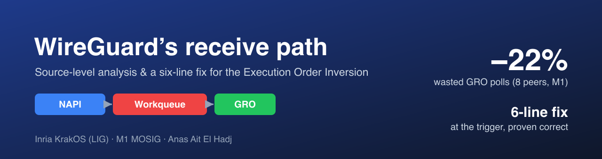
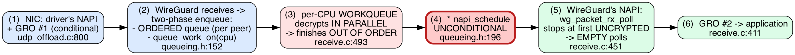

# Workqueue Scheduling Overhead in WireGuard

### Source-level analysis and a targeted fix for Execution Order Inversion

> **Inria KrakOS internship** (LIG, Grenoble) · M1 MOSIG
> Anas Ait El Hadj — supervised by **Alain Tchana** and **André Freyssinet**

---

WireGuard is a modern VPN built into the Linux kernel. Under sustained
multi-gigabit traffic with 1,000 concurrent clients, it reaches only **19.2 %**
of available bandwidth. Prior work ([Mounah *et al.*, SYSTOR 2025](#references))
traced this to an **Execution Order Inversion (EoI)**: concurrent decryption
triggers Generic Receive Offload (GRO) reassembly so frequently that one CPU
core saturates. Moving reassembly to a background thread recovered 4.7× throughput.

This project shows, through **source-level analysis**, that the prior fix is
*incomplete*: it makes each wasted reassembly cheaper, but not less frequent.
WireGuard schedules reassembly after **every** decrypted packet, even when no
progress is possible. With decryption spread over *N* cores, the packet due for
delivery next is rarely the first to finish — so most reassembly passes find
nothing to deliver. We propose a **six-line conditional guard** that triggers
reassembly only when the next packet due is actually ready.

## The break point

The receive path chains three kernel engines — NAPI, a per-CPU workqueue, and
GRO. The flow turns *down* into the unconditional `napi_schedule` call: that
single line, fired after every out-of-order completion, is where the bug lives.



## The fix

Before waking the NAPI, check whether the head of the per-peer queue is ready.
If it is still encrypted, skip the wake — the worker that finishes the head will
do it.

```c
tail = READ_ONCE(peer->rx_queue.tail);
if (tail == (struct sk_buff *)&peer->rx_queue.empty ||
    atomic_read(&PACKET_CB(tail)->state) != PACKET_STATE_UNCRYPTED)
        napi_schedule(&peer->napi);     // otherwise: skip
```

The read is lock-free and safe: `tail` is written only by the single consumer.
The worst case is a stale read that skips one wake, which NAPI's internal
*MISSED* mechanism recovers — no packet is ever stranded.

## Results (Apple M1 Pro, loopback, 5 runs each)

| peers | Δ wasted polls | GRO batch size |
|------:|:--------------:|:--------------:|
| 1     | −8.8 %         | 3.1 → 3.3      |
| 8     | **−21.9 %**    | 8.7 → **9.6**  |
| 32    | **−20.7 %**    | 7.7 → **8.9**  |

The reduction grows with peer count — exactly what the *1/N* model predicts —
and rising batch size confirms the mechanism: GRO is woken less often but
delivers more each time. Throughput is flat on loopback (the softirq never
saturates); validating throughput on a real 25 G NIC is the next step.

## Repository layout

| Path | Contents |
|------|----------|
| `report/` | Final 6-page report (LaTeX source + figures) |
| `admin/` | Defense slides (`SLIDES_DEFENSE_EN`), speaker notes, meeting prep |
| `diagrams/` | Graphviz sources (`.dot`) and rendered `.svg`/`.png` |
| `linux-source/` | Curated kernel files cited as proof (WireGuard module, GRO, UDP offload) |
| `scripts/` | Measurement harness (multi-peer, repeated runs, analysis) |
| `notes/`, `reference/` | Source-study notes and reference material |
| `io_uring_examples/` | Early io_uring exploration (the original framing) |

## Report & slides

- **Report:** `report/main.tex` — *Workqueue Scheduling Overhead in WireGuard:
  Source-Level Analysis and a Targeted Fix for Execution Order Inversion*
- **Defense deck:** `admin/SLIDES_DEFENSE_EN.md` (Marp → HTML/PDF)

## References

- C. Mounah *et al.*, "The Impact of Kernel Asynchronous APIs on the Performance
  of a Kernel VPN," SYSTOR 2025.
- [WireGuard](https://www.wireguard.com/) — Jason A. Donenfeld.

## License

Released under the **GNU General Public License v2.0** — see [`LICENSE`](LICENSE).
GPL-2.0 is used throughout because the kernel modification (`linux-source/.../receive.c`)
is a derivative of the Linux kernel and WireGuard, both GPL-2.0.
