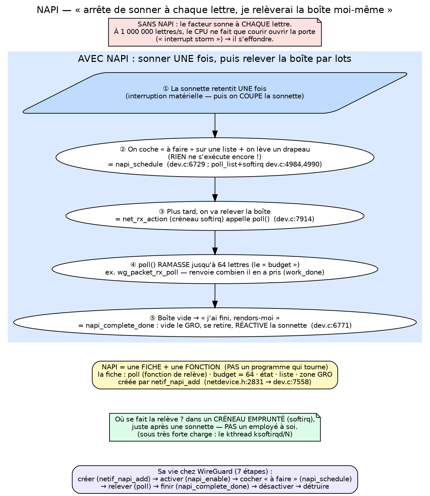
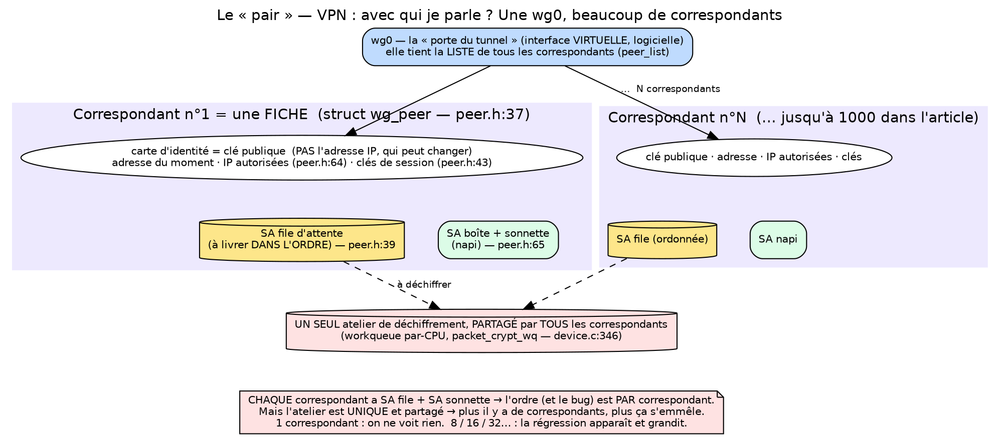
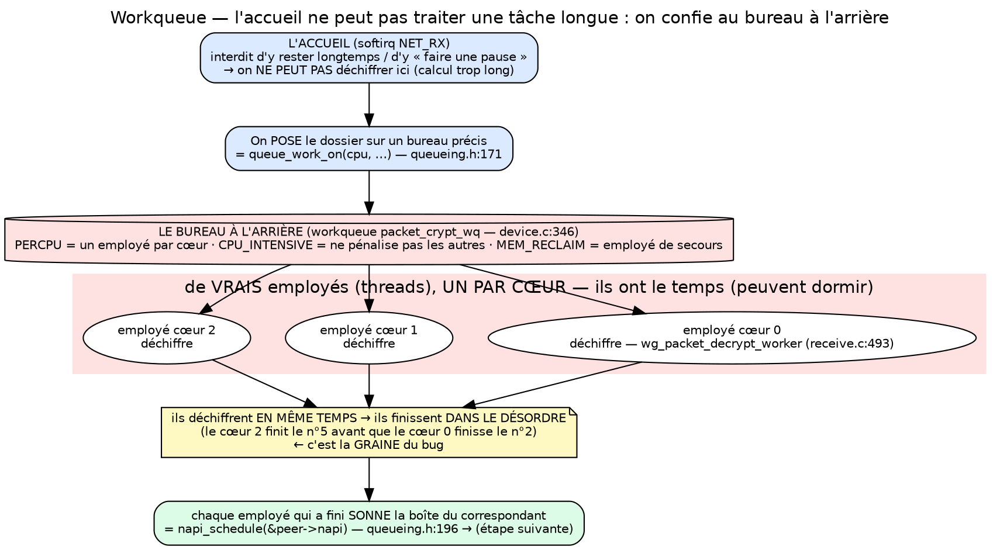

# Diagrammes par concept — NAPI · Pair · GRO · Workqueue

Quatre schémas autonomes, un par concept, pour expliquer chacun *isolément* (avant le grand
schéma du pipeline). Chacun est intuition-first mais porte les **lignes de source** clés pour
rester prouvable. Rendu : `dot -Tsvg <bloc>.dot -o <fichier>.svg`.

Fichiers rendus (dans `diagrams/`) : `concept_napi.svg`, `concept_peer.svg`,
`concept_gro.svg`, `concept_wq.svg` (+ `.png`).

Légende commune : bleu = NIC/softirq · rouge = workqueue · vert = NAPI WireGuard/GRO ·
jaune = donnée/note · violet = pair · note = encart explicatif.

---

## 1. NAPI

**À dire (résumé) :** « NAPI remplace *une interruption par paquet* par *une interruption
puis du polling par lots*. Ce n'est pas un thread : c'est une **structure + une fonction
`poll`**, et le `poll` tourne en softirq. »

**Le problème, en partant de zéro.** Une carte réseau qui reçoit un paquet doit prévenir le
processeur. Le moyen normal, c'est une **interruption** : un signal qui dit au CPU « arrête
tout de suite ce que tu fais, occupe-toi de moi ». Imagine un facteur qui **sonne à ta
porte à chaque lettre**. Pour deux lettres par jour, parfait. Mais si tu reçois un million
de lettres par seconde, tu passes *toute* ta journée à courir ouvrir la porte : tu ne lis
plus jamais ton courrier. C'est exactement ce qui arrive au CPU à très haut débit — on
appelle ça une *interrupt storm* (tempête d'interruptions), et la machine s'effondre.

**L'idée de NAPI, en une phrase.** NAPI dit au facteur : *« sonne UNE seule fois, puis
arrête de sonner ; je viendrai relever la boîte aux lettres moi-même, par paquets, quand
j'ai un moment. »* Techniquement : à la première interruption, le noyau **désactive** les
interruptions de la carte et passe en mode **polling** = « je vais vérifier la boîte
régulièrement et tout prendre d'un coup ». Quand la boîte est vide, il réactive la sonnette.
Résultat : réactif quand c'est calme, efficace quand c'est la tempête.

**Le vocabulaire, traduit en français courant :**

- *interruption* = la **sonnette** ;
- *polling* = aller **relever la boîte soi-même** ;
- *softirq* = le **petit créneau de temps** où le CPU fait cette relève. Ce n'est PAS un
  employé dédié : c'est juste un moment « emprunté », juste après avoir répondu à une
  sonnette. (Détail qui compte : dans ce créneau on n'a **pas le droit de faire une pause** —
  on y reviendra pour la workqueue.) ;
- *budget* = « je ne ramasse que **64 lettres** par passage, pour ne pas y passer la journée
  et pouvoir aussi m'occuper du reste » ;
- *poll()* = la **fonction de relève** elle-même.

**Le point le plus important (et le plus contre-intuitif).** « NAPI » n'est **pas un
programme qui tourne**. C'est une **fiche** (une structure de données) qui dit : *« voici ma
fonction de relève, et voici mon quota »* — plus cette fonction. « Réveiller la NAPI »
(`napi_schedule`) ne *fait* donc rien tout de suite : ça **coche juste « à faire »** sur une
liste et **lève un petit drapeau**. La relève réelle viendra un peu plus tard, dans le
créneau softirq.

**Le schéma, case par case** (suivre les flèches du haut vers le bas) : la **sonnette une
fois** (IRQ) → on **coche « à faire »** (`napi_schedule`) → un peu plus tard, le noyau
**relève la boîte** (`net_rx_action` appelle `poll()`) → `poll()` **ramasse jusqu'à 64
paquets** → quand la boîte est vide, il dit **« j'ai fini, rendors-moi »**
(`napi_complete_done`) et réactive la sonnette. L'encart jaune rappelle que la NAPI est une
*fiche + fonction* ; l'encart vert, qu'elle tourne en *créneau softirq* (pas un thread) ;
l'encart violet, les 7 étapes de sa vie dans WireGuard.

**Chez WireGuard.** WireGuard se **fabrique sa propre boîte-aux-lettres-avec-sonnette** pour
ses paquets une fois déchiffrés — on verra *pourquoi* avec GRO (diagramme 3).



---

## 2. Le pair (*peer*)

**À dire (résumé) :** « Une seule interface `wg0` porte plusieurs pairs. Chaque pair a **sa
propre** file ordonnée et **sa propre** NAPI — donc l'ordre et le bug sont *par pair*. Mais
tous partagent **une seule** workqueue : c'est pourquoi la régression grandit avec le nombre
de pairs. »

**Le problème, en partant de zéro.** WireGuard est un **VPN** : il relie des machines par
des **tunnels chiffrés**. La question de base : *avec qui je parle ?* Chaque correspondant à
l'autre bout d'un tunnel s'appelle un **pair** (*peer*). Particularité de WireGuard : il n'y
a **pas** de « serveur » et de « clients » au sens du protocole — juste des **pairs**
égaux ; c'est la configuration qui fait qu'une machine en a beaucoup (et joue donc le rôle
de serveur).

**Comment on identifie un pair ?** Par sa **clé publique** — sa carte d'identité
cryptographique — et *pas* par son adresse IP. Pourquoi ? Parce que l'adresse peut changer
(quelqu'un passe du Wi-Fi à la 4G), alors que la clé, elle, ne bouge pas. C'est ce qu'on
appelle le *roaming*.

**Le point d'échelle (essentiel pour comprendre le bug).** Une **seule** interface `wg0`
peut porter des **milliers** de pairs. Dans l'article qu'on étudie, le serveur a **1000
pairs** (1000 clients connectés) sur son unique `wg0`. C'est exactement ce que reproduisent
mes expériences multi-pairs.

**Ce que « contient » un pair.** Pense à une **fiche par correspondant**. Sur cette fiche :
sa clé publique, l'adresse où le joindre en ce moment, les plages d'adresses IP qu'on
l'autorise à utiliser, ses clés de session — **et, ce qui nous intéresse le plus** : sa
**propre file d'attente** de réception (pour livrer ses paquets *dans l'ordre*) et sa
**propre NAPI** (sa boîte-aux-lettres-avec-sonnette du diagramme 1).

**Le schéma, case par case.** Tout en haut, **`wg0`** (l'interface virtuelle) tient la liste
des pairs. En dessous, deux fiches de pairs (**Peer #1** … **Peer #N**, jusqu'à 1000) ;
chacune a **sa file ordonnée** (cylindre jaune) et **sa NAPI** (vert). Tout en bas, **une
seule** boîte rouge : la workqueue de déchiffrement, **partagée** par tous les pairs. Les
flèches pointillées montrent que *tous* les pairs envoient leur déchiffrement vers cette
**unique** workqueue.

> **Précision « une seule workqueue » vs « par-CPU » (sources : `device.c:346`,
> `device.h`, `queueing.h:171`).** Ce ne sont **pas** des choses contradictoires : il y a
> **un seul objet workqueue** (`packet_crypt_wq`, alloué une fois par interface), mais c'est
> une workqueue **« par-CPU »** au sens où elle a **un worker par cœur**. WireGuard garde
> d'ailleurs **un *work item* par CPU** (`struct multicore_worker __percpu *worker`) et
> soumet le travail avec `queue_work_on(cpu, …)`, qui l'exécute **sur ce cœur précis**.
> Donc : **« par-CPU » = les *workers* sont par cœur (parallélisme), PAS qu'il y aurait N
> workqueues.** C'est exactement ce que montre le diagramme « Workqueue » : *une* boîte
> rouge → *plusieurs* employés (un par cœur).

**Pourquoi c'est LE point central pour le bug** (encart rouge). Comme la file *et* la NAPI
sont **par pair**, l'obligation de livrer dans l'ordre — et donc le bug — existent **pair par
pair**. Or tout le déchiffrement passe par **un seul atelier partagé**. Conséquence : **plus
il y a de pairs, plus ça s'emmêle**. À **1 pair**, presque pas de désordre → le bug est
invisible. Sous **charge serveur** (8, 16, 32… pairs), le désordre explose → la régression
apparaît et grandit. C'est *pour ça* qu'on ne voit rien sur un usage perso et tout sur un
serveur.



---

## 3. GRO

**À dire (résumé) :** « GRO fusionne plusieurs paquets d'un même flux en un seul gros, pour
ne traverser la pile qu'une fois. Chez WireGuard il agit sur **deux fronts** ; et quand on
réveille la NAPI à vide, GRO #2 perd ses lots. »

**Le problème, en partant de zéro.** Quand un paquet arrive, il doit « monter » à travers
plusieurs **couches** du système (la couche réseau, la couche transport, puis
l'application). Ce trajet a un **coût fixe**, payé **à chaque paquet**, quelle que soit sa
taille. Avec des millions de petits paquets, on paie ce péage des millions de fois → c'est
*lui*, et pas la quantité de données, qui devient le goulot d'étranglement.

**L'analogie.** Tu dois monter **40 petites enveloppes** au 10ᵉ étage. Deux options : faire
**40 allers-retours** dans l'escalier (le « péage » = monter l'escalier, payé 40 fois) ; ou
**agrafer** les 40 enveloppes d'un même destinataire en **un seul gros colis** et monter
**une seule fois**. GRO, c'est la deuxième option.

**L'idée de GRO** (*Generic Receive Offload*). Avant de faire monter les paquets, on
**regroupe ceux qui vont au même endroit** (même connexion : mêmes adresses, mêmes ports) en
**un seul gros « super-paquet »**. Mêmes données, mais **un seul** trajet dans la pile : le
coût fixe est payé une fois au lieu de N. La fonction qui fait ça, `napi_gro_receive`, ne
pousse donc *pas* le paquet tout de suite : elle essaie d'abord de l'**agrafer** aux
précédents (elle les empile dans la NAPI).

**Quand le « colis » part-il ?** Quand la NAPI termine son passage de relève :
`napi_complete_done` appelle `gro_flush_normal`, qui **pousse le super-paquet** vers la
pile. (C'est le lien direct avec NAPI : GRO vit *à la fin* du `poll`.)

**Le schéma, case par case.** À gauche, **4 paquets** d'un même flux arrivent. Ils entrent
dans **`napi_gro_receive`** qui les **accumule**. Ça donne **un super-paquet**. Puis
**`gro_flush_normal`** le pousse vers la **pile** : **1 traversée au lieu de 4**.

**Les deux fronts (le point d'Alain)** — encart jaune. Chez WireGuard il y a **deux niveaux
de paquets**, donc GRO peut agir **deux fois** : **Front #1** sur l'**enveloppe externe
chiffrée** (côté carte réseau) — mais ce front est **conditionnel**, WireGuard ne l'active
pas lui-même ; **Front #2** sur la **lettre interne déchiffrée** (côté `wg0`) — celui-là,
WireGuard le fait **explicitement** (`receive.c:411`).

**Le lien avec le bug** — encart rouge. Si on **réveille la NAPI trop tôt / pour rien** (le
fameux `work_done = 0`), elle « ferme le colis » **sans rien avoir agrafé**. Donc le bug ne
fait pas que gâcher du temps CPU : il **casse aussi le regroupement** de GRO #2 — on perd la
performance des gros colis.

```dot
digraph GRO {
  rankdir=LR; fontname="Helvetica"; ranksep=0.6; nodesep=0.3;
  label="GRO — agrafer les enveloppes d'un même destinataire, ne monter l'escalier qu'UNE fois";
  labelloc=t; fontsize=14;
  node [fontname="Helvetica", fontsize=10, style="rounded,filled", fillcolor=white];
  edge [fontname="Helvetica", fontsize=9];

  COST [label="Monter un paquet dans la pile = un « péage » FIXE,\npayé à CHAQUE paquet (peu importe sa taille).\n40 petits paquets = 40 péages = embouteillage.", shape=note, fillcolor="#fee2e2"];

  subgraph cluster_in { label="4 enveloppes du MÊME destinataire (même flux)"; style=filled; color="#dbeafe";
    p1[label="enveloppe 1"]; p2[label="enveloppe 2"]; p3[label="enveloppe 3"]; p4[label="enveloppe 4"];
  }
  GRO   [label="On les AGRAFE au lieu de monter tout de suite\n= napi_gro_receive (les empile dans la napi)\nnetdevice.h:4251 ; chez WG : receive.c:411", shape=hexagon, fillcolor="#dcfce7"];
  BIG   [label="UN seul gros colis\n(1+2+3+4)", shape=box, fillcolor="#bbf7d0"];
  FLUSH [label="Quand la relève finit : on monte le colis\n= napi_complete_done → gro_flush_normal (dev.c:6803)", shape=box, fillcolor="#dcfce7"];
  STACK [label="pile / application\nUN seul voyage d'escalier au lieu de 4\n(1 péage au lieu de 4)", shape=box, fillcolor="#eeeeee"];

  COST -> p1 [style=invis];
  p1->GRO; p2->GRO; p3->GRO; p4->GRO;
  GRO->BIG->FLUSH->STACK;

  FRONTS [label="DEUX moments GRO chez WireGuard :\nFront #1 = enveloppe EXTERNE chiffrée (côté carte) — CONDITIONNEL, WG ne l'active pas (udp_offload.c:800)\nFront #2 = lettre INTERNE déchiffrée (côté wg0) — fait EXPLICITEMENT par WG (receive.c:411)", shape=note, fillcolor="#fef9c3"];
  BUG    [label="Lien avec le bug : si on « ferme le colis » trop tôt (réveil à vide, work_done=0),\non n'a rien agrafé → GRO #2 perd ses gros colis → on perd la performance.", shape=note, fillcolor="#fee2e2"];
  STACK -> FRONTS [style=invis];
  FRONTS -> BUG [style=invis];
}
```



---

## 4. Workqueue (WQ)

**À dire (résumé) :** « Le softirq n'a pas le droit de faire du travail long ; or déchiffrer
est lourd. On délègue donc à une **workqueue** : de vrais threads, **un par CPU**, qui
déchiffrent **en parallèle** — d'où la fin *dans le désordre* qui crée le bug. »

**Le problème, en partant de zéro.** On a vu (diagramme 1) que la « relève du courrier » se
fait dans un **petit créneau de temps emprunté** (le softirq), où l'on n'a **pas le droit de
traîner** ni de « faire une pause ». Or **déchiffrer** un paquet est un **calcul
cryptographique lourd** (ça prend du temps CPU). Le faire dans ce petit créneau
**bloquerait tout le reste**.

**L'analogie.** Pense à l'**accueil** d'une entreprise. À l'accueil (le softirq), on ne peut
pas garder un visiteur 20 minutes : ça bloque la file derrière. Si une tâche est longue, on
la **confie à un bureau à l'arrière** (la *workqueue*), avec de **vrais employés** (des
*threads*) qui, eux, **ont le temps** : ils peuvent prendre des pauses, être interrompus et
reprendre, etc.

**L'idée de la workqueue.** On **« pose » le travail lourd** (`queue_work_on`) pour qu'un
employé de l'atelier le fasse **plus tard, tranquillement**, dans un vrai thread (ce qu'on
appelle le *contexte processus* : un contexte où l'on a le droit de dormir et de prendre son
temps, contrairement au softirq).

**Le détail décisif (la graine du bug).** WireGuard met **un employé PAR CŒUR** du
processeur (*par-CPU*). Donc **plusieurs paquets sont déchiffrés EN MÊME TEMPS** sur
plusieurs cœurs. C'est rapide… mais ils **ne finissent pas dans l'ordre** où ils sont
arrivés : le cœur n°2 peut terminer le paquet n°5 avant que le cœur n°0 ait fini le n°2.
**Ce désordre est exactement ce qui déclenche le bug** (qu'on verra dans le pipeline
complet).

**Les drapeaux, en clair** (encart gris) : **PERCPU** = un employé par cœur (= parallélisme)
; **CPU_INTENSIVE** = « ces tâches mangent du CPU, ne pénalise pas les autres files à cause
d'elles » ; **MEM_RECLAIM** = « garde un employé de secours même quand la mémoire est
saturée », car le réseau doit toujours pouvoir avancer.

**Le schéma, case par case.** En haut, le **softirq** : interdit d'y déchiffrer (trop long).
Il **pose le travail** (`queue_work_on`) dans la **workqueue** (cylindre rouge). Celle-ci a
**un worker par CPU** (kworker CPU0/1/2…), chacun exécutant
`wg_packet_decrypt_worker`. Ils déchiffrent **en parallèle** → l'encart jaune insiste : **fin
dans le désordre**. Enfin, chaque worker **« sonne » la NAPI du pair** (`napi_schedule`) pour
passer à l'étape suivante du pipeline.



---

## Rendu (une commande)

```bash
cd "<repo>"
# extrait le k-ième bloc ```dot du fichier
ext() { awk -v k="$1" 'BEGIN{n=0} /^```dot$/{n++; if(n==k){f=1; next}} /^```$/{if(f)exit} f' \
        admin/DIAGRAMMES_CONCEPTS_SPEC_FR.md; }
for i in 1:napi 2:peer 3:gro 4:wq; do
  k=${i%%:*}; name=${i##*:}
  ext "$k" > diagrams/concept_$name.dot
  dot -Tsvg diagrams/concept_$name.dot -o diagrams/concept_$name.svg
  dot -Tpng -Gdpi=150 diagrams/concept_$name.dot -o diagrams/concept_$name.png
done
```
