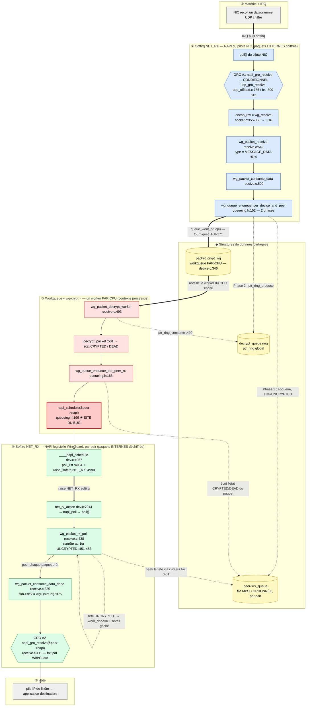
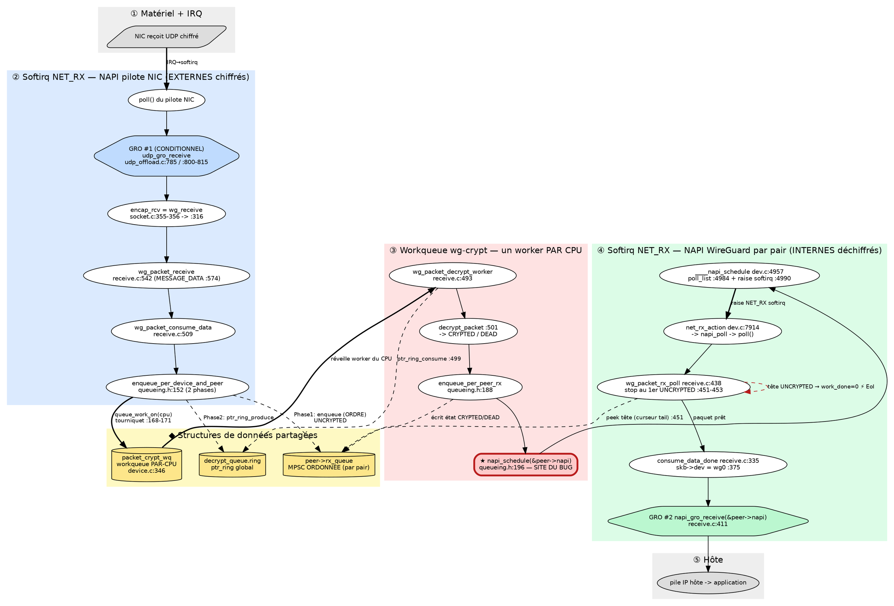

# Spécification du diagramme — pipeline de réception WireGuard (NAPI × workqueue × GRO)

Ce document n'est **pas** le diagramme : c'est le **plan pour le construire toi-même**, de
façon à pouvoir l'expliquer ligne par ligne. Il contient (1) ce que le schéma doit
*prouver*, (2) une légende stricte (formes, couleurs, flèches), (3) la **liste exhaustive
des nœuds** et (4) **des arêtes**, (5) une source **Mermaid** prête à coller, (6) une
source **Graphviz** (recommandée pour la figure du rapport), (7) les **encarts** à ajouter.

Référence des explications : `admin/PIPELINE_COMPLET_RECEPTION_WG_FR.md`. Toutes les lignes
citées sont vérifiées dans `linux-source/`.

---

## 1. Ce que le diagramme doit faire comprendre (les 4 messages)

1. **Il y a DEUX NAPI**, dans deux contextes softirq distincts : celle du *vrai* pilote NIC
   (en haut) et celle, *logicielle et par pair*, de WireGuard (en bas). Le schéma doit les
   montrer comme deux couloirs séparés.
2. **La workqueue est AU MILIEU des deux.** Le déchiffrement (parallèle, par-CPU) est ce qui
   relie la 1ʳᵉ NAPI à la 2ᵈᵉ. C'est `queue_work_on` (entrée de la workqueue) puis
   `napi_schedule` (sortie vers la 2ᵈᵉ NAPI) qui font les deux bascules de contexte.
3. **GRO est la DERNIÈRE action de chaque poll NAPI.** GRO #1 (conditionnel) à la fin du
   poll du NIC ; GRO #2 (fait par WireGuard) à la fin de `wg_packet_rx_poll`.
4. **Le bug vit exactement à la jointure workqueue → 2ᵈᵉ NAPI** : `napi_schedule`
   inconditionnel + arrêt de `rx_poll` à la 1ʳᵉ tête `UNCRYPTED`. Le schéma doit faire
   ressortir cette jointure (étoile + flèche « réveil gâché »).

> La phrase que le lecteur doit pouvoir dire en regardant le schéma : *« Le trafic traverse
> NAPI(NIC) → workqueue(déchiffrement parallèle) → NAPI(WireGuard, ordonnée + GRO), et le
> bug est le réveil mal cadencé entre les deux dernières étapes. »*

---

## 2. Légende stricte (à reproduire telle quelle dans un coin du schéma)

**Couloirs = contextes d'exécution (bandes de couleur, de haut en bas) :**

| Bande | Contexte | Couleur suggérée |
|---|---|---|
| ① | Matériel + interruption (IRQ) | gris |
| ② | Softirq NET_RX — **NAPI du pilote NIC** | bleu |
| ◆ | **Structures de données partagées** (files, ring, workqueue) | jaune |
| ③ | **Workqueue `wg-crypt`** — un worker par CPU (contexte processus) | rouge clair |
| ④ | Softirq NET_RX — **NAPI logicielle WireGuard (par pair)** | vert |
| ⑤ | Pile IP de l'hôte / application | gris |

**Formes :**

- **Rectangle arrondi** = une fonction / une étape de code.
- **Cylindre** = une structure de données (file, ring, workqueue).
- **Hexagone** = un moteur **GRO**.
- **Rectangle à bord rouge épais, marqué ★** = le **site du bug**.
- **Parallélogramme** = un évènement matériel / une E/S.

**Flèches :**

- **Pleine fine** → appel direct, *même contexte* (la pile d'appels continue).
- **Épaisse (gras)** ⇒ **bascule de contexte asynchrone** (`queue_work_on`,
  `raise_softirq`, IRQ→softirq) : « je dépose, quelqu'un d'autre exécutera plus tard ».
- **Pointillé** ⤍ **accès à une donnée** (lecture/écriture d'une file ou d'un ring), pas un
  appel de fonction.
- **Pointillé rouge bouclant** = le **réveil gâché** (EoI : `work_done = 0`).

---

## 3. Liste des nœuds (table canonique)

| ID | Couloir | Étiquette (titre) | Sous-étiquette (source) | Forme |
|---|---|---|---|---|
| `H` | ① | NIC reçoit un datagramme UDP **chiffré** | interruption matérielle | parallélogramme |
| `PNIC` | ② | `poll()` du pilote NIC | pilote, générique | rect. arrondi |
| `GRO1` | ② | **GRO #1** `napi_gro_receive` — *conditionnel* | `udp_gro_receive` `udp_offload.c:785`, branche `:800-815` | hexagone |
| `ENCAP` | ② | livraison UDP → `encap_rcv = wg_receive` | `socket.c:355-356` → `:316` | rect. arrondi |
| `RECV` | ② | `wg_packet_receive` (type = `MESSAGE_DATA`) | `receive.c:542`, `:574` | rect. arrondi |
| `CONS` | ② | `wg_packet_consume_data` | `receive.c:509` | rect. arrondi |
| `ENQ2` | ② | `wg_queue_enqueue_per_device_and_peer` (**2 phases**) | `queueing.h:152` | rect. arrondi |
| `RXQ` | ◆ | `peer->rx_queue` — file **MPSC ORDONNÉE**, par pair | `device.h` (`prev_queue`) | cylindre |
| `RING` | ◆ | `decrypt_queue.ring` — `ptr_ring` global | — | cylindre |
| `WQD` | ◆ | `packet_crypt_wq` — workqueue **PAR-CPU** | `device.c:346` | cylindre |
| `WORK` | ③ | `wg_packet_decrypt_worker` | `receive.c:493` | rect. arrondi |
| `DEC` | ③ | `decrypt_packet` → état `CRYPTED`/`DEAD` | `receive.c:501` | rect. arrondi |
| `ENQRX` | ③ | `wg_queue_enqueue_per_peer_rx` | `queueing.h:188` | rect. arrondi |
| `SCHED` | ③ | **`napi_schedule(&peer->napi)`** | `queueing.h:196` **★ BUG** | rect. bord rouge épais ★ |
| `SOFT` | ④ | `____napi_schedule` : `poll_list` + `raise_softirq` | `dev.c:4957`, `:4984`, `:4990` | rect. arrondi |
| `NRX` | ④ | `net_rx_action` → `napi_poll` → `poll()` | `dev.c:7914` | rect. arrondi |
| `RXPOLL` | ④ | `wg_packet_rx_poll` — **stoppe au 1er `UNCRYPTED`** | `receive.c:438`, `:451-453` | rect. arrondi |
| `DONE` | ④ | `wg_packet_consume_data_done` — `skb->dev = wg0` | `receive.c:335`, `:375` | rect. arrondi |
| `GRO2` | ④ | **GRO #2** `napi_gro_receive(&peer->napi)` | `receive.c:411` | hexagone |
| `APP` | ⑤ | pile IP de l'hôte → application | — | rect. arrondi |

---

## 4. Liste des arêtes (table canonique)

| De → Vers | Type | Étiquette |
|---|---|---|
| `H` ⇒ `PNIC` | gras (async) | IRQ → softirq |
| `PNIC` → `GRO1` | pleine | tente d'agréger l'UDP externe |
| `GRO1` → `ENCAP` | pleine | puis livraison à la pile UDP |
| `ENCAP` → `RECV` → `CONS` → `ENQ2` | pleine | chaîne d'appels (softirq) |
| `ENQ2` ⤍ `RXQ` | pointillé (écrit) | **Phase 1** : `enqueue` (ORDRE), état = `UNCRYPTED` (`:158,:162`) |
| `ENQ2` ⤍ `RING` | pointillé (écrit) | **Phase 2** : `ptr_ring_produce` (`:169`) |
| `ENQ2` ⇒ `WQD` | gras (async) | `queue_work_on(cpu)` — **tourniquet** (`:168-171`) |
| `WQD` ⇒ `WORK` | gras (async) | réveille le worker **du CPU choisi** |
| `WORK` ⤍ `RING` | pointillé (lit) | `ptr_ring_consume` (`:499`) |
| `WORK` → `DEC` → `ENQRX` → `SCHED` | pleine | chaîne d'appels (worker) |
| `ENQRX` ⤍ `RXQ` | pointillé (écrit) | écrit l'état **`CRYPTED`/`DEAD`** du paquet *déjà dans la file* |
| `SCHED` → `SOFT` | pleine | `napi_schedule` |
| `SOFT` ⇒ `NRX` | gras (async) | `raise_softirq(NET_RX)` |
| `NRX` → `RXPOLL` | pleine | `napi_poll` → `poll()` |
| `RXPOLL` ⤍ `RXQ` | pointillé (lit) | `peek` la **tête** via le curseur `tail` (`:451`) |
| `RXPOLL` → `DONE` | pleine | pour chaque paquet **prêt** |
| `RXPOLL` ⤍ `RXPOLL` | **pointillé rouge** | si tête `UNCRYPTED` → `work_done = 0` **⚡ réveil gâché (EoI)** |
| `DONE` → `GRO2` → `APP` | pleine | livraison interne + GRO #2 |

**Insight visuel n°1 (à rendre évident) :** `ENQ2` écrit le **même paquet** dans `RXQ`
(pour l'ordre) **et** dans `RING` (pour le travail). Dessine ces deux flèches partant du
même nœud vers deux cylindres : c'est *la* dualité ordre/parallélisme.

**Insight visuel n°2 :** `ENQRX` (worker) et `RXPOLL` (NAPI WG) touchent **tous deux** à
`RXQ` — l'un **écrit l'état**, l'autre **lit la tête**. C'est là que se joue l'EoI ; place
ces deux flèches l'une près de l'autre, avec l'étoile entre les deux couloirs.

---

## 5. Source Mermaid (à coller dans <https://mermaid.live> ou l'aperçu Mermaid de VS Code)

Donne un premier jet immédiat ; exporte ensuite en SVG/PNG, ou raffine à la main.

---

## 6. Source Graphviz / DOT (recommandée pour la figure du rapport)

Rendu : `dot -Tsvg diagramme.dot -o diagramme.svg` (ou `-Tpdf`). Graphviz gère mieux les
formes (cylindre, hexagone, étoile) et les clusters colorés.

---

## 7. Encarts (cartouches de texte à poser sur le schéma)

- **★ Cartouche « BUG » (près de `SCHED` ↔ `RXPOLL`)** :
  > Plusieurs workers (par-CPU) finissent **dans le désordre**. `napi_schedule` est lancé
  > après **chaque** paquet → `rx_poll` voit souvent la **tête encore `UNCRYPTED`** →
  > repart à vide (`work_done = 0`). Réveils gâchés **et** GRO #2 privé de ses lots.

- **✅ Cartouche « CORRECTIF » (à côté de la précédente)** :
  > Lire `peer->rx_queue.tail` **avant** `napi_schedule` ; ne réveiller **que si** la tête
  > est déchiffrée. Sûr : `tail` n'est écrit que par l'unique consommateur (file MPSC).

- **Cartouche « 2 fronts GRO »** : flécher `GRO1` et `GRO2` vers une note :
  > GRO #1 = UDP **externes chiffrés**, sur la NIC, **conditionnel** (WG n'opte pas).
  > GRO #2 = paquets **internes déchiffrés**, sur `wg0` virtuel, **fait par WireGuard**.

- **Cartouche « même paquet »** (entre `RXQ` et `RING`) :
  > Le **même `skb`** est référencé par la file ordonnée (ordre de livraison) **et** par le
  > ring (travail de déchiffrement). Ordre ⟂ parallélisme.

---

## 8. Conseils de mise en page

- **Sens vertical** (haut → bas) : ① en haut, ⑤ en bas ; le regard descend = le paquet
  progresse. Les structures ◆ en **colonne de droite**, alignées à hauteur des couloirs qui
  les touchent.
- Garde les deux **NAPI** visuellement **symétriques** (même forme de couloir, bleu en
  haut / vert en bas) pour matérialiser « la même mécanique, deux fois ».
- Mets la **workqueue (rouge) bien au centre** : c'est le pivot entre les deux NAPI.
- L'**étoile du bug** doit chevaucher la frontière rouge↔vert (workqueue → NAPI WG) : c'est
  *là* qu'est le problème, pas dans une seule boîte.
- Outils : **Mermaid** (§5) pour itérer vite ; **Graphviz** (§6) pour la figure finale du
  rapport (export SVG/PDF net) ; **draw.io / Excalidraw** si tu veux la dessiner à la main à
  partir des tables §3–§4 (rendu plus libre, idéal pour la soutenance).
