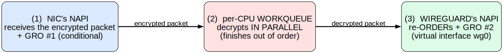
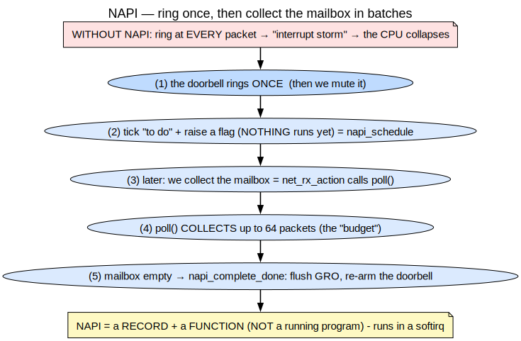
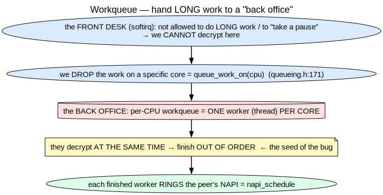
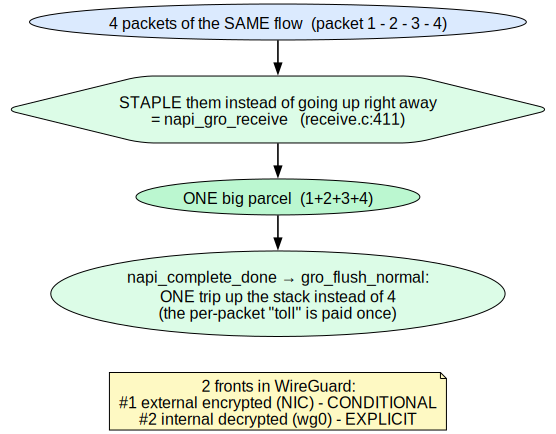
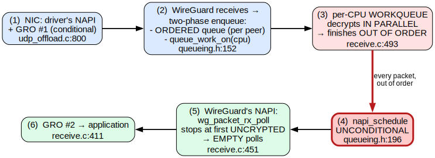
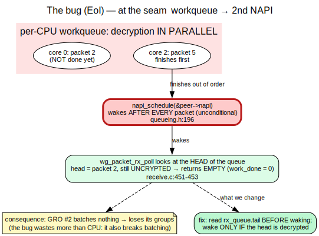

<!-- _class: lead -->
<!-- _paginate: false -->

# WireGuard's receive path
## Finding and fixing the Execution Order Inversion

Anas Ait El Hadj — Inria internship (KrakOS)
Supervisors: **Alain Tchana** · **André Freyssinet**

<!--
(15s) So — my internship is about a performance problem buried inside
WireGuard's receive path. One CPU core saturates, throughput collapses, and
the reason turns out to be something surprisingly subtle. I'll walk you through
how the pipeline works, where it breaks, what the fix looks like, and what
I measured. Let's go.
-->

---

## Context

- **WireGuard**: modern VPN in the Linux kernel — fast for one client, but on a **server with 1,000 clients** it reaches only **19.2% of line rate**.
- Prior work (Mounah *et al.*, SYSTOR 2025): found the cause (**Execution Order Inversion**) and proposed a fix → **4.7× throughput**. But that fix is **incomplete**: it makes each wasted operation cheaper, not less frequent.
- **My work**: understand the receive pipeline from the source code, identify the root cause of the EoI, and fix it at the trigger.

<!--
(45s) WireGuard is known for being fast and simple. But put it on a server
with a thousand clients pushing 25 Gbps, and one core hits 94% utilization
and throughput collapses to 19% of line rate. That's not a network limit —
that's a CPU problem. Mounah and co-authors at SYSTOR 2025 found the cause,
named it the Execution Order Inversion, and proposed a fix that recovered 4.7×
throughput. But when I read their patch, I noticed: the root cause is still
there. Their fix makes each wasted operation cheaper to run. Mine stops it from
running in the first place. That's what this talk is about.
-->

---

## The map — three stages



<span class="small">Three engines, three execution contexts. We unpack each one, then we'll see exactly where it breaks.</span>

<!--
(30s) Here's a packet's journey through WireGuard. Three stages — receive,
decrypt, deliver. Three different execution contexts. I'll explain each one,
and then when we look at the bug it'll be obvious exactly where the problem
is. Keep this map in mind.
-->

---

## Stage 1 — the peer and NAPI



<span class="small">Each client = one **peer** with its **own ordered queue** and its **own NAPI**. One shared decryption workshop for all peers.</span>

<!--
(1m30s) First, the peer. Each client on the other end of a WireGuard tunnel
is a "peer" — identified by a public key, not an IP address. Each peer gets
its own ordered receive queue — that queue is what preserves packet order —
and its own NAPI instance.

NAPI is WireGuard's batching mechanism. The analogy I like: without NAPI,
the kernel gets an interrupt for every single packet, like a postman ringing
your doorbell for every envelope. At a million packets a second, the CPU just
runs to the door constantly and never gets anything else done. NAPI's idea:
ring once, mute the doorbell, collect everything in one go.

The critical detail — and this will come back — is that calling napi_schedule
does NOT run the poll immediately. It sets a flag and raises a software
interrupt. The actual poll runs a moment later. WireGuard creates one of these
per peer on a virtual interface, woken by hand from the decrypt workers.

So: one shared decryption workshop for all peers, but each peer has its own
delivery queue. That contrast is the seed of the bug.
-->

---

## Stage 2 — the workqueue



<span class="small">Decryption is too heavy for the softirq → delegated to a **background pool**. One worker per core → decrypts **in parallel** → finishes **out of order**.</span>

<!--
(1m15s) Why is there a workqueue at all? Because decryption — ChaCha20-Poly1305
— is heavy. The softirq is borrowed time: you're not allowed to do long work
there. So WireGuard delegates decryption to background kernel threads.

The important part: there's one worker per CPU core. So if you have 8 cores,
up to 8 packets from the same peer can be decrypting at the same time. That's
fast. But — and this is the seed of the bug — they finish OUT OF ORDER. The
core handling packet 5 might finish before the core handling packet 2. There's
no reason the hardware respects arrival order.

When a worker finishes, it calls napi_schedule to ring the peer's NAPI. Every
worker. After every packet. Unconditionally.
-->

---

## Stage 3 — GRO



<span class="small">Pushing a packet up the stack has a **fixed cost per packet** → GRO **staples packets into one parcel** → one trip instead of N. WireGuard has **2 fronts**.</span>

<!--
(45s) GRO — Generic Receive Offload — is the optimization the bug destroys.
The idea is simple: traversing the network stack has a fixed cost per packet.
If you have 40 packets of the same flow, it's far better to staple them into
one big unit and traverse the stack once, rather than 40 times. GRO does that.
WireGuard uses it at stage 3 to batch decrypted packets before handing them
to the application. When GRO works well, you get big batches. When something
wakes it for nothing, those batches fall apart.
-->

---

## Assembled — and where it breaks



<span class="small">The red box: <span class="tag">napi_schedule unconditional</span> — fires after **every** completion, regardless of queue state. This is the problem.</span>

<!--
(45s) Here's the full pipeline. Look at the red box in the middle. After every
decrypted packet — not "if the head is ready", not "if there's something to
deliver" — unconditionally, every worker rings the NAPI. That single
unconditional call is where the bug lives.
-->

---

## The bug — Execution Order Inversion



<!--
(2m — this is the core of the talk, actually slow down here) So here's what
happens. Two facts collide.

Fact one: the workqueue decrypts out of order. Core 2 finishes packet 5 before
core 0 finishes packet 2.

Fact two: every worker, when it's done, calls napi_schedule unconditionally.

So the NAPI wakes up. It looks at the head of the ordered queue. The head is
packet 2 — still encrypted. It returns work_done = 0. Nothing delivered. A
completely wasted softirq pass.

And there's a second cost that's easy to miss: because the NAPI found nothing
at the head, GRO couldn't batch anything either. So the bug doesn't just waste
CPU time — it also breaks the batching optimization we just talked about.

With N cores decrypting in parallel, the head packet finishes first with
probability 1/N. So (N-1)/N wakes are wasted. Eight cores means 87.5% of wakes
do nothing. And the more peers you have, the more this compounds.

The punchline: we're ringing the doorbell every time any worker finishes, but
delivery can only start once the first packet in line is ready.
-->

---

## The fix — 6 lines

**Before** calling `napi_schedule`, check whether the **head of the queue is ready**.

```c
tail = READ_ONCE(peer->rx_queue.tail);
if (tail == (struct sk_buff *)&peer->rx_queue.empty ||
    atomic_read(&PACKET_CB(tail)->state) != PACKET_STATE_UNCRYPTED)
        napi_schedule(&peer->napi);     // otherwise: skip
```

- **Safe:** `tail` written only by the single consumer → no race condition.
- **Worst case:** stale read → skip one wake → the worker finishing the head wakes it then.
- **Effect:** premature wakes disappear → GRO gets full batches back.

<!--
(1m) The fix is six lines. The idea is almost obvious once you see the bug:
before waking the NAPI, check whether there's actually something for it to do.
Read the consumer cursor of the queue. If the head is still uncrypted, skip the
wake entirely — the worker that eventually finishes the head will do it.

Why is it safe to read that cursor from a worker? Because it's written by only
one entity — the poll itself. So it's a safe, lock-free hint. The worst case is
a slightly stale read where we miss a wake. And NAPI handles that: it has an
internal "MISSED" mechanism that re-runs the poll once if a schedule lands while
one is already running. No packet ever gets stranded.

The expected result: premature wakes gone, GRO gets its batches back.
-->

---

## Results — what the numbers say

**On ARM (M1, loopback, 5 runs each):**

| | 1 peer | 8 peers | 32 peers |
|---|---|---|---|
| Δ wasted polls | −8.8% | **−21.9%** | **−20.7%** |
| Batch size | 3.1 → 3.3 | 8.7 → **9.6** | 7.7 → **8.9** |

- The reduction **grows with peer count** — exactly what the 1/N model predicts.
- **Batch size rising** is the direct confirmation: GRO is woken less but does more each time.
- Throughput flat — expected, the loopback never saturates `NET_RX_SOFTIRQ`.

<!--
(1m) On my M1 in a loopback setup with multiple peers, the fix consistently
reduces wasted polls by 9 to 22 percent. The reduction grows with peer count —
one peer barely moves, eight peers drops by 22%. That's exactly what the 1/N
model predicts: more peers means more concurrent workers, more out-of-order
completions, more wasted wakes to eliminate.

The batch size numbers are what I find most convincing. At 8 peers, each
useful poll goes from delivering 8.7 packets on average to 9.6. That's direct
evidence: GRO is woken later, but when it wakes it finds more ready. The
mechanism works exactly as expected.

Throughput is flat, which is expected — on a loopback, ChaCha20 on the M1 is
fast enough that the softirq never saturates. The throughput collapse the paper
saw requires a real NIC pushing traffic faster than the workers can process it.
I can't reproduce that on a laptop.
-->

---

## What's next

**1. Real hardware** — CloudLab (x86, 25G NIC, 1,000 peers)
- Does the fix reduce **throughput collapse**, not just poll counts?
- Does ARM behavior reproduce on x86?

**2. A better fix**
- Current fix wakes on the first ready packet → **one-packet polls get no GRO benefit**.
- Right policy: **wake only when waking pays off**.
- Requires measuring: *poll overhead* vs *packet delivery + copy to userspace*.

**3. Combine with the prior fix** — orthogonal, should be additive.

<!--
(1m) So what's still open?

Two things. First, I need to run this on real hardware. I have CloudLab access —
x86 servers with a real 25G NIC. That's where I can reproduce the paper's regime
and see whether the fix actually moves the throughput needle, not just the
poll-count metrics. I genuinely don't know yet whether the 20% fewer polls
translates to 20% more throughput, or less, or more — it depends on how much
of the bottleneck was the wasted polls versus something else.

Second, the current fix is correct but not optimal. It wakes as soon as the
head is ready. But if only the head is ready and nothing behind it, that's a
one-packet poll with no batching. You've paid the full cost of a softirq pass
to hand up a single packet. That might be fine — or it might not be. To know,
I need to measure two costs: the overhead of a poll itself, and the cost of
delivering and copying a packet to userspace. Those numbers point to a better
fix: a batching-aware trigger that waits for enough to be ready before waking.

That's the fix I'd actually like to reach. The current one is a safe, correct
step in that direction.
-->

---

<!-- _class: lead -->

## Summary

**Understood** the receive pipeline from the source code (NAPI, workqueue, GRO).

**Located** the root cause: one unconditional line that wakes the wrong thing at the wrong time.

**Fixed it** in 6 lines. Confirmed: 9–22% fewer wasted polls on ARM, batch size up.

**Still to do:** real NIC measurements + a batching-aware trigger.

<span class="small">Thank you — questions?</span>

<!--
(30s) Three things done: understood the mechanism, found the bug, confirmed the
fix works. And two things still to do: validate on real hardware, and design a
smarter trigger. That's the natural continuation. Thank you.
-->

---

<!-- _header: "APPENDIX" -->

## Appendix A — one workqueue, per-CPU workers

- **One** workqueue object (`packet_crypt_wq`, `device.c:346`), shared by all peers.
- **Per-CPU = the *workers* are per core**: `queue_work_on(cpu, …)` dispatches each item to a specific core. It is **not** N workqueues.

<!--
It's not N workqueues — there's one object, allocated once. "Per-CPU" describes
the workers: each core gets one, and WireGuard uses queue_work_on to pin each
packet to a specific core. The diagram shows it well: one red box, several
employees.
-->

---

<!-- _header: "APPENDIX" -->

## Appendix B — NAPI lifecycle

`netif_napi_add` → `napi_enable` → `napi_schedule` (sets flag + raises softirq, **nothing runs yet**)
→ `wg_packet_rx_poll` → `napi_complete_done` → `napi_disable` → `netif_napi_del`

The poll runs at the next `spin_unlock_bh` in the worker loop — not immediately.

<!--
The full lifecycle in seven steps. The one people get wrong is napi_schedule:
it doesn't run anything. It sets a bit and raises NET_RX_SOFTIRQ. The actual
poll runs at the next point where the worker re-enables bottom halves —
specifically, the spin_unlock_bh at the end of each loop iteration. That's why
calling napi_schedule from inside the worker loop produces a poll that runs
almost immediately, but not synchronously.
-->

---

<!-- _header: "APPENDIX" -->

## Appendix C — Full results table

| peers | build | wasted/s | waste% | batch | Δwasted |
|---|---|---|---|---|---|
| 1  | stock / patched | 42,638 / 38,872 | 25.1 / 24.9 | 3.1 / 3.3 | −8.8% |
| 4  | stock / patched | 33,652 / 30,512 | 29.7 / 28.5 | 14.2 / 15.0 | −9.3% |
| 8  | stock / patched | 64,318 / 50,217 | 29.2 / 28.2 | 8.7 / 9.6 | −21.9% |
| 16 | stock / patched | 50,788 / 44,480 | 28.5 / 28.2 | 9.9 / 11.6 | −12.4% |
| 32 | stock / patched | 64,987 / 51,553 | 28.8 / 27.5 | 7.7 / 8.9 | −20.7% |

---

<!-- _header: "APPENDIX" -->

## Appendix D — bpftrace proof

```text
kretprobe:wg_packet_rx_poll { @work_done = lhist(retval, 0, 64, 8); }
```

- **Spike in bucket 0** = wasted wakes (EoI signature).
- The fix must **collapse bucket 0** and shift mass to > 1 (real batches).

<!--
One line of bpftrace traces the return value of wg_packet_rx_poll — that's
work_done, the number of packets delivered in each pass. A histogram of that
value tells the whole story: if the EoI is happening, you see a massive spike
at zero. The fix should make that spike disappear and push the mass toward
larger values. It's a direct, architecture-independent measurement of the
mechanism. Works the same on ARM and x86.
-->
