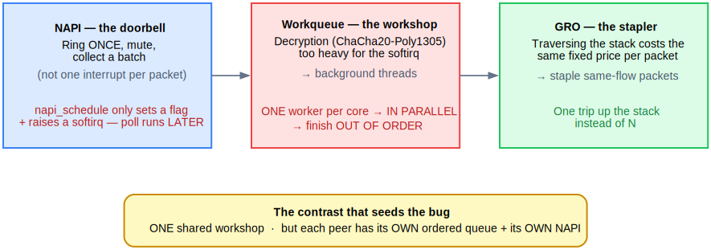

<!-- _class: lead -->
<!-- _paginate: false -->

# WireGuard's receive path
## Finding and fixing the Execution Order Inversion

Anas Ait El Hadj — Inria internship (KrakOS)
Supervisors: **Alain Tchana** · **André Freyssinet**

<span class="small">Defense — June 10, 2026 · Salle F117</span>

<!--
(15s) So — my internship is about a performance problem buried inside
WireGuard's receive path. One CPU core saturates, throughput collapses, and
the reason turns out to be something surprisingly subtle. I'll walk you through
how the pipeline works, where it breaks, what the fix looks like, and what
I measured. Let's go.
-->

---

## Context

- **WireGuard**: modern VPN in the Linux kernel — fast for one client, but on a **server with 1,000 clients** it reaches only **19.2% of line rate**.
- Prior work (Mounah *et al.*, SYSTOR 2025): found the cause (**Execution Order Inversion**) and proposed a fix → **4.7× throughput**. But that fix is **incomplete**: it makes each wasted operation cheaper, not less frequent.
- **My work**: understand the receive pipeline from the source code, identify the root cause of the EoI, and fix it at the trigger.

<!--
(45s) WireGuard is known for being fast and simple. But put it on a server
with a thousand clients pushing 25 Gbps, and one core hits 94% utilization
and throughput collapses to 19% of line rate. That's not a network limit —
that's a CPU problem. Mounah and co-authors at SYSTOR 2025 found the cause,
named it the Execution Order Inversion, and proposed a fix that recovered 4.7×
throughput. But when I read their patch, I noticed: the root cause is still
there. Their fix makes each wasted operation cheaper to run. Mine stops it from
running in the first place. That's what this talk is about.
-->

---

## The three kernel engines



<!--
(1m15s) Three mechanisms cooperate on WireGuard's receive path. You only need
one idea for each.

NAPI is the doorbell. Without it, the kernel gets an interrupt for every single
packet — like a postman ringing for every envelope. At a million packets a
second the CPU just runs to the door and never gets anything done. NAPI rings
once, mutes the bell, collects everything in one pass. The detail that will come
back: napi_schedule does NOT run the poll. It sets a flag and raises a software
interrupt — the poll runs a moment later.

The workqueue is the decryption workshop. ChaCha20-Poly1305 is heavy, and the
softirq is borrowed time — you can't do long work there. So decryption is
delegated to background kernel threads, one per core. Eight cores means up to
eight packets decrypting at once. Fast — but they finish OUT OF ORDER. The core
on packet 5 may finish before the core on packet 2.

GRO is the stapler. Traversing the network stack costs the same whether you
carry one packet or forty, so GRO staples same-flow packets into one parcel and
makes a single trip.

Now the contrast that seeds the bug: there is ONE shared workshop for all peers,
but each peer has its OWN ordered queue and its OWN NAPI. Hold that thought.
-->

---

## The pipeline — and where it breaks


<span class="small">The flow turns <span class="tag">DOWN</span> into the red box — <span class="tag">napi_schedule unconditional</span> fires after **every** completion, regardless of queue state. This is the break point.</span>

<!--
(1m15s) Here's the full pipeline with the three engines connected: receive,
decrypt in the workshop, deliver through NAPI and GRO. Each peer's decrypted
packets land in its ordered queue, and the NAPI poll drains that queue head-first
so order is preserved.

Now look at the red box. After every decrypted packet — not "if the head is
ready", not "if there's something to deliver" — unconditionally, every worker
rings the peer's NAPI. That single unconditional call is where the bug lives.
Keep your eye on it for the next slide.
-->

---

## The bug — Execution Order Inversion


<!--
(1m30s) Two facts collide.

One: the workshop decrypts out of order. Core 2 finishes packet 5 before core 0
finishes packet 2.

Two: every worker, when done, calls napi_schedule unconditionally.

So a worker finishes packet 5 and rings the doorbell. The NAPI wakes, looks at
the HEAD of the ordered queue — packet 2 — still encrypted. It returns
work_done = 0. Nothing delivered. A completely wasted softirq pass. And because
the head wasn't ready, GRO had nothing to staple either — so the bug doesn't
just burn CPU, it also breaks the batching.

The math: with N cores in parallel, the head finishes first with probability
1/N. So (N-1)/N of the wakes are wasted — at eight cores, 87.5% do nothing. And
it compounds with peer count: more peers, more concurrent workers, more wasted
wakes. One core saturates at 94%, throughput collapses.

The punchline: we ring the doorbell every time any worker finishes, but delivery
can only start once the first packet in line is ready.
-->

---

## The fix — 6 lines

**Before** calling `napi_schedule`, check whether the **head of the queue is ready**.

```c
tail = READ_ONCE(peer->rx_queue.tail);
if (tail == (struct sk_buff *)&peer->rx_queue.empty ||
    atomic_read(&PACKET_CB(tail)->state) != PACKET_STATE_UNCRYPTED)
        napi_schedule(&peer->napi);     // otherwise: skip
```

- **Safe:** `tail` written only by the single consumer → no race condition.
- **Worst case:** stale read → skip one wake → the worker finishing the head wakes it then.
- **Effect:** premature wakes disappear → GRO gets full batches back.

<!--
(1m) The fix is six lines, and it's almost obvious once you see the bug: before
waking the NAPI, check whether there's actually something to do. Read the
consumer cursor of the queue. If the head is still uncrypted, skip the wake — the
worker that eventually finishes the head will do it.

Why safe to read from a worker? That cursor is written by only one entity — the
poll itself. So it's a lock-free hint. Worst case is a slightly stale read where
we miss a wake, and NAPI already handles that: it has an internal "MISSED"
mechanism that re-runs the poll if a schedule lands while one is running. No
packet is ever stranded. Result: premature wakes gone, GRO gets its batches back.
-->

---

## Results — polls down, batches up

<span class="small">**Setup:** Apple M1 (8 cores), Linux net namespaces (multi-peer loopback), `bpftrace` for in-kernel metrics — loopback, 5 runs each.</span>

| | 1 peer | 8 peers | 32 peers |
|---|---|---|---|
| Δ wasted polls | −8.8% | **−21.9%** | **−20.7%** |
| Batch size | 3.1 → 3.3 | 8.7 → **9.6** | 7.7 → **8.9** |

- The reduction **grows with peer count** — exactly what the 1/N model predicts.
- **Batch size rising** is the direct confirmation: GRO is woken less but does more each time.
- Throughput flat — expected, the loopback never saturates `NET_RX_SOFTIRQ`.

<!--
(1m30s) Setup first, quickly, for credibility: this runs on my Apple M1 — eight
cores — with multiple peers built from Linux network namespaces over loopback,
and I measure in-kernel with bpftrace. Five runs per configuration.

The fix consistently cuts wasted polls by 9 to 22 percent, and the reduction
grows with peer count — one peer barely moves, eight peers drops 22%. That's
exactly the 1/N model: more peers, more concurrent workers, more out-of-order
completions, more wasted wakes to remove.

The batch numbers are what I find most convincing. At 8 peers, each useful poll
goes from 8.7 packets to 9.6. Direct evidence: GRO is woken later, but finds more
ready when it wakes. The mechanism works as predicted.

Throughput is flat — expected. On loopback, ChaCha20 on the M1 is fast enough
that the softirq never saturates. The throughput collapse the paper saw needs a
real NIC pushing faster than the workers can drain. I can't reproduce that on a
laptop — which is exactly what comes next.
-->

---

## Conclusion

- **Understood** the receive pipeline from the source: NAPI, the per-CPU workqueue, GRO.
- **Located** the root cause — one unconditional line (`queueing.h:196`) that wakes the wrong thing at the wrong time.
- **Fixed it** in **6 lines**: read the queue head before waking, skip the premature wake.
- **Confirmed on ARM:** **9–22% fewer wasted polls**, and **batch size up** — direct evidence the mechanism works.

<!--
(40s) To wrap up the work itself. Three things done. I understood the receive
pipeline from the source — NAPI, the per-CPU workqueue, GRO. I located the root
cause: a single unconditional line that wakes the NAPI at the wrong moment. And
I fixed it in six lines — check the queue head before waking, and skip the wake
when there's nothing ready. On ARM I measured 9 to 22 percent fewer wasted polls,
with batch sizes rising — which is the direct evidence that the mechanism does
what I claimed. That's the contribution.
-->

---

## Next steps

**The internship continues through July.** Three directions:

1. **Real hardware (CloudLab)** — x86, 25G NIC, 1,000 peers. Does the fix reduce **throughput collapse**, not just poll counts? Does the ARM behavior reproduce on x86?
2. **A batching-aware trigger** — wake only when waking *pays off* (measure poll overhead vs. delivery + copy-to-userspace cost).
3. **Combine with the SYSTOR fix** — orthogonal, should be additive.

<span class="small">Thank you — questions?</span>

<!--
(40s) And this has a clear continuation — the internship runs through July. Three
directions. First, real hardware: I have CloudLab access — x86 with a 25-gigabit
NIC — where I can finally reproduce the paper's regime and see whether fewer polls
turn into real throughput, and whether the ARM behavior holds on x86. Second, a
smarter, batching-aware trigger that waits until waking actually pays off, instead
of firing on the first ready packet. And third, combining my conditional trigger
with the SYSTOR paper's dedicated-workqueue fix — they're orthogonal, so they
should stack. Thank you — I'm happy to take questions.
-->

---

<!-- _header: "APPENDIX" -->

## Appendix A — Stage 1: the peer and NAPI


<span class="small">Each client = one **peer** with its **own ordered queue** and its **own NAPI**. One shared decryption workshop for all peers.</span>

<!--
Each client is a "peer" — identified by a public key, not an IP. Each peer gets
its own ordered receive queue (that's what preserves packet order) and its own
NAPI instance, on a virtual interface, woken by hand from the decrypt workers.
napi_schedule sets a flag and raises a softirq — the poll runs a moment later.
-->

---

<!-- _header: "APPENDIX" -->

## Appendix B — Stage 2: the workqueue


<span class="small">Decryption is too heavy for the softirq → delegated to a **background pool**. One worker per core → decrypts **in parallel** → finishes **out of order**.</span>

<!--
Decryption — ChaCha20-Poly1305 — is heavy, and the softirq is borrowed time. So
WireGuard delegates to background kernel threads, one worker per core. Up to 8
packets from the same peer decrypting at once — fast, but they finish out of
order. When a worker finishes it calls napi_schedule. Every worker. After every
packet. Unconditionally.
-->

---

<!-- _header: "APPENDIX" -->

## Appendix C — Stage 3: GRO


<span class="small">Pushing a packet up the stack has a **fixed cost per packet** → GRO **staples packets into one parcel** → one trip instead of N.</span>

<!--
GRO — Generic Receive Offload — is the optimization the bug destroys. Traversing
the stack has a fixed per-packet cost; with 40 same-flow packets it's far better
to staple them and traverse once. When GRO works you get big batches; when
something wakes it for nothing, the batches fall apart.
-->

---

<!-- _header: "APPENDIX" -->

## Appendix D — one workqueue, per-CPU workers

- **One** workqueue object (`packet_crypt_wq`, `device.c:346`), shared by all peers.
- **Per-CPU = the *workers* are per core**: `queue_work_on(cpu, …)` dispatches each item to a specific core. It is **not** N workqueues.

<!--
It's not N workqueues — there's one object, allocated once. "Per-CPU" describes
the workers: each core gets one, and WireGuard uses queue_work_on to pin each
packet to a specific core. The diagram shows it well: one red box, several
employees.
-->

---

<!-- _header: "APPENDIX" -->

## Appendix E — NAPI lifecycle

`netif_napi_add` → `napi_enable` → `napi_schedule` (sets flag + raises softirq, **nothing runs yet**)
→ `wg_packet_rx_poll` → `napi_complete_done` → `napi_disable` → `netif_napi_del`

The poll runs at the next `spin_unlock_bh` in the worker loop — not immediately.

<!--
The full lifecycle in seven steps. The one people get wrong is napi_schedule:
it doesn't run anything. It sets a bit and raises NET_RX_SOFTIRQ. The actual
poll runs at the next point where the worker re-enables bottom halves —
specifically, the spin_unlock_bh at the end of each loop iteration. That's why
calling napi_schedule from inside the worker loop produces a poll that runs
almost immediately, but not synchronously.
-->

---

<!-- _header: "APPENDIX" -->

## Appendix F — Full results table

| peers | build | wasted/s | waste% | batch | Δwasted |
|---|---|---|---|---|---|
| 1  | stock / patched | 42,638 / 38,872 | 25.1 / 24.9 | 3.1 / 3.3 | −8.8% |
| 4  | stock / patched | 33,652 / 30,512 | 29.7 / 28.5 | 14.2 / 15.0 | −9.3% |
| 8  | stock / patched | 64,318 / 50,217 | 29.2 / 28.2 | 8.7 / 9.6 | −21.9% |
| 16 | stock / patched | 50,788 / 44,480 | 28.5 / 28.2 | 9.9 / 11.6 | −12.4% |
| 32 | stock / patched | 64,987 / 51,553 | 28.8 / 27.5 | 7.7 / 8.9 | −20.7% |

---

<!-- _header: "APPENDIX" -->

## Appendix G — bpftrace proof

```text
kretprobe:wg_packet_rx_poll { @work_done = lhist(retval, 0, 64, 8); }
```

- **Spike in bucket 0** = wasted wakes (EoI signature).
- The fix must **collapse bucket 0** and shift mass to > 1 (real batches).

<!--
One line of bpftrace traces the return value of wg_packet_rx_poll — that's
work_done, the number of packets delivered in each pass. A histogram of that
value tells the whole story: if the EoI is happening, you see a massive spike
at zero. The fix should make that spike disappear and push the mass toward
larger values. It's a direct, architecture-independent measurement of the
mechanism. Works the same on ARM and x86.
-->
