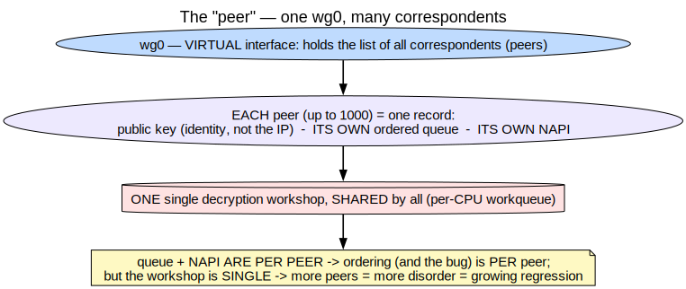

<!-- _class: lead -->
<!-- _paginate: false -->

# WireGuard's receive path under heavy load
## Understanding, measuring, and fixing the Execution Order Inversion

Anas Ait El Hadj — Inria internship (KrakOS)
Supervisors: **Alain Tchana** · **André Freyssinet**

<!--
(~30 s) Hello, I'm Anas Ait El Hadj. This is my internship at Inria, in the KrakOS team,
supervised by Alain Tchana and André Freyssinet. My subject is the path by which WireGuard —
a VPN — *receives* packets, and more precisely a timing problem inside it that shows up when a
server has many clients. The title has three verbs: understand, measure, fix. I won't dive into
the technical detail yet — let's first set the scene.
- Avoid: listing technical detail right now. Stay high-level.
- Transition → "First, what we're talking about."
-->

---

## The setting

- **WireGuard** is a modern VPN, known for being **simple and fast**, built into the Linux kernel.
- But on the **server** side (many clients at once), the **receive path** can **saturate one core** → throughput plateaus.

**Internship question:** *why* does it plateau on this path, and *how* to do better?

<!--
(~1 min 15) You may know WireGuard: a modern VPN, known for being simple and fast, built
straight into the Linux kernel. A VPN, concretely, connects machines through encrypted tunnels.
For personal use — one client, one tunnel — no problem, it's very fast. The problem shows up on
the *server* side: when a single machine has to handle hundreds, even thousands of clients at
once. And here's the key point: it isn't the *network* that saturates, it's the *CPU*. The
per-packet processing, on receive, can saturate one core — and throughput plateaus. Hence my
internship question, in two parts: *why* does it plateau, specifically on this receive path, and
*how* to do better.
- Hammer: the bottleneck is the per-packet CPU cost on receive, not bandwidth.
- Transition → "To answer that, I have a starting point: a recent paper."
-->

---

## What motivates this

- Reference paper (Mounah *et al.*, **SYSTOR 2025**): moving **GRO** into a **workqueue** → up to **4.7×** throughput on a multi-client server.
- **My subject:**
  1. **understand** this receive path precisely (NAPI / workqueue / GRO);
  2. **measure** it;
  3. study a **related bug** — the **Execution Order Inversion (EoI)** — and its **fix**.

<!--
(~1 min 15) My starting point is a 2025 paper, at SYSTOR, by Mounah and co-authors. Their idea:
in WireGuard's receive path, *move* one specific step — GRO, I'll explain it — from where it
runs today into a "workqueue". The result: up to 4.7 times more throughput on a multi-client
server. That's huge, and it shows the stakes are real. My angle isn't to *repeat* the paper.
It's to: (1) really master this receive mechanism — NAPI, workqueue, GRO — and prove it from the
code, not just assert it; (2) measure it myself; (3) study a related bug on this path — the
Execution Order Inversion, or EoI — and its fix.
- If asked about the io_uring link: the internship starts from optimizing the kernel network
  path; the WireGuard analysis is its concrete application.
- Transition → "Before all that, we need a mental map of a packet's journey."
-->

---

## The map — a packet's journey (we'll come back to it)


<span class="small">3 engines, in 3 different execution contexts. We unpack each brick, then return here.</span>

<!--
(~1 min — don't rush past it) Here's the map. For now I'm asking you *not* to read it in detail
— just keep one thing: when an encrypted packet arrives, it crosses three big engines, in this
order. One: the NIC's NAPI, which receives it. Two: a workqueue, which decrypts it. Three: a
second NAPI, WireGuard's, which re-orders it and does GRO. And the key point: these three engines
run in three different execution contexts — I'll explain what that means. We'll unpack each brick
one by one, then come back to exactly this map.
- Purpose of the slide: give a destination, so the 4 bricks make sense.
- Transition → "First brick, the simplest: who are we talking to?"
-->

---

## Brick 1 — the "peer"



<span class="small">One record per correspondent (public key) · **1 `wg0` → up to 1000 peers** · each has ITS OWN queue and ITS OWN NAPI.</span>

<!--
(~1 min 30) First brick: the peer. WireGuard is a VPN, so the first question is: who am I
talking to? Each correspondent at the other end of a tunnel is a *peer*. Think of one record per
correspondent. On the record: its identity — and its identity is its public key, not its IP
address, because the address can change if it switches from Wi-Fi to 4G. The key point for what
follows is twofold. First, a single interface — wg0 — can carry many peers: a thousand in the
paper. Second, look at the diagram: each peer has its own queue and its own mailbox — its NAPI.
But at the very bottom, there is only one decryption workshop, shared by all. Keep that contrast
— each its own queue, but one shared workshop — because it's exactly what will explain why the
bug grows with the number of peers.
- Transition → "That 'mailbox' each peer has — what is it exactly? It's the NAPI."
-->

---

## Brick 2 — NAPI


<span class="small">"Ring once, then collect the mailbox in batches." NAPI = **record + function** (not a thread), runs in a **softirq**.</span>

<!--
(~2 min — central brick, take your time) Second brick: NAPI. I'll explain it with an analogy. A
network card that receives a packet normally tells the CPU through an interrupt — picture a
postman ringing your doorbell for *every* letter. For two letters a day, fine. But at a million
packets a second, the CPU spends its life running to answer the door: it collapses. That's the
"interrupt storm". NAPI's idea: ring once, then mute the doorbell, and say "I'll collect the
mailbox myself, in batches". The cycle is the diagram: (1) the doorbell rings once; (2) we tick
"to do" and raise a flag — and I stress: at that moment nothing runs yet, "waking the NAPI" is
just ticking a box; (3) a bit later, we collect the mailbox, that is, we call the poll()
function; (4) poll() collects up to 64 packets — that quota is the budget; (5) mailbox empty, we
say "I'm done, put me back to sleep" and re-arm the doorbell. The line to remember: NAPI is not a
running program, it is a record + a function, and that function runs in a "softirq". A softirq is
the moment we actually collect the mailbox, just after the doorbell rang — borrowed time, not a
dedicated employee, and you're not allowed to linger there or fall asleep.

And what is "WireGuard's NAPI" exactly? Everything I just described is the *normal* NAPI, the one
of a real network card. But WireGuard builds its own NAPI, one per peer, connected to no
hardware. It hangs it on the virtual interface wg0 — a fake network device, purely software. And
instead of being woken by a card interrupt, it is woken by hand by the decryption workers —
that's the famous napi_schedule. Its only job: re-do GRO on the decrypted packets and deliver
them in order. So there are two NAPIs throughout: NAPI #1 = the real card's (hardware, woken by
interrupt); NAPI #2 = WireGuard's (software, one per peer, on wg0, woken by hand). The bug is on
NAPI #2.
- If asked "why build a fake NAPI?": because GRO only works inside a NAPI; after decryption
  packets no longer arrive from a card, so WireGuard simulates a NAPI to still group them.
- Transition → "Why isn't everything done in that poll? Because some tasks are too long. Hence
  the workqueue."
-->

---

## Brick 3 — the workqueue


<span class="small">Decryption is **too long** for the softirq → **back office**; **one worker per core** → finishes **out of order**.</span>

<!--
(~2 min 30 — here we plant THE cause of the bug) Third brick: the workqueue. A workqueue is a
kernel mechanism for deferring work: instead of doing a computation right now, we drop it into a
queue, and a kernel thread — a worker, which you see in the system as kworker — runs it later.
That worker runs in process context: like a real thread scheduled by the system, allowed to take
its time, be paused, and even sleep. Why WireGuard needs it here: remember the softirq is
borrowed, short time where you're not allowed to do long work or take a pause. But decrypting a
packet — the ChaCha20-Poly1305 computation — is heavy. Doing it in the softirq would block
everything else. So WireGuard delegates decryption to a workqueue. The analogy: the softirq is
the front desk of a company — you can't keep a visitor twenty minutes, it blocks the queue. The
workqueue is the back office, with real employees (the workers) who do have time. "Dropping the
work", in code, is queue_work_on: "you, the employee on that core, go decrypt this packet". The
decisive detail, the seed of the bug: WireGuard puts one worker PER CORE. So several packets
decrypt at the same time, on several cores. It's fast — but they finish OUT OF ORDER. The core
handling packet 5 may finish before the one handling packet 2. Once done, each worker "rings" the
peer's NAPI — that's the napi_schedule from earlier.
- Pitfall to avoid: don't say "several workqueues". It's one workqueue, with one worker per core
  (Appendix A if asked).
- Transition → "Last brick before we assemble: the optimization we're trying to preserve — GRO."
-->

---

## Brick 4 — GRO


<span class="small">Staple packets of the same flow into one → **a single** trip up the stack. In WG: **2 fronts**.</span>

<!--
(~2 min) Fourth brick: GRO. The problem it solves: pushing a packet up through all the layers of
the system has a fixed cost, paid for every packet, regardless of its size. With millions of
small packets, you pay that "toll" millions of times — and that's the bottleneck. The analogy:
you have 40 envelopes to carry up to the 10th floor. Either you make 40 trips up the stairs, or
you staple the 40 into one big parcel and go up once. GRO is the second option: it groups packets
of the same flow into one big one, and crosses the stack only once. On the diagram: 4 packets, we
staple them, that makes a parcel, and when the NAPI finishes its pass, we push the parcel up. An
important detail for WireGuard, and a question I was asked: there are TWO GRO moments. One on the
external encrypted envelope, NIC side, which is conditional and which WireGuard does not enable
itself; and one on the internal decrypted letter, wg0 side, done explicitly by WireGuard. It's
this second one that concerns us.
- Transition → "We have the four bricks. Let's put them back together."
-->

---

## We assemble


<span class="small">The 4 bricks in place: NAPI(NIC) → per-CPU workqueue → NAPI(WireGuard) + GRO #2. *(detailed diagram + proofs in the report.)*</span>

<!--
(~2 min — point at each block as you speak) We reassemble — and now you can read the map. I'll
follow the journey: (1) on the left, the NIC's NAPI, with GRO #1 (conditional); (2) WireGuard
receives the packet and enqueues it in two phases: an ordered per-peer queue on one side, and on
the other it places the decryption on a core; (3) in the middle, in red, the per-CPU workqueue
that decrypts in parallel — so, out of order; (4) the boxed red block: the wake of the NAPI, done
after every packet, unconditionally; (5) WireGuard's NAPI that dequeues in order; (6) and GRO #2
toward the application. That's the complete machine, and it works. The question now: where does
it jam?
- Note: the detailed diagram (with all source lines) is in the report / proof dossier; here we
  stay on the "6 blocks" version.
- Transition → "Exactly at the seam between the workqueue and the second NAPI."
-->

---

## The bug — Execution Order Inversion (EoI)


<!--
(~2 min 30 — THE CORE of the talk, slow down) This is the core of my talk. Let's bring back the
two ingredients. One: the workqueue decrypts in parallel, so packets finish out of order — here,
core 2 finished packet 5 before core 0 finished packet 2. Two: after every decrypted packet, we
wake the NAPI, unconditionally. Now, what does the NAPI do when it wakes? It must deliver in
order, so it looks at the head of the queue. And the head is packet 2… which isn't ready yet. So
it leaves without doing anything: work_done = 0. That's the Execution Order Inversion. And
there's a double cost. Not only did we waste a softirq pass, but since the NAPI woke for nothing,
GRO #2 couldn't staple anything — it loses its big parcels. So the bug doesn't just waste CPU: it
also breaks batching. On the right, in green, I'm already showing what we'll change.
- Punchline (verbatim): "we wake up to deliver, but there's nothing to deliver."
- Transition → "And precisely, the fix fits in one idea."
-->

---

## The fix

**Before** `napi_schedule`, read the queue's head cursor; wake **only if** the head is
already decrypted.

```c
tail = READ_ONCE(peer->rx_queue.tail);
if (tail == (struct sk_buff *)&peer->rx_queue.empty ||
    atomic_read(&PACKET_CB(tail)->state) != PACKET_STATE_UNCRYPTED)
        napi_schedule(&peer->napi);     // otherwise: do not wake
```

- **Safe**: `tail` is written only by the **single consumer** (Vyukov MPSC queue).
- Worst case, we skip a wake — the worker that completes the head will wake it.

<!--
(~1 min 30) The fix, proposed in the team, fits in one idea: before waking the NAPI, we read the
head cursor of the queue, and we wake ONLY IF that head is already decrypted. If the head isn't
ready, we do nothing — and that's fine: the worker that eventually finishes that head will trigger
the wake then. Why is it safe? Because that head cursor is written by only one actor — the queue's
single consumer; it's a so-called MPSC queue, single consumer. So no data race. Worst case, in an
edge case, we miss a wake, but it's caught right after. Expected result: we remove the empty
wakes, and GRO gets its batches back.
- Avoid: reading the code line by line. Just point at the condition "if head != UNCRYPTED".
- Transition → "Let's see what I actually did and measured."
-->

---

## What I did (measurements, M1 / ARM)

- **Reproduced** the mechanism on my machine (Apple M1, Fedora Asahi), multi-peer.
- Measured: the **drop in GRO grows with the number of peers** (1 peer: nothing; 8/16/32:
  growing effect) — consistent with "the bug is per peer".
- **Harness**: variance control, direct metrics (GRO counters, `work_done`), sweep.
- **Honest limit:** the local loopback **does not saturate** throughput (no real 25G NIC)
  → I see the **mechanism**, not the **throughput regime** of the paper.

<!--
(~2 min — own the limit, it's a strength) Concretely, here's my work. I reproduced the mechanism
on my own machine — a Mac M1, on Fedora Asahi — in a multi-peer setup. What I measured confirms
the analysis: the drop in GRO efficiency grows with the number of peers. At one peer, you see
nothing; at 8, 16, 32 peers, the effect appears and grows. That's exactly consistent with "the
bug is per peer". To measure cleanly, I built a harness: variance control, direct metrics — the
GRO counters, the work_done distribution — and a parameter sweep. And I want to be honest about
the limit: my local loopback does not saturate throughput, I have no real 25-gigabit card. So I
clearly see the mechanism, but not the paper's throughput regime.
- If asked for numbers: May 28 campaign — at 8 peers ≈ −17% GRO, etc. (report). Stay cautious:
  high variance on M1 (P/E cores).
- Transition → "And that's exactly what justifies the next step."
-->

---

## x86 validation + next steps (CloudLab)

- **The code transfers**: bug site, fix, MPSC queue, `rx_poll` are **identical** between
  **Asahi/ARM** and **v6.1/x86** (paper) — only a workqueue flag differs, **no effect**.
- **CloudLab** (Ubuntu **x86**, real **25G NIC**, up to **1000 peers**) → test the
  **throughput regime** and the fix's gain where the paper measures.

<!--
(~1 min 30) Two points to close on the concrete side. First: does all this hold for the paper's
architecture — x86, an older kernel — while I'm on ARM? I checked file by file: the bug site, the
fix, the queue, the poll function are identical between the two versions; the only difference is a
workqueue flag, with no effect on behavior. So my analysis and the fix transfer as-is. Then, next
steps: I obtained access to CloudLab — x86 machines, with a real 25-gigabit card, and enough to
scale up to a thousand peers. That's where I'll be able to test the throughput regime, and
therefore the real gain of the fix, where the paper measures.
- Strong point: the ARM↔x86 comparison is done and traced (COMPARAISON_CODE_VERSIONS).
- Transition → "In summary."
-->

---

<!-- _class: lead -->

## Conclusion

**1.** Receive mechanism **understood and proven by the code** (NAPI / workqueue / GRO).

**2.** Bug **located** (unconditional wake) + **safe fix** (read the head first).

**3.** **Measured on ARM**; **x86 validation (CloudLab) in progress**.

<span class="small">Thank you — questions?</span>

<!--
(~1 min — finish clean, look at the jury) To conclude, three points. One: I understood
WireGuard's receive mechanism — NAPI, workqueue, GRO — and I proved it from the code, line by
line. Two: I located the bug — an unconditional wake — and the fix is simple and safe: read the
head before waking. Three: I measured it on ARM, and the x86 validation, via CloudLab, is in
progress. Thank you for your attention — I'm ready for your questions.
- In reserve (Appendices A–D): "one workqueue / per-CPU workers"; NAPI lifecycle; Front #1 call
  chain; bpftrace proof (bucket 0 of work_done); fix safety (Vyukov MPSC, single consumer writes
  tail).
-->

---

<!-- _header: "APPENDIX" -->

## Appendix A — "one workqueue" vs "per-CPU"

- **One** workqueue object (`packet_crypt_wq`, `device.c:346`), shared by all peers.
- **"Per-CPU" = the *workers* are per core**: `struct multicore_worker __percpu *worker`
  + `queue_work_on(cpu, …)` (`queueing.h:171`). It is **not** N workqueues.

<!--
It's not contradictory: there is one workqueue object, packet_crypt_wq, allocated once for the
interface. "Per-CPU" describes the workers: one worker per core, and WireGuard keeps one work item
per CPU, submitted with queue_work_on on a specific core. So "per-CPU" means "the workers are per
core", not "there are N workqueues". That's exactly what the brick-3 diagram shows: one red box,
several employees.
-->

---

<!-- _header: "APPENDIX" -->

## Appendix B — NAPI lifecycle (7 steps)

`netif_napi_add` (`peer.c:57`) → `napi_enable` (`:58`) → `napi_schedule` (`queueing.h:196`)
→ `wg_packet_rx_poll` (`receive.c:438`) → `napi_complete_done` (`:488`) → `napi_disable`
(`peer.c:120`) → `netif_napi_del` (`:124`).

The struct lives in `struct wg_peer` (`peer.h:65`). "Waking" = tick + raise softirq
(`dev.c:6729, 4984, 4990`).

<!--
The full lifecycle is seven steps: create the NAPI with netif_napi_add, enable it with
napi_enable, wake it with napi_schedule, its poll function is wg_packet_rx_poll, it finishes with
napi_complete_done, then on peer destruction we do napi_disable and netif_napi_del. The struct
itself lives in struct wg_peer — so one per peer. And "waking", I remind you, is just ticking a
list and raising the softirq, it runs nothing.
-->

---

<!-- _header: "APPENDIX" -->

## Appendix C — Front #1: call chain (generic, outside WireGuard)

NIC `poll()` → `napi_gro_receive` (`netdevice.h:4251`) → `gro_receive_skb` (`gro.c:626`)
→ `dev_gro_receive` (`gro.c:464`, dispatch `:517`) → `inet_gro_receive` (`af_inet.c:1468`,
dispatch `:1532`) → `udp4_gro_receive` (`udp_offload.c:874`) → `udp_gro_receive` (`:785`).

Merging the external UDP is **conditional** (`udp_offload.c:800-815`); WireGuard **does not
opt in**.

<!--
Here's the full call chain of the first front, from the NIC's poll down to udp_gro_receive:
napi_gro_receive, gro_receive_skb, dev_gro_receive — which dispatches by Ethernet type —
inet_gro_receive — which dispatches by IP protocol — then udp4_gro_receive, then udp_gro_receive.
All of that is in the generic kernel: WireGuard never appears. And the merging of the external UDP
is conditional — WireGuard doesn't enable UDP GRO, so this front only coalesces if the card has
certain options turned on. That's why I drew it "conditional".
-->

---

<!-- _header: "APPENDIX" -->

## Appendix D — runtime proof (bpftrace)

```text
kretprobe:wg_packet_rx_poll { @work_done = lhist(retval, 0, 64, 8); }
```

- The **spike in bucket 0** = wasted wakes (EoI).
- The **fix** must **melt bucket 0** and shift the mass toward > 1 (real batches).

<!--
To prove it at runtime, I use bpftrace: I trace the return value of wg_packet_rx_poll — that's
work_done, the number of packets delivered on each pass. A spike in bucket 0 is the passes where
nothing was delivered: the exact signature of the bug. And the fix must melt that bucket 0 and
shift the mass toward values above 1 — real batches, hence efficient GRO. It's a direct
measurement of the mechanism, independent of the kernel version.
-->
