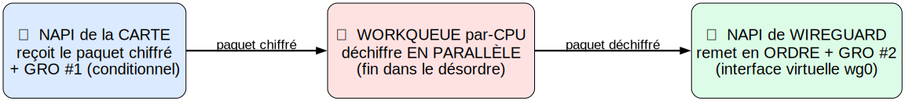
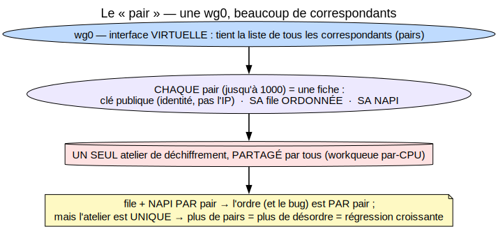
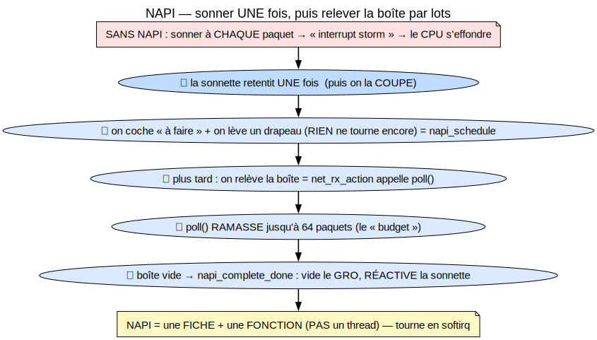
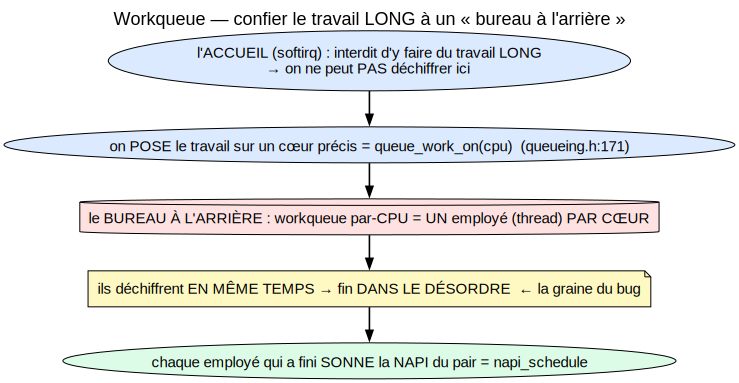
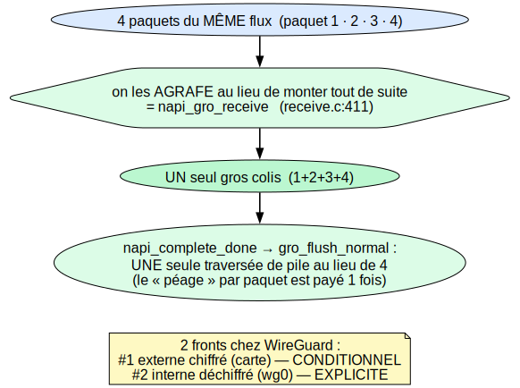
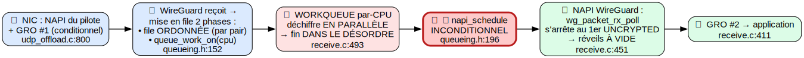
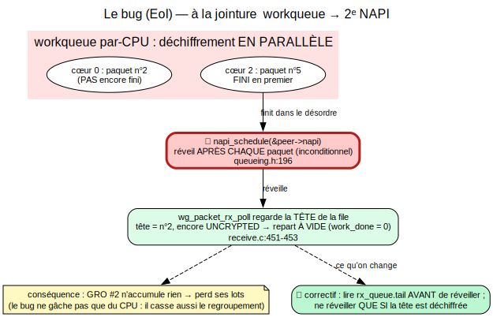

<!-- _class: lead -->
<!-- _paginate: false -->

# Chemin de réception de WireGuard sous forte charge
## Comprendre, mesurer, et corriger l'« inversion d'ordre d'exécution »

Anas Ait El Hadj — stage Inria (KrakOS)
Encadrants : **Alain Tchana** · **André Freyssinet**

---

## Le décor

- **WireGuard** = un VPN moderne, réputé **simple et rapide**, intégré au noyau Linux.
- Mais côté **serveur** (beaucoup de clients en même temps), la **réception** peut
  **saturer un cœur** → le débit plafonne.

**Question du stage :** *pourquoi* ça plafonne sur ce chemin, et *comment* faire mieux ?

---

## Ce qui motive

- Article de référence (Mounah *et al.*, **SYSTOR 2025**) : déplacer le **GRO** dans une
  **workqueue** → jusqu'à **× 4,7** de débit sur un serveur multi-clients.
- **Mon sujet :**
  1. **comprendre** précisément ce chemin de réception (NAPI / workqueue / GRO) ;
  2. le **mesurer** ;
  3. étudier un **bug connexe** — l'**inversion d'ordre d'exécution (EoI)** — et son
     **correctif**.

---

## La carte — le trajet d'un paquet (on y reviendra)



<span class="small">3 moteurs, dans 3 contextes d'exécution différents. On décortique chaque brique, puis on revient ici.</span>

---

## Brique 1 — le « pair »



<span class="small">Une fiche par correspondant (clé publique) · **1 `wg0` → jusqu'à 1000 pairs** · chacun a SA file et SA NAPI.</span>

---

## Brique 2 — NAPI



<span class="small">« Sonner une fois, puis relever la boîte par lots. » NAPI = **fiche + fonction** (pas un thread), tourne en **softirq**.</span>

---

## Brique 3 — la workqueue



<span class="small">Déchiffrer est **trop long** pour le softirq → **bureau à l'arrière** ; **un employé par cœur** → fin **dans le désordre**.</span>

---

## Brique 4 — GRO



<span class="small">Agrafer les paquets d'un même flux en un gros → **une seule** traversée de pile. Chez WG : **2 fronts**.</span>

---

## On assemble



<span class="small">Les 4 briques en place : NAPI(NIC) → workqueue par-CPU → NAPI(WireGuard) + GRO #2. *(schéma détaillé + preuves dans le rapport.)*</span>

---

## Le bug — inversion d'ordre d'exécution (EoI)



---

## Le correctif

**Avant** `napi_schedule`, lire le curseur de tête de la file ; ne réveiller **que si** la
tête est déjà déchiffrée.

```c
tail = READ_ONCE(peer->rx_queue.tail);
if (tail == (struct sk_buff *)&peer->rx_queue.empty ||
    atomic_read(&PACKET_CB(tail)->state) != PACKET_STATE_UNCRYPTED)
        napi_schedule(&peer->napi);     // sinon : on ne réveille pas
```

- **Sûr** : `tail` n'est écrit que par l'**unique consommateur** (file MPSC de Vyukov).
- Au pire, on ne réveille pas — le worker qui complétera la tête réveillera.

---

## Ce que j'ai fait (mesures, M1 / ARM)

- **Reproduit** le mécanisme sur ma machine (Apple M1, Fedora Asahi), multi-pairs.
- Mesuré : la **baisse de GRO grandit avec le nombre de pairs** (1 pair : rien ; 8/16/32 :
  effet croissant) — cohérent avec « le bug est par pair ».
- **Harnais** : contrôle de variance, métriques directes (compteurs GRO, `work_done`), sweep.
- **Limite honnête :** la boucle locale **ne sature pas** le débit (pas de vraie carte 25 G)
  → je vois le **mécanisme**, pas le **régime de débit** du papier.

---

## Validation x86 + la suite (CloudLab)

- **Le code se transfère** : site du bug, correctif, file MPSC, `rx_poll` **identiques**
  entre **Asahi/ARM** et **v6.1/x86** (papier) — seul un drapeau de workqueue diffère, **sans
  effet**.
- **CloudLab** (Ubuntu **x86**, vraie **NIC 25 G**, jusqu'à **1000 pairs**) → tester le
  **régime de débit** et le gain du correctif là où le papier mesure.

---

<!-- _class: lead -->

## Conclusion

**1.** Mécanisme de réception **compris et prouvé par le code** (NAPI / workqueue / GRO).

**2.** Bug **localisé** (réveil inconditionnel) + **correctif sûr** (lire la tête avant).

**3.** **Mesuré sur ARM** ; **validation x86 (CloudLab) en cours**.

<span class="small">Merci — questions ?</span>

---

<!-- _header: "ANNEXE" -->

## Annexe A — « une seule workqueue » vs « par-CPU »

- **Un seul** objet workqueue (`packet_crypt_wq`, `device.c:346`), partagé par tous les pairs.
- **« Par-CPU » = les *workers* sont par cœur** : `struct multicore_worker __percpu *worker`
  + `queue_work_on(cpu, …)` (`queueing.h:171`). Ce **n'est pas** N workqueues.

---

<!-- _header: "ANNEXE" -->

## Annexe B — cycle de vie NAPI (7 étapes)

`netif_napi_add` (`peer.c:57`) → `napi_enable` (`:58`) → `napi_schedule` (`queueing.h:196`)
→ `wg_packet_rx_poll` (`receive.c:438`) → `napi_complete_done` (`:488`) → `napi_disable`
(`peer.c:120`) → `netif_napi_del` (`:124`).

La structure vit dans `struct wg_peer` (`peer.h:65`). « Réveiller » = cocher + lever softirq
(`dev.c:6729, 4984, 4990`).

---

<!-- _header: "ANNEXE" -->

## Annexe C — Front #1 : chaîne d'appel (générique, hors WireGuard)

`poll()` du NIC → `napi_gro_receive` (`netdevice.h:4251`) → `gro_receive_skb` (`gro.c:626`)
→ `dev_gro_receive` (`gro.c:464`, dispatch `:517`) → `inet_gro_receive` (`af_inet.c:1468`,
dispatch `:1532`) → `udp4_gro_receive` (`udp_offload.c:874`) → `udp_gro_receive` (`:785`).

Fusion de l'UDP externe **conditionnelle** (`udp_offload.c:800-815`) ; WireGuard **n'opte
pas**.

---

<!-- _header: "ANNEXE" -->

## Annexe D — preuve à l'exécution (bpftrace)

```text
kretprobe:wg_packet_rx_poll { @work_done = lhist(retval, 0, 64, 8); }
```

- Le **pic dans le bucket 0** = réveils gâchés (EoI).
- Le **correctif** doit **faire fondre le bucket 0** et déplacer la masse vers > 1 (des lots).

