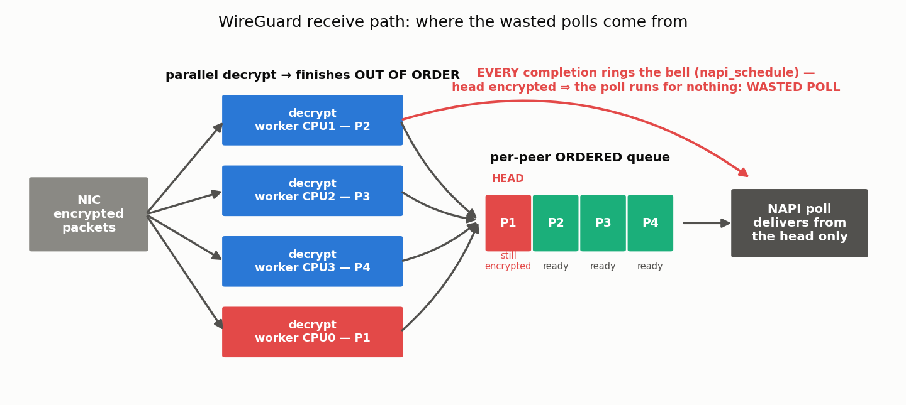
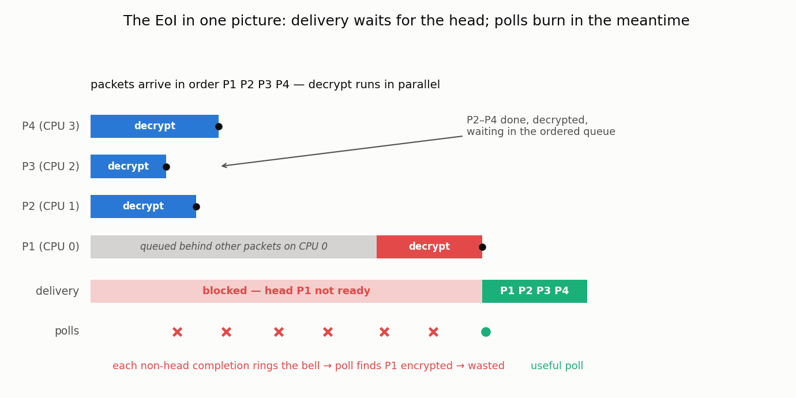
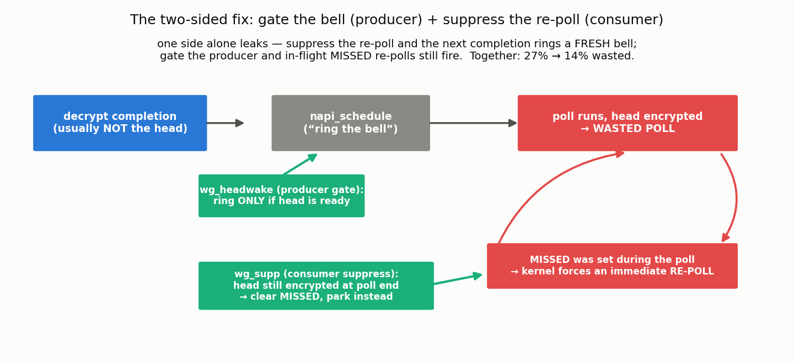
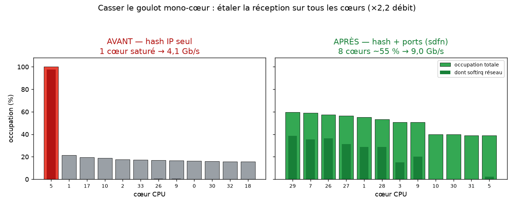
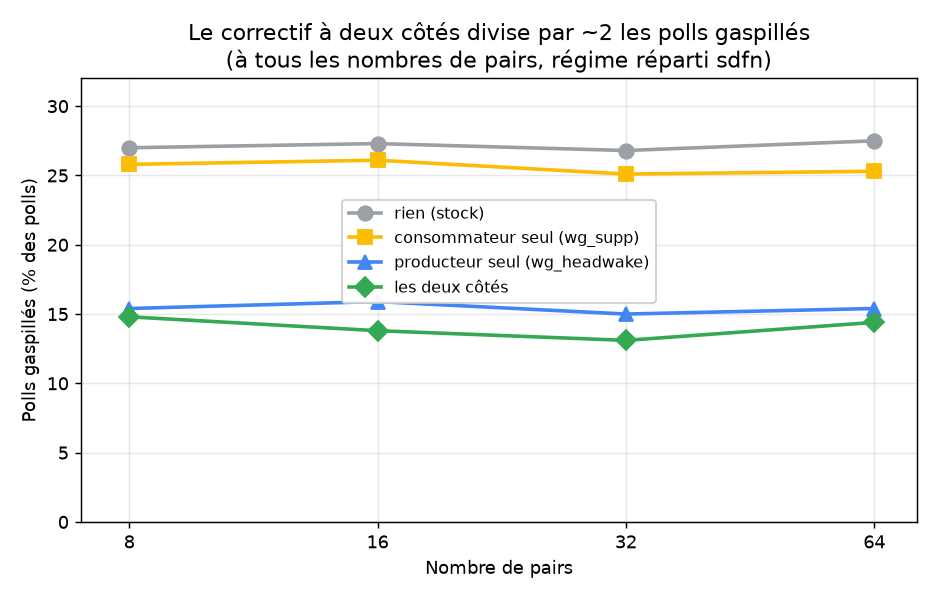
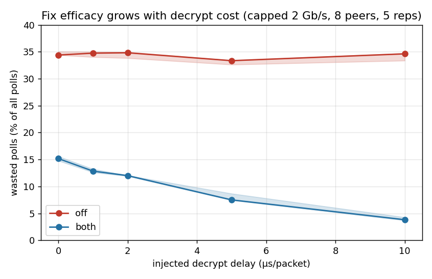
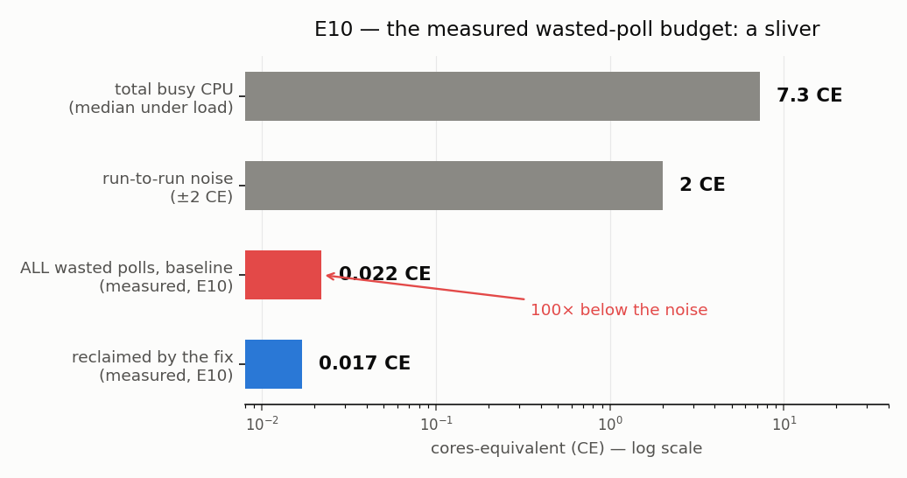
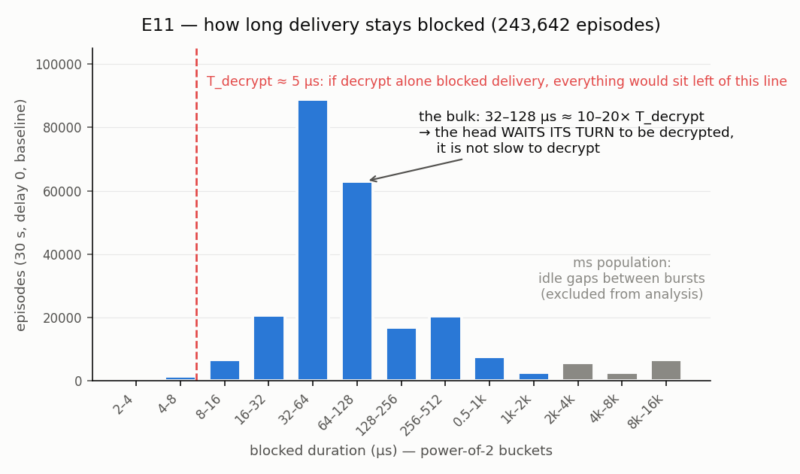
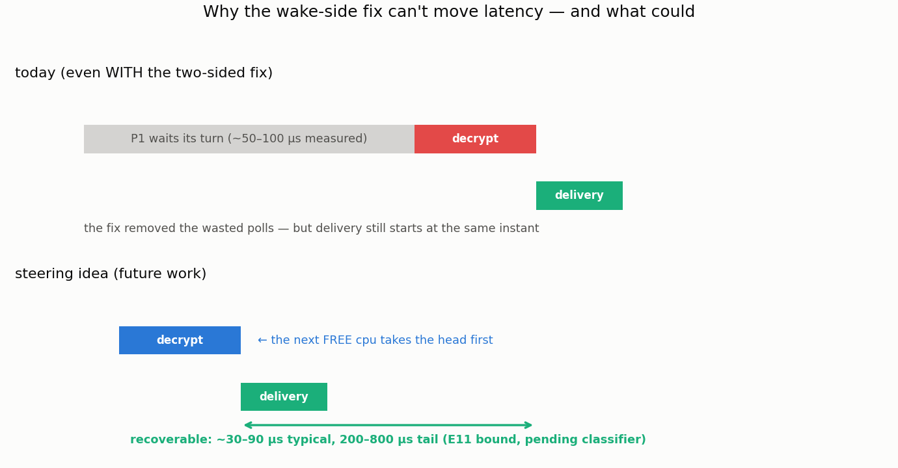

# CloudLab Experiments — Log / Findings

> The readable record of the CloudLab receive-path campaign: what question was tested,
> what ran, what was observed, what it meant, what was decided next. The full unedited
> chronological notebook (every run, error and dead end, newest-first) is preserved in
> [`CLOUDLAB_EXPERIMENTS_LOG_RAW.md`](CLOUDLAB_EXPERIMENTS_LOG_RAW.md); the polished
> synthesis is [`RECEIVE_PATH_FINDINGS.md`](RECEIVE_PATH_FINDINGS.md); runnable next
> steps are in [`CLOUDLAB_NEXT_STEPS.md`](CLOUDLAB_NEXT_STEPS.md).
> Author: Anas Ait El Hadj · Inria KrakOS (LIG).

---

## 0. Current status — read this first (2026-07-15)

The CloudLab campaign answered the main question.

- **The two-sided WireGuard fix is real**: it halves wasted polls on real 10G hardware
  (~27% → ~14%, stable from 8 to 64 peers).
- **But those wasted polls are too cheap to produce a visible CPU or latency win on
  c220g2.** Phase A (sub-saturation, 64 runs) is a clean CPU null; latency shows only a
  noisy, power-state-confounded trend and is not claimed.
- **Phase B showed the mechanism is dose-responsive**: the fix removes 56% of the waste
  on fast crypto and 89% when decrypt is slowed to 10 µs/packet — exactly as predicted —
  yet CPU and latency still do not move.
- **E10 measured why, directly**: baseline's *entire* wasted-poll budget is ~0.022
  cores-equivalent, about 100× below the ±2 CE run-to-run noise floor. The null is now a
  measurement, not an inference. *The fix removes many events, but not many cycles.*
- **E11 found a different latency opportunity, now classified (E11-C)**: delivery waits
  ~30–90 µs on heads that are *verifiably encrypted* — 150–300k such episodes per 30 s
  window, insensitive to injected decrypt delay: the head waits for scheduling, not for
  crypto. **Head-priority / decrypt-order steering** is handed over as evidence-backed
  future work (Finding 6).
- **The two-sided fix passed its reliability soak (Phase C)**: 30 min sustained load in
  the spread regime (4.2 then 9.57 Gb/s), plus 30 min in the harsher saturated funnel
  regime, zero kernel warnings, zero collapse, handshakes held — **`both` is
  recommendable** (Finding 7).

The surprising part is that the negative result is now one of the strongest results: we
know *why* the fix does not improve CPU. It is not because the fix is broken — it fires,
verifiably, and removes exactly what it targets. It is because the thing it removes is
extremely cheap on this hardware.

**Reopened 2026-07-10 — Phase D implemented the steering fix, and it works.** `wg_steal`
(the poll, blocked on an encrypted head, decrypts from the shared ring itself) crushes
the mechanism (−95% blocked time) and delivers the campaign's **first user-visible win**,
in the one regime `sdfn` cannot spread: a single tunnel. Both gates are now passed
(2026-07-15, instantiation #10, Finding 8):

- **Throughput: +2–4% around the knob's knee** — `wg_steal=4`: +4.15%, p = 0.008 by exact
  permutation test, 5 shuffled reps per value. (The smoke test's "+3–5%, no overlap" was
  optimistic: the ranges do overlap. The knee is at 4; `=1` does nothing, `=16` is no
  better.)
- **CPU: 3–5% *cheaper*, not neutral** — at every knob value, 5/5 same direction. The
  honest headline is **efficiency: +5.4–7.6% Gb/s per busy core, p = 0.008 at every
  value.** Stealing does not trade CPU for throughput; it buys both.
- **Why: the softirq core is pegged at 0.983 ± 0.003 CE in all 30 runs** — one tunnel,
  one RX queue, one saturated core: *that* is the 4.2 Gb/s ceiling. Stealing does not
  raise it, it stops wasting the cycles under it (the savings land on the worker side:
  3.77 → 3.60 CE).
- **Safety: soak with stealing ON: PASS** — 2×15 min (4.22 then 9.57 Gb/s), handshakes
  8/8, zero kernel warnings. It *did not reveal a reliability issue in the tested
  regimes*; crypto-in-softirq still deserves a scheduler-latency study before shipping.

So the campaign's arc is complete: the wake-side fix is real but too cheap to see; E11-C
located where the time actually goes; the steering fix converts that into a measurable
win. Remaining: (1) the `gro_wq` scope answer from Alain/André, (2) the final write-up.

**Reader map.**
- *2 minutes:* this section + the budget figure in Finding 5.
- *The mechanism:* §2 (mental model) + Finding 2.
- *The negative result and why it is solid:* Findings 3–5.
- *The win:* Findings 6 (where the time goes) → 8 (the fix that takes it).

## 1. What I was trying to answer

The question I brought to CloudLab was simple: the M1 loopback experiments showed that
WireGuard sometimes wakes its receive path even though no packet can be delivered yet.
If I avoid those wasted polls, do I get a real benefit on 10G hardware?

The answer turned out to be more nuanced. The fix is real — it removes the wasted
polls, and Phase B shows it becomes stronger exactly when the model predicts it should.
But on c220g2, the saved work is too small to show up as CPU or latency. So the useful
result is not "WireGuard became faster." It is: we know precisely where this waste sits
in the receive path, what it costs, and why it stays invisible on this hardware.

That also changed the direction of the project. The wake-side fix avoids useless
checks, but it does not make the head packet finish earlier. E11 suggests the next real
latency opportunity is different: the head packet spends tens of microseconds waiting
*before it even gets decrypted*. That points toward head-priority / decrypt-order
steering as future work.

## 2. Mental model: why WireGuard wastes polls

### 2.1 The normal receive path



Three things to hold onto: parallel decrypt is what gives multi-core throughput (good);
ordered delivery is a protocol requirement (non-negotiable); wasted polls are the
friction *between* the two — the delivery engine keeps checking a head that isn't ready.

### 2.2 Where the EoI appears



Every time a *non-head* packet (P2/P3/P4) finishes, it rings the delivery bell
(`napi_schedule`). The bell-ringing while P1 is still decrypting is what produces the
~27–34% wasted polls. Worse, a bell rung *during* a poll sets a MISSED flag that forces
an immediate re-poll — and 95–99.7% of the wasted polls are exactly these MISSED
re-polls. (Note the gray span in the figure — P1 sits *queued behind other packets
before its decrypt even starts*. File that away: it comes back as Finding 6.)

### 2.3 What the two-sided fix does



One side alone leaks: suppress only the re-poll, and the next non-head completion rings
a *fresh* bell (the waste "regenerates"); gate only the producer, and the MISSED
re-polls already in flight still fire. That is Alain's composition argument, and the
counters confirm it (Finding 2).

### 2.4 What the fix cannot do — by construction

The fix decides *when to check* the queue. It never touches *when P1 finishes
decrypting* — so it can never deliver any packet earlier. Its only possible user-visible
benefit is the CPU it frees. Keep this in mind for Findings 3–5: the latency null is not
an accident, it is structural. (What *could* deliver earlier is Finding 6.)

### 2.5 Vocabulary

| Term | Meaning |
|---|---|
| **EoI** | Execution Order Inversion: parallel decrypt finishes out of order, but delivery must be in order. |
| **wasted poll** | A NAPI poll (`wg_packet_rx_poll`) that delivers zero packets — ran, found the head not ready, exited. |
| **MISSED re-poll** | The kernel's self-rescheduled poll: a wake arriving during a poll forces another poll right after. |
| **fresh wake** | A wasted poll started by a brand-new `napi_schedule` — how waste regenerates with a one-sided fix. |
| **`off`** | Baseline WireGuard (called *stock* in old entries; all knobs 0). |
| **`wg_supp` / `wg_headwake` / `both`** | Consumer suppression / producer gate / the two-sided fix (old names: `move` / `root`). |
| **`sdfn`** | NIC hash setting adding UDP ports to the flow hash → tunnels spread across cores (default: IPs only → one core). |
| **CE (cores-equivalent)** | CPU normalized by wall time: 0.5 CE = half a core busy continuously; 8 CE = eight full cores. |
| **p99 / tail latency** | 99th-percentile round-trip time — the "worst moments" a user feels. |
| **`wg_decrypt_delay_ns`** | Knob injecting a busy-wait per decrypt — emulates slower crypto, poll cost untouched. |
| **stall episode** | First wasted poll after a productive one → next productive poll on the same NAPI: how long delivery stayed blocked. |
| **Phase A / Phase B / E10 / E11** | Sub-saturation CPU+latency campaign / decrypt-delay sweep / direct cost accounting / stall-gap measurement. |
| **srcversion** | Module build fingerprint recorded in every CSV row (`EA06EE82…` = the two-sided composable build). |

## 3. Main findings

### Finding 1 — Throughput was a parallelism problem, not a fix problem

At this point the main bottleneck was not WireGuard logic at all. The NIC was simply
sending all tunnels to the same receive core: its default flow hash looks only at IP
addresses, and all tunnels share the endpoint IP.

```text
default hash (sd):    8 tunnels → same RX queue → 1 core at 100% → 4.1 Gb/s
with ports (sdfn):    8 tunnels → 8 RX queues  → 8 cores ~55%   → 9.0 Gb/s
```

| NIC hash | Throughput | Cores receiving |
|---|---|---|
| `sd` (IPs only — the funnel) | 4.1 Gb/s | 1 (at 100%) |
| `sdfn` (+ UDP ports) | **9.0 Gb/s (×2.2)** | 8 (~55% each) |



Reverified on three separate instantiations. All later campaigns run in the `sdfn`
spread regime. *(Fil rouge: parallelism is both the cause of the EoI bug and the cure
for throughput.)*

> **What I learned.** Throughput was the wrong yardstick for this fix. The machine was
> not slow because of wasted polls; it was slow because every packet was landing on one
> receive core.

### Finding 2 — The two-sided fix halves wasted polls (Alain's composition was right)

The original M1 "six-line" producer-side fix alone is a **null on real hardware**
(Appendix C — at wake time the bell is usually already ringing). The two-sided version
from §2.3 is what works. Peer sweep, `sdfn` spread
(`data/cloudlab/twosided_peersweep_20260626.csv`):

| pairs | `off` | consumer only | producer only | **two-sided (`both`)** |
|---|---|---|---|---|
| 8  | 27.0% | 25.8% | 15.4% | **14.8%** |
| 16 | 27.3% | 26.1% | 15.9% | **13.8%** |
| 32 | 26.8% | 25.1% | 15.0% | **13.1%** |
| 64 | 27.5% | 25.3% | 15.4% | **14.4%** |



The leak §2.3 predicts is visible in the counters: consumer-only *raises* the
fresh-wake share of waste from ~3% to ~6% (the cancelled re-poll comes back as a fresh
bell), and adding the producer gate drops it to ~1%. The reduction is **flat from 8 to
64 peers** — the M1 "grows with peers" effect does not reproduce (Appendix C), but the
halving is solid. And the fix verifiably *fires*: in-module counters show `wg_supp`
acting in 96% of its target cases, and reading exactly 0 with the fix off — the nulls
that follow are not "a fix that doesn't fire".

> **What I learned.** The one-sided fix was incomplete, and Alain's composition point
> was exactly right: each side catches the waste the other leaks.

### Finding 3 — CPU and latency do not improve on c220g2 (a clean null)

Phase A asked: with CPU headroom (sub-saturation), does the saved poll work show up
where a user looks? The design point that matters: peer 0 carried *only* a
request/response latency probe — so we never measure a latency packet stuck behind its
own bulk traffic — while peers 1–7 created capped background WireGuard pressure.
`off` vs `both` × target loads 0/2/4/6 Gb/s × 8 reps, order fully randomized — 64 runs
(`subsat_20260701_0609.csv`).

- **Fair comparison, verified per run**: off-vs-both actual load matches within ≤3.4%
  (≤1.2% at 4/6 Gb/s) — `both` does not throttle throughput.
- **CPU: clean null.** Three independent lenses (softirq / system+IRQ / total busy CE)
  all indistinguishable at every load: deltas −4.7%…+1.6%, mixed signs, p≈0.4–1.0.
- **Latency: inconclusive and confounded.** `both` trends 7–8% lower on p99 at 2 and
  4 Gb/s but not significantly (p≈0.37–0.71, IQRs overlap), and the tail is *worst at
  the lowest nonzero bulk load* (~1.5 ms at 1.1 Gb/s vs ~1.0 ms at 3.1; 0-load floor
  ~370 µs) — the wrong direction for queueing, the classic signature of C-states under
  `schedutil`. Not claimed.

Figures: `fig_subsat_cpu.png`, `fig_subsat_latency.png`. Aborted-start CSVs
(`subsat_20260701_0400/0605`) kept as methodology provenance — the 0400 rows carry the
`REJECT_load_dev` flags that motivated per-run load verification.

> **What I learned.** A clean null is still a result — *because* the loads were matched,
> the order randomized and the CPU measured three ways, "nothing moved" is a defensible
> statement rather than an ambiguous one.

### Finding 4 — The mechanism is dose-responsive (the hero figure)

Phase B injects a per-packet busy-wait into decrypt (`wg_decrypt_delay_ns`), emulating
slower crypto under the same capped-load design (`decsweep_20260706_0321.csv`, 50/50
runs valid):



| injected delay | `off` wastes | `both` wastes | fix removes |
|---:|---:|---:|---:|
| 0 µs | 34.4% | 15.2% | **56%** of the waste |
| 1 µs | 34.7% | 12.8% | 63% |
| 2 µs | 34.8% | 12.0% | 66% |
| 5 µs | 33.3% | 7.5% | 78% |
| 10 µs | 34.6% | **3.8%** | **89%** |

Baseline stays flat (~34% — the waste is structural, not a speed artifact) while the
fix improves monotonically with tight intervals: **a dose-response**, the cleanest
mechanistic result of the project. Slower decrypt keeps the head encrypted longer,
which gives the producer gate more wakes to intercept — exactly the model's prediction.
Yet CPU deltas stay mixed-sign at every delay and p99 stays mixed — even at a
decrypt:poll cost ratio of ~10:1. (Suggestive only, not claimed: 10–30× fewer TCP
retransmits with the fix at 5–10 µs; n=5, high variance.) The earlier "stock waste
rises to ~44%" observation was an uncapped-load collapse artifact (Appendix C).
Second figure: `fig_decsweep_cpu.png`.

> **What I learned.** The mechanism is real precisely because it responds to the dose:
> when I make the disease worse, the medicine removes more of it. That is much stronger
> evidence than any single A/B.

### Finding 5 — The missing cycles were never there

This was the part that felt wrong at first. At 10 µs of injected decrypt delay, the
two-sided fix removes almost all of the wasted polls. Intuitively, that should save
*something* visible. E10 measured why it does not — with two independent instruments in
separate windows (bpftrace duration sums; perf cycle attribution).

The resolution: "89% of wasted polls" is not "89% of CPU". A wasted poll is a very
cheap check — **1.14–1.36 µs**, measured in-regime (the cost model said ~1.0; kretprobe
overhead makes this an upper bound). All of baseline's ~500k wasted polls per 30 s
window add up to:

```text
total busy CPU under load:    ~7–9  CE
run-to-run noise:             ±2    CE
ALL wasted polls (baseline):   0.022 CE   ← the entire disease
saved by the fix:              0.017–0.022 CE
```



perf agrees from the other direction: the entire poll+wake machinery
(`wg_packet_rx_poll` *including its useful work* + `napi_complete_done` +
`__napi_schedule`) is **<0.7% of all busy cycles** in every condition. The CPU lives in
per-packet delivery, decrypt workers, TCP/IP and userspace — not in polls.

So the final interpretation is simple: **the fix removes many events, but not many
cycles.** The event counter moves a lot because we target exactly that event; the CPU
counter does not move because that event was a tiny fraction of the total cost. And per
§2.4, latency could not move either — the fix never makes the head deliverable earlier.
Bonus observation: with the fix on, polls are fewer but longer (15 → 23 µs average) —
deliveries consolidate into bigger batches, the M1 GRO-batch effect on real hardware.
Per-cell data provenance: §7.

> **What I learned.** Event counts are not CPU cost. A percentage is only as meaningful
> as the budget of the thing it is a percentage *of* — and we should have priced the
> waste in CE from day one.

### Finding 6 — The next latency opportunity: head-priority steering

E11 measured how long delivery actually stays blocked when a poll finds the head not
ready (stall episodes, baseline, delays 0/2/5/10 µs):



The bulk of stalls sit at **32–128 µs ≈ 10–20× T_decrypt** (~5 µs) — and the median
**does not move** when +10 µs of decrypt delay is injected. That distinction matters:
the crypto itself is not the delay. The head packet spends most of its blocked time
waiting *before a worker actually gets to it* — queued behind other packets on its
assigned CPU, or waiting for the kworker to be scheduled (it matches the bimodal
Δ_complete ~5 µs / ~100 µs from the cost model). That is why the current wake-side fix
cannot help latency, and why a head-priority design is more interesting:



Being precise about the epistemic status:

```text
What E11 proves:        stall gaps are tens of µs and not explained by decrypt time.
What E11 suggests:      worker queueing / decrypt ordering is responsible.
What E11 does NOT prove: that all those gaps are true head-blocked stalls —
                        ~46% of wasted polls find an EMPTY queue, and the probe
                        cannot tell the two apart per episode.
Next step:              classify episodes in wg_diag (~20 lines), re-run E11.
```

Conservative bound, with the agreed correction chain (raw gap = upper bound on blocked
time; ×~54% head fraction; − decrypt floor): **typically ~30–90 µs recoverable, tail
population 200–800 µs** — above the "not worth it" band (5–20 µs), tail beyond the "go"
threshold (100 µs). The ms-scale population (~6% of episodes) is inter-burst idle and
excluded. **Decision: do not implement steering yet; build the classifier first.**

**UPDATE — the classifier ran (E11-C, 2026-07-09/10).** The module now classifies every
episode at the source (`wg_diag_stall_{empty,uncrypt}` arrays: count, total, max, and
buckets ≤16 µs / 16–128 µs / 128 µs–1 ms / >1 ms). Two campaigns — instantiation #8
(`stallclass_20260709_0727.csv`) and a spread-regime-guaranteed rerun on #9
(`stallclass_20260710_0332.csv`, NIC autodetected) — agree:

- **The UNCRYPTED-head class is real and big**: 150k–298k episodes per 30 s window,
  **mean 35–94 µs in the spread regime** (44–171 µs on #8), bulk in the 16–128 µs
  bucket, ≤1% above 1 ms, max 2–4.6 ms — and still **insensitive to injected decrypt
  delay** (means at 10 µs delay ≈ means at 0). The head verifiably waits for
  *scheduling*, not for crypto.
- **The empty class carries the entire ms tail** (means 0.5–1.3 ms, 19–28k episodes
  >1 ms per window vs ≤1.5k for uncrypt) — the bpftrace-era exclusion of the ms
  population as inter-burst idle is now measured, not assumed.
- **Against the decision rule**: classified recoverable excess (mean − 5–16 µs decrypt
  floor) is **~30–80 µs typical**, with 2–10% of episodes in 128 µs–1 ms. Above the
  "not worth it" band; the mean sits just under a clean 100-µs-everywhere. Verdict at
  the time: **steering is worth designing** — the classifier, the numbers and the bounded
  prize were meant as the handover. Rep-to-rep spread is visible (n=3 per delay), so the
  estimate itself is worth tightening with more reps.

> **Reopened by Finding 8 (2026-07-10/15).** This finding closed as "future work" and was
> reopened the same day: the steering fix (`wg_steal`) got implemented and measured after
> all. The prize bounded here is what it went after — see Finding 8 for what it actually
> yielded, and note the twist: the blocked time is real, but the user collects it as
> throughput and CPU on a pegged core, not as probe latency.

> **What I learned.** The wake-side fix and latency were never going to meet — the fix
> optimizes the *checking*, not the *readiness*. The classifier settled the last
> ambiguity: delivery really does wait ~30–90 µs on heads that are verifiably encrypted,
> 10× their decrypt time. That is the handover point for a head-priority design.

### Finding 7 — The two-sided fix is safe to run (Phase C soak: PASS)

The producer gate carries a theoretical lost-wakeup risk (a skipped wake ⇒ a TCP flow
deadlocks); the Dekker publish-then-recheck is meant to close it. The empirical gate,
30 minutes of sustained load with `both` ON, sampling throughput / handshakes / kernel
log every 15 s (`measure_soak.sh`):

- **Spread regime (#9, `soak_20260710_0349.csv`): PASS.** 15 min capped at a rock-steady
  4.22 Gb/s, then 15 min uncapped at **9.57 Gb/s** (line-rate spread confirmed),
  handshakes 8/8 throughout, **zero** rcu/stall/hung/BUG/WARNING lines.
- **Bonus, the harsh case** (`soak_20260710_0238.csv`): a first run accidentally executed
  in the single-core *funnel* regime — the exact regime where the original headwake
  stall appeared — 30 min saturated at a stable 4.42 Gb/s, zero kernel warnings, no
  collapse. (Its FAIL verdict was a harness artifact: a 7/8 handshake count from the
  module reload, since fixed with a warm-up; details in §6.)

**Consequence: `both` is recommendable in the report** — mechanically verified,
dose-responsive, and now soak-tested in both the nominal and the worst-case regime.

> **What I learned.** The "wasteful" MISSED re-poll is the kernel's safety net, and we
> removed half of it — the soak is what says we didn't remove the safety with it.

### Finding 8 — The work-stealing poll: a real win, and it is a CPU win first

Phase D's smoke test said single-tunnel throughput +3–5%. Gate 1 re-ran that properly:
`wg_steal` ∈ {0,1,2,4,8,16} × 5 shuffled reps, 20 s of uncapped `iperf3 -P 4` through a
single tunnel, CPU captured around each exact window (`measure_single.sh`,
`single_20260715_0516.csv`, instantiation #10). Each value is tested against `off` with an
**exact permutation test** (C(10,5) = 252 splits ⇒ the smallest reachable two-sided p is
0.008; with 5 comparisons, read against a Bonferroni threshold of 0.01).

| `wg_steal` | Gb/s (mean) | vs off | p | busy CE | vs off | p | Gb/s per busy core |
|---|---|---|---|---|---|---|---|
| 0 | 4.193 | — | — | 4.788 | — | — | 0.876 |
| 1 | 4.193 | +0.00% | 1.000 | 4.540 | **−5.17%** | **0.008** | 0.924 |
| 2 | 4.266 | +1.74% | 0.341 | 4.595 | **−4.03%** | **0.008** | 0.928 |
| 4 | **4.367** | **+4.15%** | **0.008** | 4.634 | −3.20% | 0.016 | **0.942** |
| 8 | 4.311 | +2.81% | 0.040 | 4.624 | **−3.42%** | **0.008** | 0.932 |
| 16 | 4.269 | +1.80% | 0.151 | 4.616 | −3.59% | 0.016 | 0.925 |

Read honestly, this is **weaker on throughput and stronger on CPU** than the smoke test
suggested:

- **Throughput**: the win survives, but only at the knee. `wg_steal=4` gives +4.15%
  (p = 0.008, survives correction); `=8` gives +2.81% (p = 0.04, does not). Unlike the
  smoke run, the ranges now **overlap** (off 4.14–4.24 vs steal=8 4.22–4.40) — so the
  claim is "+2–4% around the knee", not "no overlap, +4%". `=1` is worthless for
  throughput (one steal per poll never unblocks the head); `=16` is no better than `=4`.
- **CPU**: stealing is **cheaper, not neutral** — every knob value lands 3–5% below
  baseline, 5/5 in the same direction. That settles the review's open question: the
  Phase D A/B's "steal-alone 8.33 CE" was noise. Stealing does not buy throughput with
  CPU; it buys both.
- **Efficiency** (Gb/s per busy core, the per-run ratio, immune to the throughput wobble)
  is the most robust number here: **+5.4% to +7.6%, p = 0.008 at every single knob value**.

**Why — and this is the part the sweep taught us.** `softirq_ce` is pinned at
**0.983 ± 0.003 CE across all 30 runs** (sd = 0.3%), whatever the condition. One tunnel
funnels to one RX queue whose softirq core is saturated at exactly one core: *that* is the
4.2 Gb/s ceiling. So stealing cannot add softirq CPU — there is none to add. It changes
what the pegged core does with its cycles (decrypting in place instead of re-polling a
head that is not ready), and the savings show up entirely on the **worker side**:
system-minus-softirq drops 3.77 → ~3.60 CE. Fewer handoffs, fewer wakeups, less
cross-core ping-pong for the same delivered bytes.

```text
Single tunnel, off:     [softirq core: 1.00 CE, pegged]  -> blocked polls + handoffs
                        [workers: 3.77 CE]                   4.19 Gb/s
Single tunnel, steal=4: [softirq core: 1.00 CE, pegged]  -> decrypt in place
                        [workers: 3.62 CE]                   4.37 Gb/s
```

**Gate 2 — the safety soak with stealing ON: PASS** (`soak_20260715_0530.csv`,
`wg_supp`+`wg_headwake`+`wg_steal=8`, srcversion `40814CD3…`). 15 min capped at a steady
4.22 Gb/s, then 15 min uncapped at **9.57 Gb/s**, handshakes 8/8 throughout, **zero**
rcu/stall/hung/BUG/WARNING lines — and zero across the sweep's 30 runs too. The medians
match Phase C's to the cell because both stages are ceiling-bound (stage 1 capped at
4 Gb/s, stage 2 at 10GbE line rate); the file is not a duplicate. Stated with the
discipline the campaign has used throughout: this **did not reveal a reliability issue in
the tested regimes** — it is not a proof of production-safety, and running crypto inside
softirq deserves a scheduler-latency study before anyone ships it.

> **What I learned.** I went looking for a throughput win and found a CPU win wearing a
> throughput costume. The ceiling was never "the machine is out of cycles" — it was "one
> core is pegged, and it is spending some of its cycles asking a question whose answer is
> still no". Stealing does not raise the ceiling; it stops wasting the cycles under it.

### Finding 9 — Gate A: the saturated-regime win holds under paired confirmation

Finding 8 rested on one discovery sweep with n=5 per knob value and a p-value floored at
0.008. Gate A re-tested it as a **randomized paired confirmation on the same CloudLab
instantiation after controlled environment reset**: 12 randomized paired blocks, each
containing `off` / `both` / `steal4` / `bsteal4` once in re-shuffled order, 30 s of
uncapped single-tunnel `iperf3 -P 4` per run, 48 complete runs, zero relevant kernel
warnings, analyzer exit 0 (`measure_confirm.sh`, `confirm_20260716_090437.csv`).
Analysis is on **within-block paired deltas** with an exact two-sided sign-flip test
(floor 2/4096 ≈ 0.000488 at 12 blocks). The **co-primary endpoints**, declared before
the run, are throughput and total busy CPU for `steal4 − off`; throughput per busy
core-equivalent is a **secondary derived endpoint**, not a co-primary.

| `steal4 − off` — Gate A endpoints | effect | exact p | favorable blocks |
|---|---|---|---|
| throughput *(co-primary)* | **+1.96%** (+0.082 Gb/s, CI95 [+0.034, +0.130]) | **0.0103** | 9/12 |
| total busy CPU *(co-primary)* | **−3.66%** (−0.176 CE, CI95 [−0.204, −0.146]) | **0.000488** | 12/12 |
| Gb/s per busy CE *(secondary derived)* | **+5.83%** | 0.000488 | 12/12 |

> In the uncapped saturated single-tunnel regime, `wg_steal=4` reproduced a reduction in
> total CPU and an increase in throughput, yielding a substantial improvement in
> delivered throughput per core-equivalent.

Both co-primaries passed in the favorable direction — and the CPU side is again the
stronger of the two: perfect sign consistency at the exact-test floor, versus a +2%
throughput effect that sits inside Finding 8's "+2–4% around the knee" claim but below
the sweep's +4.15% point estimate.

**Composition** (secondary family, Holm-adjusted): for `both − off`, no throughput
effect was detected (−0.13%, p = 0.60) while a small CPU reduction was detected
(−0.62%, p_holm = 0.032) — for the wake-only stack, no detectable throughput effect
was observed in this regime, alongside a small real CPU saving. A small secondary CPU reduction was observed for
`both` versus `off`, but **no incremental throughput, CPU, or efficiency effect was
detected for `bsteal4` versus `steal4`** (p = 0.61 / 0.75 / 0.62), and the 2×2 factorial
interaction was not detected on any metric. This does not establish equivalence or prove
redundancy.

**Evidence.** Raw: `confirm_20260716_090437.csv` + `.meta`/`.percore`/`.dmesg` sidecars
and 48 raw iperf JSONs (commit `fc9fd60`). Analysis: `confirm_20260716_090437.analysis.txt`
(commit `87fb8d4`). Harness provenance stamped and verified per run:
`9c2c35f514652d685527db0a0e0363ba1f55540e`. Module srcversion `40814CD3…`.

### Finding 10 — Gate B: no favorable CPU effect detected at matched sub-saturated load

The remaining claim was "same bytes, less CPU". Gate B tested it directly, as a
**CPU-only matched-load paired confirmation** on the same instantiation after controlled
reset: 8 randomized paired blocks × the same four conditions, 32 complete runs, 60 s
exact windows, `CPU_ONLY=1` (no Sockperf process of any kind), bulk capped at
`LOAD=3.58` Gb/s at the application layer so the **delivered** load — measured from
`wg0` rx_bytes over the exact CPU window — lands on the predeclared 3.8 Gb/s target
(`measure_fixedload.sh`, `fixedload_cpu_20260718_024625.csv`, analyzer exit 0).

The validity gates all passed, and tightly: measured loads spanned **3.8012–3.8027 Gb/s**
(maximum deviation from target 0.071% against a ±5% gate), the worst required
within-block paired-load mismatch was **0.0316%** (gate: 1.5%), the per-core sidecar
carried 1,280 unique `(block, position, cpu)` tuples (32 runs × 40 CPUs), dmesg logged
zero relevant warnings, and the raw directory holds exactly 32 iperf JSONs and no
Sockperf file.

**Primary** (`steal4 − off` on total busy CPU): mean **−0.047 CE (−1.17%)**, bootstrap
CI95 **[−0.245, +0.134] CE**, favorable in **3/8 blocks**, exact p = **0.6562**. No
favorable matched-load CPU effect was detected at approximately 3.8 Gb/s. The confidence
interval includes both a moderate saving and a small cost, so the result does not
establish absence of an effect or equivalence. No secondary comparison was detected
after Holm adjustment (smallest p_holm = 0.43; interaction −0.002 CE, p = 0.98).

**Mechanism, descriptively.** Descriptive mechanism evidence at matched load showed that
the mean classified head-blocked count fell from approximately 743,942 episodes per
window with `off` to 10,021 with `steal4`, a reduction of about 98.7%. The `steal4`
condition pulled approximately 2.32 million decrypt jobs per window. These counters show
that stealing nearly eliminated the observed classified head-blocked population, even
though this did not translate into a detectable total-CPU saving at that load. These
counters are descriptive mechanism evidence, not a statistically tested endpoint,
latency evidence, or proof of user-visible benefit.

**Across the two regimes.** In the uncapped single-tunnel campaign, where the RX softirq
workload was near one full core-equivalent, `wg_steal=4` reduced total busy CPU by 3.66%
and increased throughput by 1.96%. At an exactly matched delivered load of approximately
3.8 Gb/s, where softirq consumption averaged about 0.81–0.86 core-equivalents, the
measured CPU contrast was −0.047 CE (−1.17%; CI95 [−0.245, +0.134], exact p = 0.656),
and no favorable CPU effect was detected. This cross-regime pattern is consistent with
stealing providing its detectable payoff when the pinned RX/softirq core approaches the
binding limit, but it does not formally establish a saturation-by-treatment interaction
or prove that no effect exists below saturation.

**Latency.** Same-tunnel latency was attempted in a preliminary loaded-tunnel smoke, but
the closed-loop UDP Sockperf probe could stall after an unanswered packet, producing
condition-dependent valid durations and insufficient p99.9 sample support. The resulting
percentile distributions were not comparable, so no user-visible latency claim is made.
A future latency study should use an open-loop or otherwise loss-tolerant probe.

**Evidence.** Raw: `fixedload_cpu_20260718_024625.csv` + sidecars, 32 raw iperf JSONs,
both preserved smoke attempts (commit `63b125a`). Analysis:
`fixedload_cpu_20260718_024625.analysis.txt` (commit `f50dd08`). Harness provenance:
`d6dae228c1142a751915e72b62a7164f9cbd8034`. Module srcversion `40814CD3…`.

> **What I learned.** The payoff was detectable in the uncapped saturated regime, while
> no favorable CPU effect was detected at the tested matched load of approximately
> 3.8 Gb/s. That pattern is consistent with the pinned RX/softirq core needing to
> approach the binding limit before the benefit becomes measurable, but the two
> campaigns do not prove an exclusive saturation threshold or the absence of an effect
> below it. The mechanism still fired below the ceiling — the classifier watched the
> blocked population vanish — and a non-detection with every validity gate green is not
> a failure; it is where the claim's support currently ends.

## 4. Timeline of experiments

| Date | Experiment | What changed | Result | Status |
|---|---|---|---|---|
| 06-17 | Testbed live (instantiation #1) | 2× c220g2, 10G link, kernel 5.15 verified | probes confirmed, BTF present | settled |
| 06-18 | EoI reproduction (1 peer) | first bpftrace on real NIC | 35.8% wasted polls — EoI is real off-loopback | settled |
| 06-18 | Modules built | M1 patch applies unchanged on 5.15 | stock + patched `.ko` | settled |
| 06-19 | Six-line fix A/B (8 peers) | first real-NIC A/B | **null** + diagnosis (wake already pending ~63%) | settled |
| 06-19 | Cost model (E2–E5) | per-step probes | T_decrypt 5–6 µs, C_poll ~1 µs, C_deliver ~1.6 µs | settled |
| 06-22 | Saturation diagnosis | per-core CPU under load | one-core funnel: IP-only NIC hash | settled |
| 06-23 | Trigger module + `wg_supp` | single-binary runtime knobs | suppression works (−5 pp) but throughput flat | settled |
| 06-24 | `wg_headwake` + **sdfn spread** | producer gate; NIC hash change | 33→20% wasted; **4.1→9.0 Gb/s (×2.2)** | settled |
| 06-24 | Mechanism verification | in-module counters | `wg_supp` fires 96%; waste regenerates as fresh wakes | settled |
| 06-25 | Point with Alain | reframe: compose the fix; measure CPU at sub-saturation; sweep decrypt cost | two-sided build (`EA06EE82…`), 30.4→15.3% single-run | settled |
| 06-26 | Two-sided peer sweep (#3) | 8–64 peers, warm-up added | **27→14% wasted, flat across peers** | settled |
| 07-01 | Phase A campaign (#5) | sub-saturation, 64 runs | data collected | settled |
| 07-02 | Phase A analysis | — | **clean CPU null**; latency confounded | settled |
| 07-02/03 | Phase B attempt (#6) | rewritten capped-load sweep | ran clean; **data lost to lease expiry** | superseded by 07-06 |
| 07-06 | Phase B (#7) | capped-load decrypt sweep, 50 runs | **dose-response 56→89% waste removed; CPU/latency still null** | settled |
| 07-06 | E10 cost accounting | bpftrace duration sums + perf | wasted-poll budget **0.022 CE**, 100× under noise | settled |
| 07-06 | E11 stall gaps | episode probe, delays 0–10 µs | median stall 50–100 µs, delay-insensitive | superseded by E11-C |
| 07-09 | E11-C classified stalls (#8) | in-module per-episode classifier | UNCRYPT class real: mean 44–171 µs, delay-insensitive | settled |
| 07-10 | E11-C rerun, spread-guaranteed (#9) | NIC autodetection | UNCRYPT mean 35–94 µs; empty class holds the ms tail | settled |
| 07-10 | Phase C soak (#9) | `both` ON, 2×15 min + funnel bonus run | **PASS** — 0 dmesg hits, no collapse, 9.57 Gb/s line rate | settled |
| 07-10 | **Phase D: wg_steal** (#9) | work-stealing poll implemented + A/B | blocked time **−95%**; CPU neutral; probe p99 null; **single-tunnel +3–5%** | needs soak + sweep |
| 07-15 | **Phase D gates** (#10) | single-tunnel `wg_steal` sweep 0/1/2/4/8/16 ×5; soak with steal ON | knee at 4: **+4.15% Gb/s** (p=0.008); CPU **−3–5%** at every value; **efficiency +5.4–7.6%** (p=0.008 ∀); soak **PASS** | Finding 8 |
| 07-16 | **Gate A paired confirmation** (#10, controlled reset) | 12 randomized paired blocks × {off, both, steal4, bsteal4}, 30 s uncapped | co-primaries confirmed: **+1.96% Gb/s** (p=0.010), **CPU −3.66%** (p=0.0005, 12/12); efficiency +5.83% (secondary derived) | Finding 9 |
| 07-18 | **Gate B CPU-only matched load** (#10, controlled reset) | 8 paired blocks, `CPU_ONLY=1`, delivered 3.80 Gb/s from wg0 rx_bytes | primary **not detected** (−1.17%, p=0.66, CI [−6.1%, +3.3%]); blocked episodes −98.7% (descriptive) | Finding 10 |

## 5. Journal — the decisions, entry by entry

Fixed template per entry: *Question → Setup → Result → Interpretation → Decision →
Artifacts.* Full raw detail for every entry (including all E0.x setup steps):
`CLOUDLAB_EXPERIMENTS_LOG_RAW.md`.

### 2026-06-18 — EoI reproduced on real hardware

**Question.** Does the wasted-poll signature exist outside the M1 loopback at all?
**Setup.** Stock in-tree module, 1 peer, iperf3 through the tunnel, bpftrace histogram
of `wg_packet_rx_poll` return values, 20 s.
**Result.** 35.8% of polls returned zero packets; single TCP stream 4.75 Gb/s,
CPU-bound on one core (not link-bound).
**Interpretation.** The EoI is real on real hardware — go. Single-peer throughput is
single-core-bound, so multi-core needs multiple peers.
**Decision.** Build stock+patched modules, scale to 8 peers.
**Artifacts.** raw log E1 entry; probe one-liners in `CLOUDLAB_NEXT_STEPS.md`.

### 2026-06-19 — The M1 six-line fix is null on a real NIC — and why

**Question.** Does the original producer-side fix cut the 33% wasted polls at 8 peers?
**Setup.** Stock vs patched module A/B, 8 peers, repeated runs.
**Result.** No effect (33.0% vs 33.2%); later confirmed with tight error bars (CV<2%).
Diagnosis with tracing: when a non-head completion calls `napi_schedule`, a poll is
already running ~63% of the time — the call is a no-op whose only effect (setting
MISSED) the fix does not prevent; the fix also sits on the wrong side to stop re-polls.
**Interpretation.** Not a measurement failure — the fix's premise doesn't hold under
real-NIC timing. The waste is MISSED-re-poll-driven.
**Decision.** Attack the re-poll site (consumer side) and, per Alain later, the
regeneration (producer side). Build the cost model first.
**Artifacts.** raw log entries E1-A/B + DIAGNOSIS; `MISSED_REPOLL_PROOF.md`.

### 2026-06-19→24 — Cost model measured (E2–E5)

**Question.** What does each step of the receive path actually cost?
**Result.** `T_decrypt` ≈ 5–6 µs/packet; `Δ_complete` bimodal ~5 µs (active) / ~100 µs
(idle); `C_poll` ≈ 1.0 µs (empty poll); delivery setup ≈ 3.7 µs; `C_deliver` ≈ 1.64
µs/packet in-poll.
**Interpretation.** A wasted poll is the cheapest operation in the chain — first hint
that waste *count* and waste *cost* are different questions.
**Decision.** These numbers calibrate everything after (trigger design, Phase B delays,
E10 predictions).
**Artifacts.** raw log E2–E5 entries; summary table preserved in Appendix B.

### 2026-06-22→24 — The single-core wall, and the ×2.2 that isn't the fix

**Question.** Why does throughput sit at 4.1 Gb/s on a 10G link whatever we fix?
**Setup.** Per-core CPU accounting under load; then `ethtool -N … rx-flow-hash udp4 sdfn`.
**Result.** One core 100% (97% softirq), all others ≤22%, regardless of variant. With
`sdfn`: 8 cores at ~55%, 9.0 Gb/s — reverified on later instantiations.
**Interpretation.** The wall was NIC flow placement (IP-only hash), not WireGuard.
Throughput is the wrong yardstick for the EoI fix.
**Decision.** All later campaigns run in the spread regime; the fix is judged on
CPU/latency at sub-saturation (Alain, 06-25).
**Artifacts.** `cpu_sd_spread.csv`, `cpu_sdfn_spread.csv`, `fig_spread.png`.

### 2026-06-24→26 — Two-sided fix built and verified (the mechanism result)

**Question.** Can consumer suppression + producer gating compose, and does the pair cut
the waste both sides leak individually?
**Setup.** `receive.c` made composable (srcversion `EA06EE82…`); `measure_missed.sh`
with warm-up; peer sweep 8/16/32/64, sdfn.
**Result.** 27→14% wasted at every N (Finding 2 table); fresh-wake regeneration visible and
closed; `wg_supp` verified firing at 96% via in-module counters (0 with fix off).
**Interpretation.** The two sides are additive exactly as Alain reasoned; the M1
peer-growth does not reproduce, the halving does.
**Decision.** `both` becomes the candidate fix; question moves to user-visible payoff.
**Artifacts.** `twosided_peersweep_20260626.csv`, `fig_twosided_peers.png`,
`build/wg515-trigger/`.

### 2026-07-01→02 — Phase A: sub-saturation CPU/latency (clean null)

**Question.** With CPU headroom, does the saved poll work show in CPU or tail latency?
**Setup.** Instantiation #5; dedicated latency peer + capped bulk peers; off vs both ×
0/2/4/6 Gb/s × 8 reps, randomized; per-run load verification.
**Result.** CPU: deltas −4.7…+1.6%, mixed signs, three lenses agree (null). Latency:
7–8% p99 lean at mid loads, not significant, C-state-confounded (Finding 3).
**Interpretation.** A defensible null, not an ambiguous one — the harness separated the
failure modes it was designed to separate.
**Decision.** Reprioritize to Phase B (decrypt sensitivity), where a win could still
live.
**Artifacts.** `subsat_20260701_0609.csv` (+`0400/0605` provenance),
`analyze_subsat.py`, `fig_subsat_cpu/latency.png`.

### 2026-07-06 — Phase B: decrypt-cost sweep (dose-response, still no payoff)

**Question.** Does slower crypto make the fix matter?
**Setup.** Instantiation #7; rewritten capped-load single-window sweep (the 06-26
uncapped attempt collapsed — Appendix C); delays 0/1/2/5/10 µs × off/both × 5 reps.
**Result.** Fix removes 56→89% of the waste as delay grows; baseline flat ~34%; CPU and
p99 still mixed-sign at every delay (Finding 4).
**Interpretation.** Mechanism dose-responsive — the strongest mechanistic evidence yet —
but the absolute saving stays micro on this hardware.
**Decision.** Stop asking "does it pay here" and measure the cost model itself (E10) +
the blocked-head time (E11).
**Artifacts.** `decsweep_20260706_0321.csv`, `analyze_decsweep.py`,
`fig_decsweep_wasted/cpu.png`.

### 2026-07-06 — E10: direct cost accounting (the null, measured)

**Question.** Is a wasted poll really ~1 µs, or is there hidden cost (IPIs, cache,
scheduler) the duration histogram missed?
**Setup.** Same capped load; off vs both at delay 0 and 10 µs; bpftrace duration *sums*
and perf cycle attribution in **separate** windows; two runs (first had one cold window
and an E11 script bug — per-cell provenance in §7).
**Result.** Wasted poll = 1.14–1.36 µs; baseline's total waste = **0.022 CE**; poll+wake
machinery < 0.7% of busy cycles (Finding 5).
**Interpretation.** No hidden cost. The CPU null is measured. *Many events, not many
cycles.*
**Decision.** Close the cost question; keep the "fewer, longer polls" batching
observation for the report.
**Artifacts.** `costacct_20260706_0539/` + `_0613/`, `measure_cost_accounting.sh`,
`fig_e10_budget_en.png` (FR version for the point docs: `_fr`).

### 2026-07-06 — E11: stall-episode gaps (the steering bound)

**Question.** How long does delivery stay blocked on a not-ready head — i.e. what could
a head-priority scheme recover at best?
**Setup.** Baseline, delays 0/2/5/10 µs; per-NAPI episode timing (first wasted →
next productive poll).
**Result.** Bulk of stalls 32–128 µs, median delay-*insensitive*; bimodal with an
excluded ms idle population (Finding 6).
**Interpretation.** The head waits for scheduling, not for crypto. Conservative
recoverable excess ~30–90 µs typical, 200–800 µs tail — promising but contaminated.
**Decision.** Build the wg_diag per-episode classifier before any steering design.
**Artifacts.** `costacct_20260706_0613/stall_d*.txt`, `fig_e11_stall_en.png` (FR: `_fr`).

### 2026-07-09/10 — E11-C and the soak (the closing experiments)

**Question.** Are the long stalls really blocked-on-encrypted-head (steering prize), and
is `both` safe under sustained load?
**Setup.** ~45-line behaviour-preserving classifier in the module (per-episode class +
duration buckets, gated on `wg_diag`); `measure_stall_class.sh` at delays 0/5/10 µs × 3
reps; `measure_soak.sh` 2×15 min with `both` ON. Instantiations #8 and #9.
**Result.** UNCRYPT class: mean 35–94 µs (spread regime), delay-insensitive, ≤1% over
1 ms; EMPTY class carries the ms tail. Soak: PASS in spread (4.22 / 9.57 Gb/s stages) +
a bonus saturated-funnel run, both with zero kernel warnings (Findings 6–7).
**Interpretation.** The steering premise survives classification with a bounded prize
(~30–80 µs excess); the two-sided fix is safe in nominal and worst-case regimes.
**Decision.** Campaign closed. Steering = documented handover; `both` = recommendable.
**Artifacts.** `stallclass_20260709_0727.csv`, `stallclass_20260710_0332.csv`,
`soak_20260710_0349.csv`, `soak_20260710_0238.csv` (funnel bonus),
`build/wg515-trigger/` (srcversion `47258C70…`).

### 2026-07-10 — Phase D: wg_steal, the steering fix — first user-visible WIN

**Question.** E11-C proved delivery blocks ~30–90 µs on verifiably-encrypted heads
waiting for worker scheduling. Can a fix that attacks *that* — instead of the wakes —
produce something a user sees?
**Setup.** `wg_steal` implemented (srcversion `40814CD3…`): when the poll finds its head
UNCRYPTED, it consumes up to `wg_steal` entries from the shared decrypt ring and
decrypts them itself (MPMC `ptr_ring`, same ownership rules as the worker), then
resumes delivery if the head unblocked. Four-condition A/B (`steal_20260710_1542.csv`)
+ targeted single-tunnel and in-flow probes.
**Result.**
- *Mechanism, crushed*: observed head-blocked wall time 9.50 s → **0.44 s per 30 s
  window (−95%)** with `bsteal`; episodes 217k → 6.9k. 390–440k packets/window decrypted
  by polls. Zero kernel warnings. (Caveat: under `both` the classifier under-observes —
  gated wakes mean fewer wasted polls to open episodes — so off↔steal comparisons are
  the clean ones.)
- *CPU, neutral as predicted*: softirq flat (~1.24 CE), total within noise — the
  migrated decrypt work is ~0.07 CE, invisible, consistent with E10 arithmetic.
- *Probe p99, null — and expectedly so*: the unloaded latency peer rarely experiences
  head-blocking (its ping-pongs ride alone in their queue); the blocked time we removed
  lives in the *bulk* peers' queues. In-flow latency (probe sharing a saturated tunnel):
  also null, drowned under ~1 ms of the bulk's own TCP queueing.
- **Single-tunnel uncapped throughput — the win**: one tunnel = one 5-tuple = one RX
  queue, the case `sdfn` cannot spread. Four shuffled reps per side:
  `off` 4.078–4.182 Gb/s vs `steal` 4.267–4.445 Gb/s — **no overlap, median +4%**.
  The mechanism reads clean: the blocked NAPI's pipeline bubbles are filled by the poll
  decrypting in place.
**Interpretation.** The steering premise pays exactly where the theory said parallelism
can't help: the single-heavy-tunnel (site-to-site) regime. Modest (+3–5%) but real,
mechanically explained, and CPU-neutral.
**Decision.** Before claiming it in the report: (1) a steal soak (same gate as Phase C),
(2) a `wg_steal` 1/2/4/8/16 sweep, (3) more single-tunnel reps with CPU capture.
**Artifacts.** `steal_20260710_1542.csv`; smoke numbers in this entry;
`measure_steal.sh`; module `build/wg515-trigger/` (`40814CD3…`).

### 2026-07-15 — The Phase D gates: the win holds, but it is not the win I announced

**Question.** Three things stood between the smoke test and a claim in the report: is the
+4% real with proper reps and statistics, where is the knob's knee (8 was arbitrary), and
does stealing cost CPU (the A/B's steal-alone median of 8.33 CE was unexplained)?
**Setup.** Instantiation #10 (dut c220g2-011029). `measure_single.sh`: `wg_steal` ∈
{0,1,2,4,8,16} × 5 shuffled reps × 20 s uncapped single-tunnel, CPU snapshotted around
each exact window. Then `measure_soak.sh` with `STEAL=8` for the safety gate.
**Result.** Finding 8 has the table. Three corrections to the 07-10 entry:
- The throughput claim **shrinks**: +4.15% at `wg_steal=4` (p=0.008, exact permutation)
  and +2.81% at 8 (p=0.04), with **overlapping ranges** — the smoke test's "no overlap,
  +3–5%" was 4 reps getting lucky. The knee is at 4, not 8.
- The CPU claim **inverts, in our favour**: not neutral — 3–5% *cheaper* at every knob
  value. The 8.33 CE was noise. Efficiency (+5.4–7.6% Gb/s per busy core, p=0.008 at all
  five values) is by far the most robust number in the sweep.
- The **mechanism finally reads clean**: `softirq_ce` = 0.983 ± 0.003 in all 30 runs. The
  bottleneck core is pegged at one core no matter what; stealing doesn't add capacity, it
  spends the pegged core's cycles on decrypt instead of on re-polls that answer "not yet",
  and the worker side drops 3.77 → 3.60 CE.
- Soak with steal ON: **PASS** (4.22 / 9.57 Gb/s, 8/8 handshakes, zero warnings).
**Interpretation.** The honest framing for the report is efficiency-first: *the
work-stealing poll delivers the same bytes for 3–5% less CPU, and in the single-tunnel
regime that converts to +2–4% throughput because the receive path's own core is the
ceiling.* Which is, pleasingly, the same lesson as the negative result — this campaign has
been about where cycles go from the start.
**Methodology note.** I first pooled all `steal>0` rows into one group and got a
meaningless p=0.105: pooling knob values with different means inflates the null's variance
and makes the test conservative (the bootstrap CI on the same pooling said +0.8..+3.5%,
contradicting it — that disagreement is what exposed the error). Per-value exact
permutation tests are the right instrument; `analyze_single.py` documents this.
**Artifacts.** `single_20260715_0516.csv`, `soak_20260715_0530.csv`;
`measure_single.sh`, `analyze_single.py`.

## 6. Incidents and methodology fixes

| Date | Problem | Effect | Fix | Lesson |
|---|---|---|---|---|
| 06-25 | `insmod` fails with unknown symbols on fresh image | module won't load | `modprobe wireguard; rmmod; insmod ours` (keeps deps) | scripted into bootstrap |
| 06-26 | First condition measured cold after module reload | bogus `polls=1` rows, fake "stall" scare | warm-up burst before the condition loop | validate poll counts before believing zeros |
| 06-26 | Decrypt sweep at uncapped load | pipeline collapse past ~10 µs, `gbps=0/NA` | capped-load single-window rewrite (07-02) | collapse is data only if the load is controlled |
| 07-03 | Lease expired before scp (instantiation #6) | Phase B data lost, full re-run | — | **scp artifacts in the same session that produces them** |
| 07-06 | Sweep launched twice concurrently | each setup `rmmod`+`pkill`'d the other: all rows `p50=NA`, `act=0.0000` | `flock` single-instance guard | measurement scripts must be single-instance |
| 07-06 | `REJECT_DEV=0.40` vs iperf3 pacing undershoot (~45–50%) | healthy runs mislabeled "collapse" | threshold 0.60; knee located in analysis vs delay-0 baseline | know the generator's slop before flagging |
| 07-06 | bpftrace 0.14 rejects scripts with an `END` block | all E11 windows silently empty | drop `END`; filter residual maps in analysis | never send probe stderr to /dev/null while validating |
| 07-06 | One E10 window ran with no load (twice, same cell) | cold cells in raw dirs | `ensure_load` rx_bytes-delta guard (first, bpftrace-based version was itself broken by BTF-parse startup) | each window must verify its own traffic |
| 07-10 | Scripts hardcoded NIC `enp6s0f0`; #9's experiment port is `enp6s0f1` | first soak silently ran in the funnel regime ("line rate" = 4.42 Gb/s = one core) | autodetect the NIC from the 192.168.1.1 address | never hardcode the NIC name — it flips between instantiations |
| 07-10 | Soak reloads the module ⇒ handshakes reset; unloaded peer 0 never re-handshakes | 7/8 count all through stage 1 → spurious FAIL | warm-up ping for all peers; verdict judges steady state only | a reliability check must not fail on its own setup artifacts |

## 7. Raw data and figures index

| Result | Data | Script | Figure(s) |
|---|---|---|---|
| sdfn spread ×2.2 (Finding 1) | `cpu_sd_spread.csv`, `cpu_sdfn_spread.csv` | `measure_spread.sh` | `fig_spread.png` |
| Two-sided peer sweep (Finding 2) | `twosided_peersweep_20260626.csv` | `measure_missed.sh` | `fig_twosided_peers.png` |
| Phase A null (Finding 3) | `subsat_20260701_0609.csv` (provenance: `_0400`, `_0605` + `.placement.txt` sidecars) | `measure_subsat.sh`, `analyze_subsat.py` | `fig_subsat_cpu.png`, `fig_subsat_latency.png` |
| Phase B dose-response (Finding 4) | `decsweep_20260706_0321.csv` + placement | `measure_decrypt_sweep.sh`, `analyze_decsweep.py` | `fig_decsweep_wasted.png`, `fig_decsweep_cpu.png` |
| E10 cost accounting (Finding 5) | `costacct_20260706_0539/`, `costacct_20260706_0613/` | `measure_cost_accounting.sh` | `fig_e10_budget_en.png` (+`_fr`) |
| E11 stall gaps (Finding 6) | `costacct_20260706_0613/stall_d*.txt` | `measure_cost_accounting.sh` | `fig_e11_stall_en.png` (+`_fr`) |
| Explainer diagrams (§2, Finding 6) | — (conceptual) | `scripts/make_explainer_figs.py` | `fig_eoi_pipeline_en.png`, `fig_eoi_timeline_en.png`, `fig_twosided_en.png`, `fig_fix_vs_steering_en.png` |
| E11-C classified stalls (Finding 6) | `stallclass_20260709_0727.csv`, `stallclass_20260710_0332.csv` | `measure_stall_class.sh` | — |
| Phase C soak PASS (Finding 7) | `soak_20260710_0349.csv` (+ `_0238` funnel bonus) | `measure_soak.sh` | — |
| Phase D wg_steal A/B (Finding 8) | `steal_20260710_1542.csv` | `measure_steal.sh` | — |
| Phase D gate 1 — single-tunnel sweep (Finding 8) | `single_20260715_0516.csv` | `measure_single.sh`, `analyze_single.py` | — |
| Phase D gate 2 — soak with steal ON (Finding 8) | `soak_20260715_0530.csv` | `measure_soak.sh` (`STEAL=8`) | — |
| Gate A paired confirmation (Finding 9) | `confirm_20260716_090437.csv` + `.analysis.txt` (+ sidecars, 48 iperf JSONs; smoke attempts preserved) | `measure_confirm.sh`, `analyze_confirm.py` | — |
| Gate B CPU-only matched load (Finding 10) | `fixedload_cpu_20260718_024625.csv` + `.analysis.txt` (+ sidecars, 32 iperf JSONs; withdrawn-probe smoke `fixedload_smoke_20260717_030207.csv` preserved) | `measure_fixedload.sh` (`CPU_ONLY=1 LOAD=3.58`), `analyze_confirm.py --cpu-only` | — |
| Module + knobs | — | `build/wg515-trigger/` (srcversion `EA06EE82…` campaigns ≤07-06; `47258C70…` = + E11-C classifier, 07-09; `40814CD3…` = + `wg_steal`, 07-10 on) | — |

**E10/E11 per-cell provenance** (the raw dirs contain cold windows — use these):

| cell | bpf source | perf source |
|---|---|---|
| delay 0, off | `0613` (0539 cold: 80 polls) | **none valid** (cold in both runs — first-window warm-up overlap) |
| delay 0, both | `0539` + `0613` | `0539` + `0613` |
| delay 10 µs, off | `0539` + `0613` | `0539` + `0613` |
| delay 10 µs, both | `0539` (0613 cold: 74 polls) | `0539` + `0613` |
| E11 stalls (all delays) | `0613` only (0539 empty: END-block bug) | — |

## 8. Appendices

### Appendix A — CloudLab instantiations

Hardware is the same class every time: 2 × c220g2 (Wisconsin), 2× Xeon E5-2660 v3
(40 threads), 10 GbE experiment link, Ubuntu 22.04, kernel 5.15.0-177-generic. The lease
resets daily; each session re-bootstraps from a blank image with
`scripts/cloudlab/bootstrap_testbed.sh` (one command: packages, module build, tunnel,
peers, handshake check).

| # | Date | dut / gen | Experiment NIC | Used for |
|---|---|---|---|---|
| 1 | 06-17 | c220g2-011308 / -011310 | `enp6s0f1` | setup, EoI repro, six-line null, cost model, funnel diagnosis |
| 2 | 06-25 | c220g2-011002 / -011003 | `enp6s0f0` | two-sided build, sdfn reverification |
| 3 | 06-26 | c220g2-010630 / -010628 | `enp6s0f0` | peer sweep 8–64, first (broken) decrypt sweep |
| 5 | 07-01 | c220g2-011319 / -011315 | `enp6s0f0` | Phase A campaign |
| 6 | 07-02 | c220g2-011118 / -011131 | `enp6s0f0` | Phase B first run — data lost to lease expiry |
| 7 | 07-06 | c220g2-011118 / -011119 | `enp6s0f0` | Phase B (clean), E10, E11 |
| 8 | 07-09 | c220g2-010631 / -010625 | (unverified) | E11-C classified stalls, first run |
| 9 | 07-10 | c220g2-010624 / -011126 | `enp6s0f1` | E11-C spread-guaranteed rerun, Phase C soak (PASS), Phase D wg_steal A/B |
| 10 | 07-15 | c220g2-011029 / -011022 | `enp6s0f0` | Phase D gates: single-tunnel sweep, soak with steal ON (PASS) |

(#4 was a short-lived instantiation with no experiment output. Node IDs, public keys
and per-instantiation gotchas: `CLOUDLAB_EXPERIMENTS_LOG_RAW.md`, "Environment of
record".)

### Appendix B — Environment essentials and the cost model

- **Probe points confirmed** (5.15.0-177, in-tree + our module): `wg_packet_rx_poll`,
  `wg_packet_decrypt_worker`, `decrypt_packet`, `wg_packet_receive`,
  `wg_packet_consume_data`, `napi_gro_receive`. **Not probeable:**
  `wg_queue_enqueue_per_peer_rx` (inlined) — the reason E11 uses poll-episode gaps and
  the steering classifier must live in the module.
- **BTF** present for bpftrace (0.14.0); module BTF is *not* generated (no vmlinux at
  build time) — so bpftrace cannot walk WireGuard struct types.
- **Module builds** (srcversion → meaning): `81233F6…` stock 5.15 · `069999A…` M1
  six-line patch · `3076ED3…` first trigger build · `EA06EE82…` **two-sided composable
  build used by every campaign since 06-25** (knobs: `wg_supp`, `wg_headwake`,
  `wg_trig_k`, `wg_trig_tau_ns`, `wg_decrypt_delay_ns`, diagnostics under `wg_diag`).
- **Cost model** (measured 06-19→24, the calibration for everything after):

| Quantity | Value | Note |
|---|---|---|
| `T_decrypt` per packet | ~5–6 µs | ChaCha20-Poly1305 with SIMD, these Xeons |
| `Δ_complete` (decrypt completion gap) | bimodal ~5 µs / ~100 µs | active vs idle worker — the ~100 µs mode is what E11 rediscovered as stalls |
| `C_poll` (empty poll) | ~1.0 µs (E10 in-regime: 1.14–1.36 µs) | the waste unit |
| delivery setup per productive poll | ~3.7 µs | what batching amortizes |
| `C_deliver` per packet | ~1.64 µs | slope, k=1..16 |

### Appendix C — Superseded / historical results (labeled)

Each entry: what we believed, why it changed, what the current truth is.

1. **The M1 six-line producer-side fix helps (M1 loopback: −8.8…−21.9% wasted).**
   *Superseded 06-19.* On a real NIC it is a null: at wake time a poll is already
   running ~63% of the time, so the gated `napi_schedule` was mostly a no-op whose
   MISSED side-effect the fix could not prevent. Current truth: only the **two-sided**
   fix moves the waste (Finding 2).
2. **"The fix's benefit grows with peer count" (M1).** *Superseded 06-26.* On real
   hardware the reduction is flat from 8 to 64 peers. The halving is real; the growth
   was a loopback artifact.
3. **"Stock waste rises ~28→44% as decrypt slows" (06-26 sweep).** *Superseded 07-06.*
   That rise was an uncapped-load pipeline collapse artifact; under capped load stock
   stays flat ~34% at every delay (Finding 4).
4. **Early tail-latency runs (ping, then 2000-sample sockperf)** showed `both` winning/
   losing inconsistently with sample loss on the `off` side. *Superseded by Phase A's
   design* (dedicated latency peer, 30 s windows, verified load): the honest answer is
   "no significant latency effect, confounded by power states" (Finding 3).
5. **The hrtimer batching trigger (`wg_trig_k`)** batched polls (−22% useful polls) but
   throughput flat-to-down and softirq *up* — it self-defeats by running on the core it
   relieves. *Closed 06-23*; kept as a knob for reproduction only.
6. **The one-sided numbers of 06-25** (30.4→15.3% in a single run) were superseded by
   the multi-N sweep of 06-26 (27→14% with warm-up fix) — same conclusion, cleaner data.
7. **Early per-peer A/B tables (E1/E5 with the six-line patch)** were abandoned when
   the fix went two-sided; the M1 reference columns live in the raw log.

### Appendix D — Where the rest lives

- **Full chronological notebook** (every entry, error, node ID, pubkey, probe
  one-liner): `CLOUDLAB_EXPERIMENTS_LOG_RAW.md`.
- **Plan / methodology**: `CLOUDLAB_EXPERIMENTS_PLAN.md` (phases A–C original),
  `CLOUDLAB_PLAN_phase2.md` (sub-saturation + decrypt-sweep design and results).
- **Mechanism proof**: `MISSED_REPOLL_PROOF.md`. **Trigger design**: `TRIGGER_DESIGN.md`.
- **Supervisor points**: `../meetings/POINT_ALAIN_2026-06-24_FR.md`,
  `POINT_ALAIN_2026-07-03_FR.md`, `POINT_ALAIN_2026-07-07_FR.md`.
