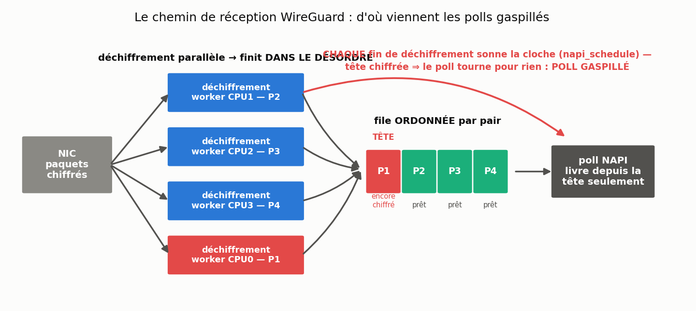
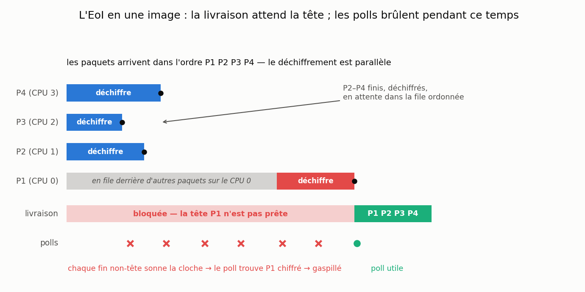
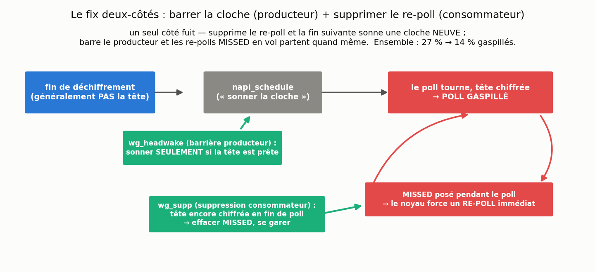
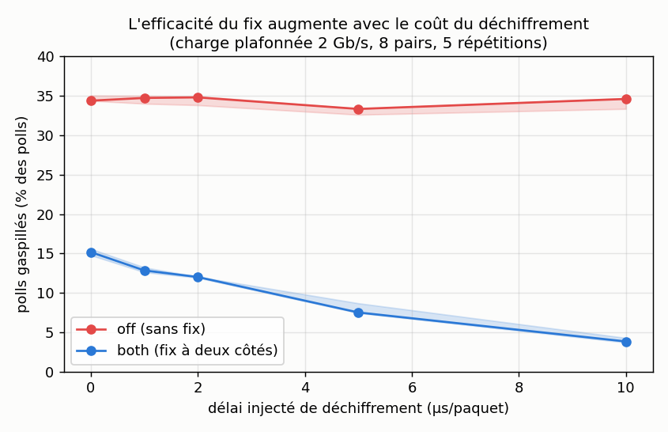
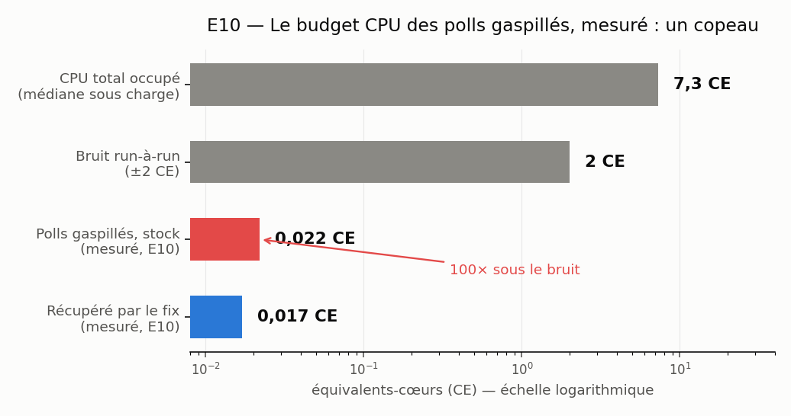
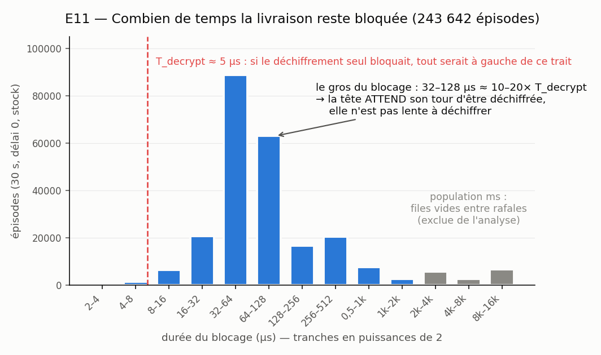
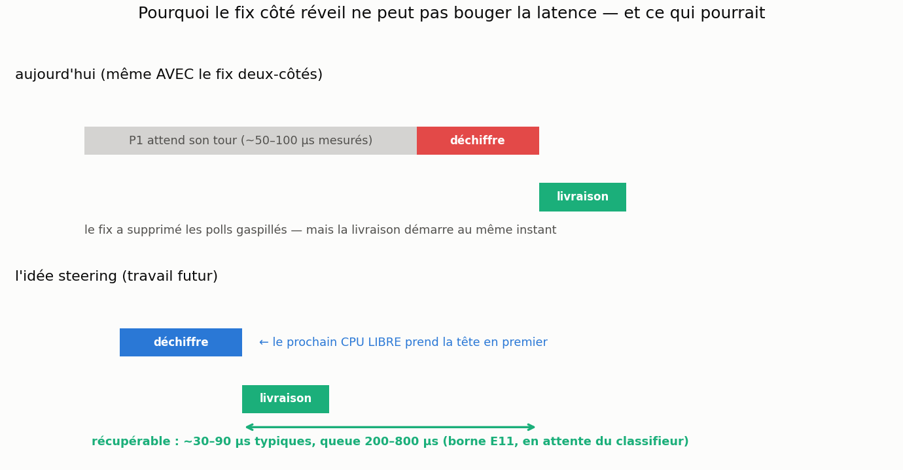

# Journal des expériences CloudLab

> Le journal de la campagne CloudLab sur le chemin de réception WireGuard :
> la question posée, ce qui a tourné, ce qu'on a vu, ce que ça veut dire, ce qu'on fait
> ensuite. Toutes les données brutes (CSV, scripts, figures) sont dans le dépôt Git du
> projet ; l'index en §6.
> Auteur : Anas Ait El Hadj · Inria KrakOS (LIG).

---

## 0. Où on en est — à lire en premier (7 juillet 2026)

La campagne CloudLab a répondu à la question principale.

- **Le fix à deux côtés est réel** : il divise par deux les polls gaspillés sur du vrai
  matériel 10G (~27 % → ~14 %, stable de 8 à 64 pairs, les *peers*).
- **Mais ces polls gaspillés sont trop bon marché pour produire un gain visible** en CPU
  ou en latence sur c220g2. La Phase A (sous-saturation, 64 runs) est un null CPU propre ;
  la latence ne montre qu'une tendance bruitée, polluée par les états d'énergie — je ne
  la revendique pas.
- **La Phase B montre que le mécanisme répond à la dose** : le fix enlève 56 % du
  gaspillage sur crypto rapide et 89 % quand je ralentis le déchiffrement à 10 µs/paquet,
  comme le modèle le prédit. Et pourtant, CPU et latence ne bougent toujours pas.
- **E10 a mesuré pourquoi, directement** : la totalité du budget des polls gaspillés fait
  ~0,022 équivalent-cœur, environ cent fois sous le bruit de ±2 CE. Autrement dit, même
  en supprimant 100 % des polls gaspillés, le gain CPU attendu serait trop petit pour
  sortir de la variation naturelle entre deux runs. Le null n'est plus une déduction,
  c'est une mesure. Le fix supprime beaucoup d'événements, pas beaucoup de cycles.
- **E11 suggère une autre piste pour la latence** : les épisodes de blocage durent
  souvent ~50–100 µs, bien plus que le temps de déchiffrement lui-même, et ne
  s'allongent pas quand on ralentit le crypto. Ça pointe vers une attente *avant*
  déchiffrement (file du worker, ordonnanceur) — mais il faut encore le classifieur
  `wg_diag` pour séparer les vrais blocages de tête des files vides avant d'en faire
  une conclusion. C'est l'idée **head-priority / steering du déchiffrement**.

Le plus surprenant : le résultat négatif est devenu l'un des plus solides du projet,
parce qu'on sait *pourquoi* le fix n'améliore pas le CPU. Pas parce qu'il est cassé (il
agit, les compteurs le prouvent), mais parce que ce qu'il supprime ne coûte presque rien
sur cette machine.

Reste à faire : (1) le classifieur `wg_diag` (~20 lignes) pour séparer les vrais
blocages de tête des files vides, puis re-mesurer E11 ; (2) le soak de fiabilité de
`headwake` ; (3) trancher avec Alain/André si le fix du papier (`gro_wq`) et la config
combinée restent un livrable du 31 juillet ; (4) la rédaction finale.

## 1. La question que je me posais

La question que j'ai apportée sur CloudLab était simple : les expériences sur le M1
avaient montré que WireGuard réveille parfois son chemin de réception alors qu'aucun
paquet ne peut être livré. Si j'évite ces polls gaspillés, est-ce que je gagne quelque
chose de réel sur du matériel 10G ?

La réponse est moins nette que ce que j'espérais. Le fix est réel : il supprime bien
les polls gaspillés, et la Phase B montre qu'il devient plus efficace là où le modèle
l'annonce. Mais sur c220g2, le travail économisé est trop petit pour apparaître en CPU
ou en latence. Le résultat utile n'est donc pas « WireGuard est devenu plus rapide ».
C'est : on sait précisément où ce gaspillage se loge dans le chemin de réception, ce
qu'il coûte, et pourquoi il reste invisible sur ce matériel.

Et ça a changé la direction du projet. Le fix côté réveil évite des vérifications
inutiles, mais il ne fait jamais finir le paquet de tête plus tôt. E11 suggère que la
vraie piste pour la latence est ailleurs : la tête passe des dizaines de microsecondes à
attendre *avant même d'être déchiffrée*. Ça pointe vers le steering du déchiffrement
comme travail futur.

## 2. Le modèle mental : pourquoi WireGuard gaspille des polls

### 2.1 Le chemin de réception normal



Trois choses à garder en tête : le déchiffrement parallèle est ce qui donne le débit
multi-cœurs (tant mieux) ; la livraison ordonnée est une exigence du protocole (non
négociable) ; les polls gaspillés sont la friction *entre* les deux — le moteur de
livraison n'arrête pas de vérifier une tête qui n'est pas prête.

### 2.2 Où l'EoI apparaît



Chaque fois qu'un paquet *non-tête* (P2/P3/P4) finit, il sonne la cloche de livraison
(`napi_schedule`). Ces coups de cloche pendant que P1 se déchiffre encore, c'est ce qui
produit les ~27–34 % de polls gaspillés. Pire : une cloche sonnée *pendant* un poll pose
un drapeau MISSED qui force un re-poll immédiat — et 95 à 99,7 % des polls gaspillés
sont exactement ces re-polls MISSED. (Notez la bande grise dans la figure — P1 *fait la
queue avant même que son déchiffrement commence*. Gardez-la en tête : elle revient au
Résultat 6.)

### 2.3 Ce que fait le fix à deux côtés



Un seul côté fuit : supprimez seulement le re-poll, et la prochaine fin de déchiffrement
non-tête sonne une cloche *neuve* (le gaspillage « se régénère ») ; barrez seulement le
producteur, et les re-polls MISSED déjà en vol partent quand même. C'est l'argument de
composition d'Alain, et les compteurs le confirment (Résultat 2).

### 2.4 Ce que le fix ne peut pas faire — par construction

Le fix décide *quand vérifier* la file. Il ne touche jamais à *quand P1 finit de se
déchiffrer* — donc il ne peut livrer aucun paquet plus tôt. Son seul bénéfice visible
possible, c'est le CPU qu'il libère. À garder en tête pour les Résultats 3–5 : le null
latence n'est pas un accident, il est structurel. (Ce qui *pourrait* livrer plus tôt,
c'est le Résultat 6.)

### 2.5 Vocabulaire

| Terme | Sens |
|---|---|
| **EoI** | Execution Order Inversion : le déchiffrement parallèle finit dans le désordre, mais la livraison doit être dans l'ordre. |
| **poll gaspillé** | Un poll NAPI (`wg_packet_rx_poll`) qui ne livre aucun paquet — il a tourné, trouvé la tête pas prête, et est reparti. |
| **re-poll MISSED** | Le re-poll auto-programmé du noyau : une cloche sonnée pendant un poll force un autre poll juste après. |
| **fresh wake** | Un poll gaspillé lancé par un `napi_schedule` tout neuf — comment le gaspillage se régénère avec un fix à un seul côté. |
| **`off`** | WireGuard de base (appelé *stock* dans les vieilles entrées ; tous les knobs à 0). |
| **`wg_supp` / `wg_headwake` / `both`** | Suppression consommateur / barrière producteur / le fix à deux côtés (anciens noms : `move` / `root`). |
| **`sdfn`** | Réglage du hachage NIC ajoutant les ports UDP → les tunnels s'étalent sur les cœurs (défaut : IP seules → un seul cœur). |
| **CE (équivalent-cœur)** | CPU normalisé par le temps : 0,5 CE = un demi-cœur occupé en continu ; 8 CE = huit cœurs pleins. |
| **p99 / latence de queue** | Le 99ᵉ percentile du temps aller-retour — les « pires moments » que ressent un utilisateur. |
| **`wg_decrypt_delay_ns`** | Knob injectant une attente active par déchiffrement — émule un crypto plus lent, coût du poll inchangé. |
| **épisode de blocage** | Du premier poll gaspillé après un poll productif au prochain poll productif sur la même NAPI : combien de temps la livraison est restée bloquée. |
| **Phase A / Phase B / E10 / E11** | Campagne sous-saturation CPU+latence / balayage du délai de déchiffrement / comptabilité directe des coûts / mesure des blocages. |
| **srcversion** | L'empreinte de build du module, écrite dans chaque ligne de CSV (`EA06EE82…` = le build à deux côtés composable). |
| **bruit run-à-run** | La variation naturelle du CPU total entre deux répétitions identiques d'une même mesure (~±2 CE ici : ordonnanceur, C-states, dynamique TCP). Un effet plus petit que ce bruit est invisible — détail au Résultat 5. |

### 2.6 Les expériences, une par une

Les identifiants E1, E2… E11 reviennent tout au long du document. Voici ce que chacune
mesure et comment :

| ID | Question posée | Comment on s'y prend |
|---|---|---|
| **E1** | L'EoI existe-t-il sur vraie carte ? Le fix six-lignes aide-t-il ? | Compter les polls qui ne livrent rien (sonde bpftrace sur le retour de `wg_packet_rx_poll`), module stock contre patché, à 1 puis 8 pairs. |
| **E2** | Combien coûte un déchiffrement ? | Chronométrer `decrypt_packet` sur des millions de paquets → **5–6 µs**. |
| **E3** | À quel rythme les déchiffrements finissent-ils ? | Mesurer l'écart entre deux fins de déchiffrement sur un même cœur → bimodal : **~5 µs** (worker actif) / **~100 µs** (worker à réveiller). |
| **E4** | Combien coûte un poll, vide ou plein ? | Chronométrer `wg_packet_rx_poll` selon le nombre de paquets livrés → **~1 µs** à vide ; ~3,7 µs de mise en route + ~1,6 µs par paquet sinon. |
| **E5** | Combien coûte la remontée vers l'application ? | Chronométrer `napi_gro_receive` → **~1 µs** par paquet. |
| **Phase A** | Avec de la marge CPU, le fix rend-il du CPU ou de la latence ? | Résultat 3 : pair de latence dédié + charge de fond plafonnée, off/both × 4 charges × 8 répétitions, ordre mélangé. |
| **Phase B** | Le fix devient-il utile quand le crypto ralentit ? | Résultat 4 : délai injecté par paquet (0→10 µs), off/both × 5 répétitions, même charge plafonnée. |
| **E10** | Combien coûtent *vraiment* les polls gaspillés ? | Résultat 5 : chronométrage bpftrace des polls à vide + échantillonnage de cycles perf, en fenêtres séparées. |
| **E11** | Combien de temps la tête bloque-t-elle la livraison ? | Résultat 6 : durée entre le premier poll raté et le prochain poll utile, par file NAPI, à chaque délai. |

(E6 à E9 n'existent pas : la numérotation a sauté au fil des réorganisations du plan.
E2–E5 forment ensemble le « modèle de coût » cité partout.)

## 3. Les résultats

### Résultat 1 — Le débit était un problème de parallélisme, pas un problème de fix

À ce stade, le vrai goulot n'était pas du tout la logique WireGuard. La carte réseau
envoyait simplement tous les tunnels sur le même cœur de réception : son hachage par
défaut ne regarde que les adresses IP, et tous mes tunnels partagent la même IP.

| Hachage NIC | Débit | Cœurs qui reçoivent |
|---|---|---|
| `sd` (IP seules — l'entonnoir) | 4,1 Gb/s | 1 (à 100 %) |
| `sdfn` (+ ports UDP) | **9,0 Gb/s (×2,2)** | 8 (~55 % chacun) |


Revérifié sur trois instanciations différentes. Toutes les campagnes suivantes tournent
en régime étalé `sdfn`. *(Le fil rouge : le parallélisme est à la fois la cause du bug
EoI et le remède du débit.)*

> **Ce que j'ai retenu.** Le débit était le mauvais critère pour juger ce fix. La machine
> n'était pas lente à cause des polls gaspillés ; elle était lente parce que tous les
> paquets atterrissaient sur un seul cœur.

### Résultat 2 — Le fix à deux côtés divise le gaspillage par deux

Le fix « six lignes » du M1, côté producteur seul, est un **null sur du vrai matériel** :
le tracing a montré qu'au moment où une fin de déchiffrement veut sonner la cloche, un
poll est déjà en cours ~63 % du temps — l'appel barré était donc surtout un no-op, dont
le fix n'empêchait pas l'effet secondaire (le drapeau MISSED). La version à deux côtés du
§2.3 est celle qui marche. Balayage en pairs, régime `sdfn`
(`data/cloudlab/twosided_peersweep_20260626.csv`) :

| pairs | `off` | consommateur seul | producteur seul | **deux-côtés (`both`)** |
|---|---|---|---|---|
| 8  | 27,0 % | 25,8 % | 15,4 % | **14,8 %** |
| 16 | 27,3 % | 26,1 % | 15,9 % | **13,8 %** |
| 32 | 26,8 % | 25,1 % | 15,0 % | **13,1 %** |
| 64 | 27,5 % | 25,3 % | 15,4 % | **14,4 %** |


La fuite prédite au §2.3 se voit dans les compteurs : le consommateur seul *augmente* la
part fresh-wake du gaspillage de ~3 % à ~6 % (le re-poll annulé revient en cloche
neuve), et ajouter la barrière producteur la fait tomber à ~1 %. La réduction est
**plate de 8 à 64 pairs** — l'effet « croît avec les pairs » du M1 ne se reproduit pas,
mais la division par deux est solide. Et le fix agit, c'est vérifié : les compteurs
in-module montrent `wg_supp` actif dans 96 % de ses cas cibles, et exactement 0 fix
éteint — les nulls qui suivent ne sont pas « un fix qui ne se déclenche pas ».

> **Ce que j'ai retenu.** Le fix à un côté était incomplet, et l'argument de composition
> d'Alain était le bon : chaque côté rattrape la fuite de l'autre.

### Résultat 3 — Ni le CPU ni la latence n'en profitent sur c220g2 (un null propre)

**Le montage (Phase A).** L'idée : se placer en dessous de la saturation, là où la
machine a de la marge, et regarder si le travail que le fix économise se voit quelque
part. Huit pairs WireGuard : le pair 0 ne fait *que* de la latence (un petit ping-pong
applicatif, sockperf, qui mesure le temps aller-retour de chaque requête), et les
pairs 1 à 7 envoient un trafic de fond plafonné (0, 2, 4 ou 6 Gb/s au total).
Séparer les deux compte : si le pair de latence portait aussi du gros trafic, on
mesurerait ses paquets coincés derrière leur propre file, pas l'effet du fix. Chaque
combinaison (charge × fix on/off) est répétée 8 fois, dans un ordre tiré au hasard
pour qu'une dérive de la machine (échauffement, tâche de fond) ne favorise pas un
camp. 64 runs au total (`subsat_20260701_0609.csv`).

**Ce qu'on vérifie avant de comparer.** À chaque run, on enregistre le débit
réellement atteint : `off` et `both` atteignent la même charge à 3,4 % près. Quand on
compare leur CPU, on compare donc deux machines qui font le même travail.

**Le CPU ne bouge pas.** On le mesure de trois façons (la partie réseau du noyau
seule ; tout le noyau ; tout ce qui est occupé). Sur les trois, l'écart off/both
oscille entre −4,7 % et +1,6 % selon la charge — tantôt dans un sens, tantôt dans
l'autre, sans direction. C'est la signature d'un non-effet : un vrai gain irait
toujours dans le même sens, pas ce zigzag. Un test statistique le confirme (le hasard
suffit largement à expliquer ces écarts), mais l'argument principal, ce sont les
signes mélangés.

**La latence non plus, et la mesure est piégée.** Le fix penche 7–8 % plus bas sur le
p99 aux charges moyennes — tentant, mais les barres d'erreur des deux camps se
recouvrent largement : avec 8 répétitions, impossible de distinguer cet écart du
hasard. Et il y a un piège : la pire latence de queue n'apparaît pas à forte charge,
mais à la charge la plus *faible* (hors zéro) — ~1,5 ms à 1,1 Gb/s contre ~1,0 ms à
3,1 Gb/s. Une file d'attente ferait l'inverse. L'explication : quand la machine n'a
presque rien à faire, ses cœurs s'endorment pour économiser l'énergie (les
« C-states »), et le premier paquet qui arrive paie leur réveil. Le gouverneur de
fréquence par défaut (`schedutil`) laisse faire. Ce bruit d'endormissement-réveil se
compte en centaines de microsecondes, et pousse la queue au-delà de la milliseconde ; les
quelques microsecondes que le fix pourrait rendre sont noyées dedans. Donc je ne
revendique rien sur la latence.

> **Ce que j'ai retenu.** Un null propre est quand même un résultat — *parce que* les
> charges étaient appariées, l'ordre mélangé et le CPU mesuré trois fois, « rien n'a
> bougé » est une affirmation défendable, pas une ambiguïté.

### Résultat 4 — Le mécanisme répond à la dose (la figure vedette)

**Comment on ralentit le déchiffrement, et pourquoi c'est une mesure valide.** J'ai
ajouté au module un paramètre, `wg_decrypt_delay_ns` : après chaque déchiffrement réel
d'un paquet, le worker boucle à vide pendant N nanosecondes avant de continuer. Vu du
reste du système, rien ne change (même chemin de code, mêmes files, mêmes réveils),
sauf que « déchiffrer un paquet » prend maintenant 5+N µs au lieu de ~5. Ce n'est pas
un autre matériel réel : c'est un outil de sensibilité. Il ne prétend pas reproduire
parfaitement une machine sans SIMD ou un cœur embarqué ; il permet d'augmenter
`T_decrypt` sans changer le coût du poll ni le reste du chemin. Et comme le coût du
*poll* ne bouge pas,
on balaie le rapport coût-du-déchiffrement / coût-du-poll sur la même machine, toutes
choses égales par ailleurs — au lieu de comparer des machines différentes où tout
changerait à la fois.

Délais testés : 0/1/2/5/10 µs par paquet, `off` contre `both`, 5 répétitions chacun,
avec le même protocole que la Phase A mais une seule charge, fixée à 2 Gb/s — assez
bas pour que même le déchiffrement le plus lent suive le rythme
(`decsweep_20260706_0321.csv`, 50 runs sur 50 valides) :



| délai injecté | `off` gaspille | `both` gaspille | le fix enlève |
|---:|---:|---:|---:|
| 0 µs | 34,4 % | 15,2 % | **56 %** du gaspillage |
| 1 µs | 34,7 % | 12,8 % | 63 % |
| 2 µs | 34,8 % | 12,0 % | 66 % |
| 5 µs | 33,3 % | 7,5 % | 78 % |
| 10 µs | 34,6 % | **3,8 %** | **89 %** |

La base reste plate (~34 % — le gaspillage est structurel, pas une affaire de vitesse)
pendant que le fix s'améliore de façon monotone, avec des intervalles serrés : **une
réponse à la dose**, le résultat mécanistique le plus propre du projet. Plus le
déchiffrement est lent, plus la tête reste chiffrée longtemps, plus la barrière
producteur a de cloches à intercepter : la prédiction du modèle, mot pour mot. Et pourtant
les écarts CPU restent à signes mélangés à tous les délais, et le p99 aussi — même à un
ratio déchiffrement:poll de ~10:1. (Suggestif seulement, non revendiqué : 10 à 30 fois
moins de retransmissions TCP avec le fix à 5–10 µs ; n=5, forte variance.) L'ancienne
observation « le gaspillage stock monte à ~44 % » était un artefact d'effondrement à
charge non plafonnée.

> **Ce que j'ai retenu.** Le mécanisme est réel précisément parce qu'il répond à la
> dose : quand j'augmente artificiellement le coût du déchiffrement, le fix supprime
> une fraction plus grande du gaspillage. C'est une preuve plus forte qu'un simple A/B
> isolé.

### Résultat 5 — Les cycles manquants n'ont jamais existé

C'est la partie qui semblait fausse au début. À 10 µs de délai injecté, le fix
à deux côtés enlève presque tous les polls gaspillés. Intuitivement, ça devrait bien
économiser *quelque chose* de visible. E10 a mesuré pourquoi ce n'est pas le cas.

**Comment on a mesuré (E10).** Deux instruments indépendants, jamais en même temps
(chacun perturbe un peu la machine ; les faire tourner ensemble fausserait les deux) :

- **Un chronomètre sur la fonction de poll** (sonde bpftrace) : à chaque entrée dans
  `wg_packet_rx_poll` on note l'heure, à la sortie on calcule la durée ; si le poll n'a
  rien livré, cette durée s'ajoute au compteur « temps gaspillé ». Au bout de 30 s, on
  a le temps CPU exact, en nanosecondes, passé à poller pour rien — pas un décompte
  d'événements, un chronométrage.
- **Un échantillonneur de cycles** (perf) : plusieurs centaines de fois par seconde,
  sur les 40 cœurs, il note quelle fonction s'exécute. À la fin, on sait quelle part
  des cycles occupés chaque fonction consomme — une photo de « où va le CPU »,
  obtenue sans notre chronomètre, donc un recoupement indépendant.

Le tout dans les conditions de la Phase B (même charge plafonnée, `off` contre
`both`, délais 0 et 10 µs), exécuté deux fois pour vérifier que les chiffres se
répètent.

**Ce que ça donne.** « 89 % des polls gaspillés », ce n'est pas « 89 % du CPU ». Un
poll gaspillé, concrètement, c'est ceci : la fonction de livraison se réveille,
regarde le premier paquet de la file, le voit encore chiffré, et repart. Une lecture
mémoire et un test — pas de déchiffrement, pas de copie, aucun paquet remonté.
Chronométré : **1,14 à 1,36 µs** par poll (le modèle disait ~1,0 ; le surcoût de la
sonde en fait plutôt une borne haute). À côté, déchiffrer un paquet coûte 5–6 µs et le
remonter à l'application encore quelques-unes. Voilà ce que « très bon marché » veut
dire : l'opération qu'on supprime est la moins chère de toute la chaîne. Les ~500 000
polls gaspillés de la base par fenêtre de 30 s totalisent :

```text
CPU total occupé sous charge :   ~7–9  CE
bruit run-à-run :                ±2    CE
TOUS les polls gaspillés :        0,022 CE   ← tout le gaspillage
récupéré par le fix :             0,017–0,022 CE
```

**Et ce « bruit run-à-run » de ±2 CE, c'est quoi ?** Refaites exactement la même
mesure deux fois, même charge et mêmes réglages : le CPU total occupé ne revient pas
au même chiffre. D'une répétition à l'autre, il oscille entre ~5 et
~9 équivalents-cœurs. Ce n'est pas un défaut de l'instrument, c'est la vie de la
machine : l'ordonnanceur place les tâches un peu différemment, les cœurs s'endorment
et se réveillent, TCP accélère et freine. On l'a chiffré sans rien inventer : c'est la
dispersion observée entre les 8 répétitions de la Phase A et les 5 de la Phase B, à
conditions identiques. C'est la barre qu'un gain doit franchir pour être visible — et
le gain maximal du fix, 0,022 CE, est cent fois en dessous.



L'échantillonneur perf confirme par l'autre bout : toute la machinerie poll + réveil
(`wg_packet_rx_poll` *travail utile compris* + `napi_complete_done` +
`__napi_schedule`) pèse **moins de 0,7 % des cycles occupés** dans toutes les
conditions. Le CPU vit dans la livraison par paquet, les workers de déchiffrement,
TCP/IP et l'espace utilisateur — pas dans les polls.

L'interprétation finale est donc simple : **le fix supprime beaucoup d'événements, pas
beaucoup de cycles.** Le compteur d'événements bouge beaucoup parce qu'on vise
exactement cet événement ; le compteur CPU ne bouge pas parce que cet événement était
une fraction minuscule du coût total. Et d'après le §2.4, la latence ne pouvait pas
bouger non plus — le fix ne rend jamais la tête livrable plus tôt. Au passage : avec le
fix, les polls sont moins nombreux mais plus longs (15 → 23 µs en moyenne), les
livraisons se regroupent en plus gros lots. C'est l'effet « batch GRO » du M1, retrouvé
sur vrai matériel.

> **Ce que j'ai retenu.** Un compte d'événements n'est pas un coût CPU. Un pourcentage
> ne vaut que par le budget de la chose dont il est le pourcentage — on aurait dû
> chiffrer le gaspillage en CE dès le premier jour.

### Résultat 6 — La prochaine piste pour la latence : le steering de la tête

Jusqu'ici, tous les fixes agissent autour du poll : ils évitent de vérifier la file
trop tôt. Mais ils ne changent pas le moment où la tête devient réellement livrable
(§2.4). Pour améliorer la latence, il faut donc regarder plus tôt dans la chaîne :
pourquoi la tête met-elle autant de temps à être déchiffrée ?

E11 a mesuré combien de temps la livraison reste réellement bloquée quand un poll
trouve la tête pas prête (épisodes de blocage, base, délais 0/2/5/10 µs) :



Le gros des blocages se situe à **32–128 µs ≈ 10–20 fois T_decrypt** (~5 µs) — et la
médiane **ne bouge pas** quand j'injecte +10 µs de délai de déchiffrement. Cette
distinction compte : le crypto lui-même n'est pas le délai. La tête passe l'essentiel de
son temps bloqué à attendre *qu'un worker s'occupe d'elle* — en file derrière d'autres
paquets sur son CPU attitré, ou en attente d'ordonnancement du kworker (ça recoupe le
Δ_complete bimodal ~5 µs / ~100 µs du modèle de coût). C'est pour ça que le fix côté
réveil ne peut pas aider la latence, et pour ça que l'idée head-priority est plus
intéressante :



> **Ce qu'E11 prouve.** Les épisodes de blocage sont souvent bien plus longs que le
> temps de déchiffrement seul, et leur durée ne suit pas le coût du crypto.
>
> **Ce qu'E11 suggère.** Une partie du délai vient probablement de l'attente dans les
> workers ou de l'ordonnancement.
>
> **Ce qu'E11 ne prouve pas encore.** Que tous ces épisodes sont de vrais blocages de
> tête : ~46 % des polls gaspillés trouvent une file *vide*, et la sonde ne sait pas
> distinguer les deux cas épisode par épisode.
>
> **Prochaine étape.** Classifier les épisodes dans `wg_diag` (~20 lignes), puis
> re-mesurer E11.

Borne prudente, avec la chaîne de correction convenue (écart brut = borne sup. du temps
bloqué ; × ~54 % de fraction tête-chiffrée ; − plancher de déchiffrement) :
**typiquement ~30–90 µs récupérables, population de queue à 200–800 µs** — au-dessus de
la bande « pas la peine » (5–20 µs), queue au-delà du seuil « on y va » (100 µs). La
population milliseconde (~6 % des épisodes) est de l'inactivité entre rafales, exclue.
**Décision : ne pas implémenter le steering maintenant ; construire d'abord le
classifieur.**

> **Ce que j'ai retenu.** Le fix côté réveil et la latence n'allaient jamais se
> rencontrer — le fix optimise la *vérification*, pas la *disponibilité*. S'il existe un
> gain de latence dans cette histoire, il vit dans l'ordonnancement du déchiffrement, et
> un petit classifieur décidera si on le poursuit.

## 4. Chronologie

| Date | Expérience | Ce qui a changé | Résultat | Statut |
|---|---|---|---|---|
| 17/06 | Banc en ligne (instanciation #1) | 2× c220g2, lien 10G, noyau 5.15 | sondes confirmées | réglé |
| 18/06 | Reproduction EoI (1 pair) | premier bpftrace sur vraie carte | 35,8 % de polls gaspillés | réglé |
| 19/06 | A/B du fix six-lignes (8 pairs) | premier A/B réel | **null** + diagnostic (cloche déjà en cours ~63 %) | réglé |
| 19–24/06 | Modèle de coût (E2–E5) | sondes par étape | T_decrypt 5–6 µs, C_poll ~1 µs | réglé |
| 22/06 | Diagnostic de saturation | CPU par cœur sous charge | entonnoir mono-cœur : hachage IP-seules | réglé |
| 24/06 | `wg_headwake` + **étalement sdfn** | barrière producteur ; hachage NIC | 33→20 % gaspillés ; **4,1→9,0 Gb/s (×2,2)** | réglé |
| 25/06 | Point avec Alain | composer le fix ; CPU en sous-saturation ; sensibilité crypto | build à deux côtés (`EA06EE82…`) | réglé |
| 26/06 | Balayage pairs à deux côtés | 8–64 pairs, warm-up ajouté | **27→14 % gaspillés, plat** | réglé |
| 01–02/07 | Phase A (64 runs) + analyse | sous-saturation | **null CPU propre** ; latence confondue | réglé |
| 02–03/07 | Tentative Phase B (#6) | sweep réécrit à charge plafonnée | tourné proprement ; **données perdues (bail expiré)** | remplacé le 06/07 |
| 06/07 | Phase B (#7, 50 runs) | sweep du délai de déchiffrement | **dose-réponse 56→89 % ; CPU/latence toujours null** | réglé |
| 06/07 | E10 comptabilité des coûts | bpftrace + perf | budget gaspillage **0,022 CE**, 100× sous le bruit | réglé |
| 06/07 | E11 blocages | sonde d'épisodes, délais 0–10 µs | blocage médian 50–100 µs, insensible au délai | **classifieur requis** |

## 5. Incidents et corrections de méthodo

| Date | Problème | Effet | Correction | Leçon |
|---|---|---|---|---|
| 26/06 | Première condition mesurée à froid après rechargement du module | fausses lignes `polls=1`, fausse alerte « stall » | rafale de warm-up avant la boucle | vérifier les comptes de polls avant de croire un zéro |
| 26/06 | Sweep de déchiffrement à charge non plafonnée | effondrement du pipeline au-delà de ~10 µs | réécriture à charge plafonnée, fenêtre unique | un effondrement n'est une donnée que si la charge est contrôlée |
| 03/07 | Bail expiré avant le scp (instanciation #6) | données Phase B perdues, re-run complet | — | **rapatrier les artefacts dans la session qui les produit** |
| 06/07 | Sweep lancé deux fois en parallèle | chaque setup a détruit le tunnel de l'autre : lignes toutes NA | verrou `flock` mono-instance | les scripts de mesure doivent être mono-instance |
| 06/07 | Seuil REJECT 0,40 vs sous-atteinte du pacing iperf3 (~45–50 %) | runs sains marqués « collapse » | seuil 0,60 ; genou localisé à l'analyse | connaître la marge du générateur avant de flaguer |
| 06/07 | bpftrace 0.14 refuse les scripts avec un bloc `END` | toutes les fenêtres E11 silencieusement vides | retirer `END` | ne jamais jeter le stderr d'une sonde en phase de validation |
| 06/07 | Une fenêtre E10 a tourné sans charge (deux fois, même cellule) | cellules froides dans les répertoires bruts | garde `ensure_load` (delta rx_bytes) | chaque fenêtre doit vérifier son propre trafic |

## 6. Données, scripts et figures

Tout est dans le dépôt Git du projet (`wireguard-receive-path`). Chaque résultat
ci-dessus se vérifie depuis son CSV :

| Résultat | Données (`data/cloudlab/`) | Script (`scripts/`) | Figure(s) |
|---|---|---|---|
| Étalement sdfn ×2,2 (R1) | `cpu_sd_spread.csv`, `cpu_sdfn_spread.csv` | `cloudlab/measure_spread.sh` | `fig_spread.png` |
| Balayage pairs à deux côtés (R2) | `twosided_peersweep_20260626.csv` | `cloudlab/measure_missed.sh` | `fig_twosided_peers.png` |
| Null Phase A (R3) | `subsat_20260701_0609.csv` (+ `_0400`/`_0605`, départs avortés gardés en provenance) | `cloudlab/measure_subsat.sh`, `analyze_subsat.py` | `fig_subsat_cpu.png`, `fig_subsat_latency.png` |
| Dose-réponse Phase B (R4) | `decsweep_20260706_0321.csv` + sidecar placement | `cloudlab/measure_decrypt_sweep.sh`, `analyze_decsweep.py` | `fig_decsweep_wasted_fr.png` (EN : `fig_decsweep_wasted.png`, `fig_decsweep_cpu.png`) |
| Comptabilité des coûts E10 (R5) | `costacct_20260706_0539/`, `costacct_20260706_0613/` | `cloudlab/measure_cost_accounting.sh` | `fig_e10_budget_fr.png` |
| Blocages E11 (R6) | `costacct_20260706_0613/stall_d*.txt` | `cloudlab/measure_cost_accounting.sh` | `fig_e11_stall_fr.png` |
| Diagrammes explicatifs (§2, R4, R6) | — (conceptuels) | `make_explainer_figs.py` | `fig_eoi_*_fr.png`, `fig_twosided_fr.png`, `fig_fix_vs_steering_fr.png`, `fig_decsweep_wasted_fr.png` |
| Module + knobs | — | `build/wg515-trigger/` (srcversion `EA06EE82…`) | — |

**Provenance E10/E11 cellule par cellule** — les répertoires bruts contiennent des
fenêtres froides (voir incidents) ; voici lesquelles utiliser :

| cellule | source bpf | source perf |
|---|---|---|
| délai 0, off | `0613` (0539 froide : 80 polls) | **aucune valide** (froide dans les deux runs) |
| délai 0, both | `0539` + `0613` | `0539` + `0613` |
| délai 10 µs, off | `0539` + `0613` | `0539` + `0613` |
| délai 10 µs, both | `0539` (0613 froide : 74 polls) | `0539` + `0613` |
| blocages E11 (tous délais) | `0613` seulement (0539 vide : bug du bloc END) | — |

## 7. Annexes

### A — Les instanciations CloudLab

Même matériel à chaque fois : 2 × c220g2 (Wisconsin), 2× Xeon E5-2660 v3 (40 threads),
lien d'expérience 10 GbE, Ubuntu 22.04, noyau 5.15.0-177. Le bail se réinitialise chaque
jour ; chaque session repart d'une image vierge via `bootstrap_testbed.sh` (une
commande : paquets, build du module, tunnel, pairs, vérification des handshakes).

| # | Date | dut / gen | Servie à |
|---|---|---|---|
| 1 | 17/06 | c220g2-011308 / -011310 | setup, reproduction EoI, null du fix six-lignes, modèle de coût, diagnostic entonnoir |
| 2 | 25/06 | c220g2-011002 / -011003 | build à deux côtés, revérification sdfn |
| 3 | 26/06 | c220g2-010630 / -010628 | balayage pairs 8–64, premier sweep déchiffrement (cassé) |
| 5 | 01/07 | c220g2-011319 / -011315 | campagne Phase A |
| 6 | 02/07 | c220g2-011118 / -011131 | premier run Phase B — données perdues (bail expiré) |
| 7 | 06/07 | c220g2-011118 / -011119 | Phase B propre, E10, E11 |

(La #4 a vécu quelques heures sans produire de résultat.)

### B — Résultats remplacés, et pourquoi

Pour l'honnêteté du dossier : ce qu'on a cru, pourquoi ça a changé, ce qui est vrai
aujourd'hui.

1. **« Le fix six-lignes du M1 aide » (loopback : −8,8 à −21,9 % de gaspillage).**
   Remplacé le 19/06 : sur vraie carte, null — au moment de sonner, un poll tourne déjà
   ~63 % du temps. Seul le fix **deux-côtés** déplace le gaspillage (R2).
2. **« Le bénéfice croît avec le nombre de pairs » (M1).** Remplacé le 26/06 : sur vrai
   matériel, la réduction est plate de 8 à 64 pairs. La division par deux est réelle ; la
   croissance était un artefact du loopback.
3. **« Le gaspillage stock monte de ~28 à ~44 % quand le déchiffrement ralentit »
   (sweep du 26/06).** Remplacé le 06/07 : c'était un effondrement à charge non
   plafonnée ; à charge contrôlée, le stock reste plat ~34 % à tous les délais (R4).
4. **Les premières mesures de latence** (ping puis sockperf court) : incohérentes, avec
   perte d'échantillons côté `off`. Remplacées par le protocole Phase A (pair de latence
   dédié, fenêtres de 30 s, charge vérifiée) : « pas d'effet significatif, confondu par
   les états d'énergie » (R3).
5. **Le trigger hrtimer (`wg_trig_k`)** groupait les polls (−22 % de polls utiles) mais
   débit plat-à-baissier et softirq en hausse : il se sabote en tournant sur le cœur
   qu'il veut soulager. Clos le 23/06 ; gardé comme knob de reproduction.
6. **Les chiffres mono-run du 25/06** (30,4 → 15,3 %) : remplacés par le balayage
   multi-N du 26/06 (27 → 14 % avec warm-up) — même conclusion, données plus propres.
