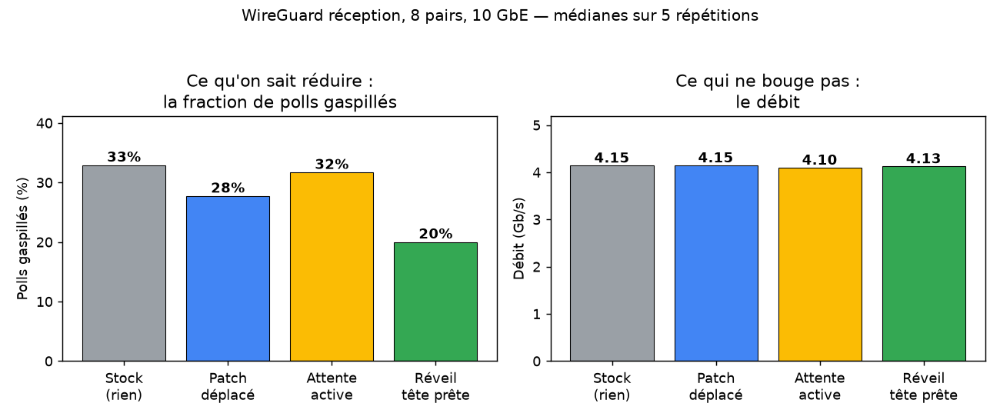

# WireGuard receive path on real 10G hardware — findings

> Synthesis of the CloudLab receive-path investigation. The lab notebook with raw runs
> is `CLOUDLAB_EXPERIMENTS_LOG.md`; this is the polished, honest conclusion. Author: Anas
> Ait El Hadj · Inria KrakOS (LIG). Testbed: CloudLab Wisconsin `c220g2`, 2× Xeon
> E5-2660 v3 (40 threads), 10 GbE, kernel 5.15.0-177 (experiment NIC `enp6s0f1` on
> instantiation #1, `enp6s0f0` on #2/#3). Figures live in `../meetings/figures/`.

> **Update 2026-06-26 (after the point with Alain):** the framing below is corrected. The
> fix *does* remove real work — the earlier "buys nothing / negative result" wording was
> measuring it against the wrong yardstick (throughput, which is already saturated). What is
> still open is whether that removed work converts into a *user-visible* gain (CPU-per-byte,
> tail latency). See §2b for the two-sided result and §7 for the corrected reading.

## TL;DR — what we actually found (and what we did not)

1. **The EoI fix removes real wasted work; the open question is whether that shows up where
   a user looks.** The wasted-poll inefficiency is real, and the **two-sided fix (producer
   gate + consumer suppress together) halves it** — ~27% → ~14% of polls, flat from 8 to 64
   peers (§2b). That is genuine CPU work removed (~1 µs/poll on the receive core). What it
   does *not* do is move **throughput** — but throughput is the wrong yardstick here, it is
   already at line rate. Whether the saved work shows up in **tail latency / CPU-per-byte**
   is being measured and is **not yet conclusive** (latency noisy, decrypt-sweep methodology
   still rough).
2. **The throughput lever is parallelism, and it is a NIC config change, not the fix.** The
   receiver was funnelled onto a single core by the NIC's IP-only flow hash; switching the
   hash to include the UDP ports (`sdfn`) fans the tunnels across 8 cores and lifts
   throughput **4.1 → 9.0 Gb/s (×2.2)**, near line rate, with *stock* WireGuard.
3. **Deliverable so far: the real lever (parallelism) + a fix that demonstrably removes
   ~half the wasted polls, with the user-visible payoff under active measurement.** (Note:
   on the earlier *M1 loopback* testbed the fix's benefit *grew with peers*; on this real-HW
   spread regime the wasted-poll reduction is **flat across peers** — it does not reproduce
   the peer-count growth, but the reduction itself is solid.)

The rest of this document is the evidence.

## 1. The mechanism (confirmed, single-core AND parallel)

WireGuard decrypts a peer's packets **in parallel across cores** (padata), so they finish
**out of order**, but delivery must be **in order**. The NAPI poll (`wg_packet_rx_poll`)
only consumes from the head of the per-peer queue; if the head isn't decrypted yet the
poll delivers nothing — a **wasted poll**. Stock: **~30–33% of polls are wasted**.

Almost all of them are **MISSED-driven re-polls**: while a poll runs, a decrypt worker
finishing a *non-head* packet calls `napi_schedule`, which is a no-op for starting a poll
but sets `NAPI_STATE_MISSED`; at poll end `napi_complete_done` sees MISSED and forces
another poll that re-finds the same UNCRYPTED head. Measured share of wasted polls that
are MISSED re-polls: **99.7% on one core, 95% in the 8-core spread regime** — the
mechanism is the same under parallelism.

Cost model (Phase C, measured): `C_poll` ≈ 1.0 µs (empty poll), fixed delivery setup
≈ 3.7 µs, `C_deliver` ≈ 1.64 µs/packet, `T_decrypt` ≈ 5–6 µs. The natural MISSED re-poll
fires at median ~1.6 µs — ~3× too early vs `T_decrypt` (a coin-flip).

## 2. The four interventions and their results

All built into **one binary** `wireguard_trigger.ko` (clean-room from pristine 5.15
source; patch in `build/wg515-trigger/`), selected by runtime knobs so each A/B toggles a
setting on the *same loaded module*. 8 peers, ≥5–7 shuffled runs, CV < 4%.

| Intervention | Knob | Wasted polls | Throughput | Notes |
|---|---|---|---|---|
| Original "6-line" producer gate | (M1 patch) | ~0% change | flat (−0.3%) | null: `napi_schedule` ~63% no-op + wrong side |
| **Move the fix to the re-poll site** | `wg_supp=1` | 33% → **28%** | flat | fires correctly (96%) but waste regenerates (see §5) |
| **Active wait / batching (hrtimer)** | `wg_trig_k=8` | 33% → 31% | flat / −0.9% | batches polls but timer self-defeats; *worse* in spread |
| **Root fix: wake only when head ready** | `wg_headwake=1` | 33% → **20%** | flat | best waste cut, but intermittent lost-wakeup STALL |

*Left: every variant reduces wasted polls (33→28→31→20%). Right: throughput is flat
(~4.1 Gb/s) everywhere. Medians, 5 reps.*

The progression is itself the story: **the more completely you fix the EoI, the more
wasted polls you remove** — while the most complete version (`headwake`) carries a
lost-wakeup risk (a single lost wakeup deadlocks the flow under TCP; this is why the
kernel's "wasteful" MISSED re-poll exists — the waste is the safety; mitigated here with a
Dekker publish-then-recheck, §2b).

## 2b. The two-sided fix (composable) and the peer sweep — the clean positive result

After the point with Alain (2026-06-25), `wg_supp` (consumer) and `wg_headwake` (producer)
were made **composable** (previously mutually exclusive; `receive.c` no longer returns early
in the headwake branch). Rationale: the consumer-side suppress cancels the wasted re-poll,
but the wake **regenerates** through the producer path (the next non-head completion calls
`napi_schedule`); the producer gate intercepts that regeneration. Module srcversion
`EA06EE82…`; `both` = `wg_supp=1 wg_headwake=1`.

Peer sweep on instantiation #3 (sdfn spread, `measure_missed.sh`, warm-up added so the first
condition isn't measured cold; `data/cloudlab/twosided_peersweep_20260626.csv`):

| peers | stock | move (supp) | root (headwake) | both |
|---|---|---|---|---|
| 8  | 27.0% | 25.8% | 15.4% | 14.8% |
| 16 | 27.3% | 26.1% | 15.9% | 13.8% |
| 32 | 26.8% | 25.1% | 15.0% | 13.1% |
| 64 | 27.5% | 25.3% | 15.4% | 14.4% |

Three readings: (1) **`both` halves wasted polls (~27 → ~14%)** and is additive — the
consumer adds little alone (~2 pts), the producer does most, the two together edge below
either. (2) The **regeneration is visible in the counters**: `move` alone raises the
*fresh-wake* share of wasted polls from ~3% (stock) to ~6%, and adding the producer gate
drops it to ~1% — direct evidence the two sides catch the waste the other leaks. (3) It is
**flat from 8 to 64 peers**: the M1 loopback's peer-count growth does not reproduce on this
real-HW spread regime, but the ~½ reduction holds at every N.

This is the corrected positive result: a real, reproducible halving of wasted poll work. The
remaining question (does it convert to a user-visible CPU/latency win) is §7's open item.

## 3. Why throughput does not move (and why that is the wrong yardstick)

Per-core CPU under load shows **one core pinned at 100% / 97% softirq**, every other core
≤ 22%, *regardless of which fix is on*. That core's time goes to **per-packet delivery up
the stack** (GRO → `wg_packet_consume_data_done` → `napi_gro_receive` → IP/UDP/TCP),
which scales with **packets**, not **polls** (~12 s of a 20 s core budget by the cost
model). The fixes touch the cheap poll overhead (~1 µs), not the per-packet wall — so
throughput is flat. The hrtimer trigger is additionally **self-defeating**: it runs in
softirq on the very core it is trying to relieve.

Why a single core: the NIC flow hash is **IP-only** (`rx-flow-hash udp4 = IP SA/IP DA`),
so all 8 same-IP tunnels collapse onto one RX queue. The realistic
single-heavy-tunnel / site-to-site case.

## 4. Latency — also unchanged

`ping` through the tunnel under the 8-flow load, 500 samples/condition. **Median ~1.60 ms,
p99 ~2.3 ms — identical across all four variants (±2%).** Under saturation, latency is
dominated by queueing on the busy core (~1.6 ms); the wake-policy tweaks are µs-scale
(τ = 5 µs, `C_poll` = 1 µs) and invisible against it. So neither throughput **nor** latency
depends on the wake policy in this regime.

## 5. Parallelism — the only real throughput win (and it isn't the fix)

The single-core wall is a NIC-config artifact, not WireGuard. Adding the UDP ports to the
hash (`ethtool -N enp6s0f1 rx-flow-hash udp4 sdfn`) fans the 8 tunnels (distinct source
ports) across 8 of the 40 RX queues → 8 cores. IRQ affinity was already one-per-core, so
no other tuning was needed.

| NIC hash | Throughput | Cores in receive |
|---|---|---|
| `sd` (IP only — the funnel) | **4.1 Gb/s** | 1 (cpu5 @ 100%) |
| `sdfn` (+ UDP ports) | **9.0 Gb/s** | 8 (~55% each) |

**×2.2 throughput, ≈ line rate, from one config command — with stock WireGuard.** This is
the genuine performance improvement of the phase; it is orthogonal to the EoI fix. The
fil rouge: parallelism is both the *cause* of the bug (parallel decrypt → out-of-order →
wasted polls) and the *cure* for throughput.

### 5b. Does the fix pay off in the spread regime (CPU-per-byte)?

With headroom (8 cores at ~55%) the fix can't add throughput (already line rate), so the
right metric is CPU efficiency. We isolated **softirq CPU** (where the poll runs) summed
across cores, 8 reps:

| cond | gbps | softirq cores-equiv | wasted% |
|---|---|---|---|
| stock | 8.99 | **2.38** | 30 |
| move | 8.99 | 2.44 (+2%) | 28 |
| batch | 8.99 | 2.58 (+8%) | 37 |
| root | 8.99 | 2.54 (+6%) | 16 |

**No fix reduces CPU; `root`/`batch` slightly *increase* softirq** (their own overhead —
barriers, the hrtimer — exceeds the cheap wasted-poll savings). Total CPU is
indistinguishable (deltas ≪ run-to-run spread). So the fix gives no efficiency benefit
even where it had the best chance.

## 6. Mechanism verification — does the re-poll fix actually fire? (yes; it just doesn't help)

To be sure the negative result isn't a broken fix, we instrumented the module with
behaviour-preserving counters (`wg_diag`, read via sysfs) and confirmed in the spread
regime:

- **`wg_supp` fires correctly: it clears a genuinely-pending MISSED in 96% of its target
  cases** (`supp_cleared` = 800,855 of 830,601 UNCRYPTED-head reschedules; an independent
  rerun: 718,546 / 744,850 = 96.5%). Sanity check: the counter is exactly 0 with the fix
  off and ~720k with it on, while the fix-independent classifier stays constant — so the
  counter is causally tied to the fix path.
- It is **not** defeated by a concurrent-core re-set (`supp_reset_race` = 906, negligible)
  nor by the recheck (re-arms 4.5%).
- **Yet aggregate wasted polls barely move**, because suppressing the MISSED re-poll just
  **parks the NAPI, and the next non-head completion wakes a *fresh* poll that is also
  wasted** (head still decrypting). The waste **regenerates as a fresh wake**; the root
  cause (out-of-order completion) is untouched. Only `headwake`, by gating *all* wakes
  until the head is ready, suppresses the regeneration too (→ 20%) — and still helps
  nothing, while risking the stall.

Of stock reschedules, **54% occur with an UNCRYPTED head, 46% with an empty (drained)
queue** — both common in parallel mode.

## 7. What this means for the project (honest, corrected 2026-06-26)

- **The fix removes real wasted work.** The two-sided version halves the wasted polls
  (~27 → ~14%, §2b) — genuine CPU cycles (~1 µs/poll) reclaimed on the receive core. The
  earlier "buys nothing" wording was wrong: it judged the fix by throughput, which is the
  wrong yardstick (already at line rate, so it cannot rise).
- **Throughput is unaffected, and that is expected.** The throughput lever is parallelism
  (×2.2, a NIC-config change, §5), orthogonal to the fix.
- **Open and under measurement: does the saved work show up where a user looks?** Two tests
  in flight, neither conclusive yet:
  - *Tail latency at sub-saturation* — currently too noisy to call (off/both trade places
    run-to-run, outliers, uneven sample counts). Needs a tighter harness.
  - *Decrypt-cost sensitivity* — the hypothesised direction holds (slower decrypt → stock
    waste rises ~28 → ~44%, fix removes more), but the busy-wait collapses the pipeline at
    high delay, so no clean curve yet. Needs a capped sub-line-rate re-run.
  Earlier `measure_cpueff` at *line-rate saturation* showed no softirq-CPU drop — but that
  is the regime where the fix cannot help by construction, so it does not settle the
  question.
- **Contribution so far:** the real throughput lever (parallelism) + a fix that
  demonstrably and reproducibly removes ~half the wasted-poll work across 8–64 peers, with
  the user-visible payoff being measured. This corrects, not discards, the M1 hypothesis:
  the reduction is real but flat across peers here, not growing as on loopback.

## 8. Reproducibility

- Module + patch: `build/wg515-trigger/` (vs pristine 5.15). Knobs (all `/sys/module/
  wireguard/parameters/`): `wg_supp`, `wg_headwake` (composable — set both for the two-sided
  fix), `wg_trig_k`, `wg_trig_tau_ns`, `wg_decrypt_delay_ns` (decrypt-cost sensitivity);
  plus diagnostic counters under `wg_diag`. Fresh-instantiation bootstrap + build recipe:
  `scripts/cloudlab/bootstrap_testbed.sh`; details in `CLOUDLAB_NEXT_STEPS.md`.
- New scripts (2026-06-26): `measure_taillat.sh` (sub-saturation tail latency),
  `measure_decrypt_sweep.sh` (decrypt-cost sweep), `bootstrap_testbed.sh` (one-command
  redeploy). `measure_missed.sh` gained the `both` condition + a warm-up burst.
- Scripts (`scripts/cloudlab/`, run on `dut`): `measure_supp.sh`, `measure_trigger.sh`,
  `measure_headwake.sh`, `measure_cpu_trigger.sh`, `measure_all.sh` (4-way consolidated),
  `measure_latency.sh`, `measure_spread.sh` (parallelism), `measure_cpueff.sh`
  (CPU-per-byte), `measure_missed.sh` (mechanism). Throughput via `genload_json.sh` on
  `gen`; wasted polls via bpftrace; CPU via `/proc/stat`; mechanism via in-module counters.
- Data: `data/cloudlab/*.csv`. Figures: `docs/meetings/figures/`. Dated raw entries:
  `CLOUDLAB_EXPERIMENTS_LOG.md`. Supervisor summary: `docs/meetings/POINT_ALAIN_2026-06-24_FR.md`.
