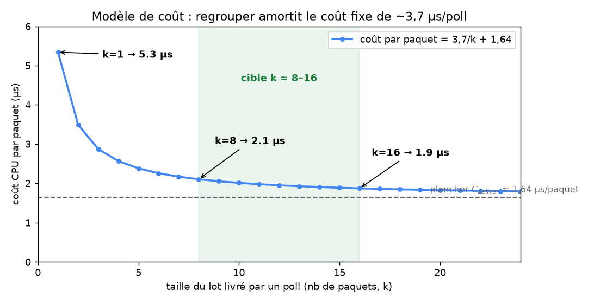
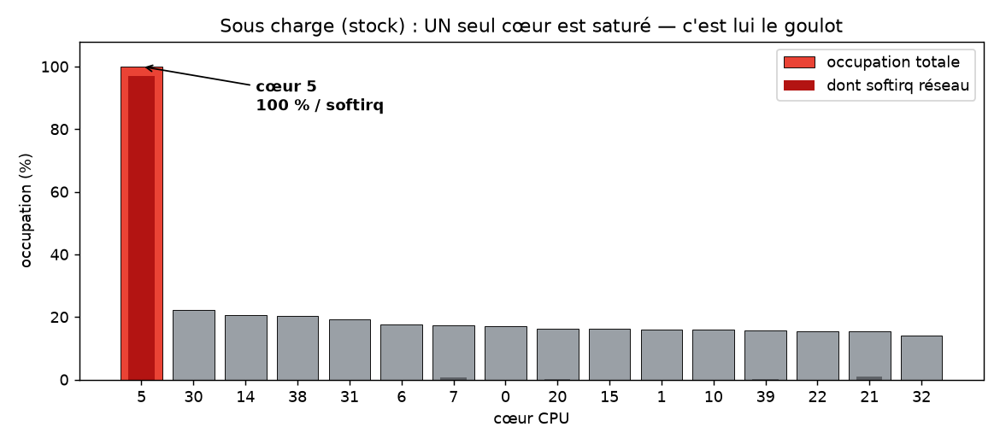
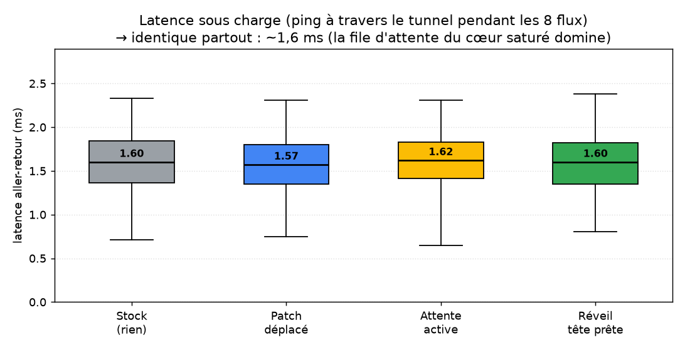

# Point d'avancement — banc CloudLab et tests du patch (24 juin 2026)

> Pour Alain et André. Je raconte simplement : ce que j'ai monté, ce que j'ai
> lancé, ce que j'ai observé — avec les graphes, les chiffres, les commandes et le
> code. Détail technique complet : `docs/cloudlab/RECEIVE_PATH_FINDINGS.md`.

## En deux phrases

J'ai porté l'expérience du M1 (qui tournait en loopback sur mon Mac) sur du **vrai
matériel 10 Gb/s** à CloudLab, et j'ai testé plusieurs façons de corriger le problème
des « polls gaspillés » de WireGuard. Deux résultats : **(1)** on sait maintenant réduire
ces polls — jusqu'à les diviser par ~1,6 — **mais ça n'améliore ni le débit ni la
latence**, car les deux sont bornés par un seul cœur saturé ; **(2)** j'ai trouvé le vrai
levier du débit — **en étalant la réception sur tous les cœurs** (une option de la carte
réseau, le **parallélisme**), **le débit passe de 4,1 à 9,0 Gb/s (×2,2)**, et c'est là, en
régime non saturé, que le correctif pourrait enfin servir.

Ce résultat tient en une image :


*À gauche : les quatre variantes réduisent les polls gaspillés (33 % → 20 %). À droite :
le débit ne bouge pas (≈ 4,1 Gb/s partout). Médianes sur 5 répétitions, écart < 4 %.*

## 1. Ce que j'ai monté (le banc)

Sur M1, le trafic passait en loopback : la carte n'était jamais saturée, on ne voyait
donc pas l'effet réel. Il me fallait du matériel réaliste, alors j'ai monté un banc sur
CloudLab :

- **deux vraies machines** (`c220g2`, bi-Xeon, 40 threads), reliées par un **lien privé
  10 Gb/s** ;
- `dut` = le **récepteur WireGuard** que j'instrumente ;
- `gen` = le **générateur** : j'y crée **8 pairs** WireGuard (8 espaces de noms réseau)
  qui poussent du trafic iperf3 dans le tunnel vers `dut`.

Pour mesurer, sur `dut` :

- **bpftrace** (sondes noyau) pour compter les polls *utiles* (livrent ≥ 1 paquet) vs
  *gaspillés* (ne livrent rien) ;
- **iperf3** pour le **débit** agrégé ;
- `/proc/stat` pour l'**occupation CPU cœur par cœur** (voir *quel* cœur sature).

Tout est rejouable : un seul module noyau avec les correctifs activables à chaud par
paramètre, et des scripts qui font les A/B + médianes (commandes et code en fin de note).

## 2. Le problème de départ (rappel d'une ligne)

WireGuard déchiffre les paquets d'un pair **en parallèle sur plusieurs cœurs** → ils
finissent **dans le désordre**, mais il faut les **livrer dans l'ordre**. La boucle de
réception (« poll ») ne regarde que la **tête** : si elle n'est pas encore déchiffrée,
le poll ne livre rien → **poll gaspillé**. Au départ, **~33 %** des polls sont gaspillés.

## 3. Le modèle de coût (ce que coûte *chaque* étape)

Avant de corriger quoi que ce soit, j'ai d'abord **mesuré le coût de chaque étape** de la
réception (avec des sondes bpftrace sur le déchiffrement, le poll, la livraison). C'est le
travail « tout mesurer » qu'on s'était fixé, et c'est lui qui explique tous les résultats
qui suivent. Les coûts mesurés sur le banc (à 8 pairs) :

| Étape | Coût mesuré | Rôle |
|---|---|---|
| `C_poll` — un poll **vide** (gaspillé) | **~1,0 µs** | un poll gaspillé est **bon marché** |
| coût **fixe** de livraison (setup) | **~3,7 µs** | payé **une fois** dès qu'un poll livre ≥ 1 paquet |
| `C_deliver` — par paquet livré | **~1,64 µs/paquet** | remontée dans la pile réseau |
| `T_decrypt` — déchiffrement | **~5–6 µs/paquet** | sur cœurs séparés (en parallèle) |

Deux conséquences directes, visibles sur la courbe ci-dessous :



*Coût CPU par paquet = 3,7/k + 1,64. Plus un poll livre de paquets d'un coup (k grand),
plus le coût fixe de 3,7 µs est dilué : 5,3 µs/paquet à k=1 → ~1,9 µs à k=16. C'est
exactement ce qui motivait l'idée d'« attente active » (regrouper pour viser k ≈ 8–16).*

- **Un poll gaspillé coûte ~1 µs** → en supprimer beaucoup ne libère pas grand-chose.
- **Le coût qui domine est par paquet** (`C_deliver` × nb de paquets), indépendant du
  nombre de polls. Or sur le banc, la plupart des polls ne livrent que **≤ 4 paquets**
  (distribution très « tassée vers le bas »), donc on paie le setup de 3,7 µs presque à
  chaque poll, sans l'amortir.

**C'est ce modèle de coût qui prédit tout le reste** : réduire/regrouper les polls touche
des µs bon marché, alors que le débit est fixé par le coût *par paquet* — ce que les
expériences suivantes confirment.

## 4. Ce que j'ai lancé, et ce que j'ai vu

**(a) Reproduit et confirmé le mécanisme.** 99,7 % des polls gaspillés viennent d'un
re-réveil automatique (bit « MISSED ») déclenché par un paquet *qui n'est pas la tête*.

**(b) Patch d'origine du M1 → aucun effet**, et j'ai compris pourquoi : sous charge,
l'appel qu'il bloque est déjà sans effet ~63 % du temps. Mauvais endroit.

**(c) Déplacé le patch au bon endroit** (à la *fin* du poll, là où on connaît vraiment
l'état de la tête) → supprime **25 % des polls gaspillés** (33 → 28 %, barre bleue).
**Mais le débit ne bouge pas.**

**(d) Pourquoi ? J'ai regardé le CPU par cœur.** C'est le résultat important :



*Sous charge, **un seul cœur est à 100 %** (saturé en softirq réseau) ; tous les autres
sont à ~20 %.* Ce cœur unique est le goulot, et il passe son temps à **livrer les
paquets dans la pile réseau** (coût *par paquet*), pas à faire des polls. Supprimer des
polls gaspillés (≈ 1 µs chacun, bon marché) ne libère donc presque rien.

> Pourquoi un seul cœur : la carte répartit le trafic avec un hachage *qui ignore les
> ports* ; mes 8 tunnels ayant la même IP, ils tombent tous sur **la même file → le même
> cœur**. C'est le cas réaliste « un gros tunnel / site-à-site ».

**(e) L'« attente active » dont on parlait** (attendre ~5 µs ou K paquets prêts avant de
réveiller, pour livrer de plus gros lots) : **ça regroupe bien** (−22 % de polls), donc
*ça fonctionne* au sens mécanique — **mais le débit ne bouge toujours pas**, et le
minuteur **se pénalise lui-même** (il tourne sur le cœur déjà saturé).

**(f) Attaqué la racine : ne réveiller que si la *tête* est prête.** Version la plus
propre, sans minuteur → réduit le **plus** les polls gaspillés (33 → **20 %**, barre
verte). **Mais elle bloque par intermittence** le tunnel sous TCP (un réveil perdu, et
TCP n'a plus rien à renvoyer pour relancer). Pas proposée comme correctif robuste.

## 5. Pourquoi je n'ai pas réussi à améliorer le débit

C'est la question centrale. La chaîne de raisonnement, étayée par les mesures :

1. **Le débit est limité par UN seul cœur**, pas par toute la machine (figure des cœurs :
   un cœur à 100 %, les autres à ~20 %).
2. **Ce cœur passe son temps à la livraison *par paquet***, pas aux polls. Le modèle de
   coût le chiffre : `C_deliver ≈ 1,64 µs/paquet` × le nombre de paquets ≈ ~12 s sur les
   20 s du budget du cœur. C'est ça, le mur.
3. **Mes correctifs agissent sur les *polls***, qui coûtent des µs **bon marché**
   (`C_poll ≈ 1 µs`). Que je supprime des polls gaspillés (déplacement) ou que je les
   regroupe (attente active), je touche des µs bon marché — **jamais le coût par paquet**
   qui, lui, est fixé par le débit de paquets et reste identique.
4. **Donc le cœur reste à 100 % sur la livraison, quoi que je fasse côté polls** → le
   débit ne bouge pas (~4,1 Gb/s). C'est exactement ce qu'on voit : les quatre variantes
   réduisent les polls gaspillés mais laissent le débit plat.
5. La cause du mono-cœur est la carte réseau (hachage *IP seulement* → les 8 tunnels sur
   une file/un cœur). Ce n'est pas WireGuard, c'est la répartition matérielle.

Autrement dit : **je m'attaquais à un coût de second ordre.** Pour gagner du débit il
faudrait soit rendre la livraison par paquet moins chère (hors de mon périmètre), soit
**l'étaler sur plusieurs cœurs** — la piste (a) ci-dessous.

## 6. Et la latence ?

Comme le débit ne bougeait pas, j'ai regardé la **latence** — c'est là que la politique
de réveil (quand on livre les paquets) pourrait jouer. J'ai mesuré le temps aller-retour
d'un `ping` **à travers le tunnel pendant que les 8 flux chargent**, 500 mesures par
variante :



| Variante | médiane | p99 |
|---|---|---|
| Stock | 1,60 ms | 2,34 ms |
| Patch déplacé | 1,57 ms | 2,33 ms |
| Attente active | 1,62 ms | 2,32 ms |
| Réveil tête prête | 1,60 ms | 2,39 ms |

**La latence est identique partout** (~1,6 ms médian, ~2,3 ms en p99, à ±2 %). Pourquoi :
sous saturation, la latence est **dominée par la file d'attente sur le cœur saturé**
(~1,6 ms) ; mes ajustements de réveil sont à l'échelle de la **µs** (`τ = 5 µs`,
`C_poll = 1 µs`) → **invisibles** face à 1,6 ms. Même l'« attente active », que je
craignais coûteuse en latence, ne se voit pas : son délai τ est ~300× plus petit que la
file d'attente.

> Nuance honnête : à **faible charge** (file d'attente courte), ce délai τ *se verrait*.
> Mais ici, dans le régime saturé, **ni le débit ni la latence** ne dépendent de la
> politique de réveil — les deux sont gouvernés par le cœur saturé.

## 7. Casser le goulot : utiliser tous les cœurs (×2,2 le débit)

Si le mur est « un seul cœur », la vraie question est : **peut-on le supprimer en
utilisant tous les cœurs ?** Le diagnostic disait que le mono-cœur venait de la carte
réseau (hachage *IP seulement* → 8 tunnels sur une file). J'ai vérifié la cause matérielle
(IRQ déjà réparties une par cœur, donc le seul coupable est le hachage), puis j'ai **ajouté
les ports au hachage** (`ethtool -N enp6s0f1 rx-flow-hash udp4 sdfn`). Une seule commande.


| Hachage carte | Débit | Cœurs en réception |
|---|---|---|
| `sd` (IP seul — le funnel) | **4,1 Gb/s** | **1** (cpu5 à 100 %) |
| `sdfn` (+ ports UDP) | **9,0 Gb/s** | **8** (~55 % chacun) |

Les 8 tunnels (ports source distincts) se répartissent sur **8 cœurs** → le débit
**passe de 4,1 à 9,0 Gb/s (×2,2)**, soit ~le débit ligne du lien 10 G (le reste, c'est
l'overhead TCP). **Le mur mono-cœur n'était pas WireGuard, c'était la répartition
matérielle.**

Et le plus intéressant pour la suite : les 8 cœurs ne sont qu'à **~55 %** — il y a
maintenant de la **marge**. C'est **précisément le régime où le correctif de l'EoI peut
enfin compter** : récupérer les cycles des polls gaspillés ne se traduirait plus en débit
(on est près de la ligne) mais en **CPU économisé → plus de pairs par machine**. C'est le
prochain test.

> Le fil rouge : **le parallélisme est à la fois la cause de notre bug** (le déchiffrement
> en parallèle crée le désordre → polls gaspillés) **et la clé du débit** (étaler la
> réception sur les cœurs). C'est la même idée des deux côtés.

## 8. L'enseignement

Le re-poll « gaspilleur » du noyau **n'est pas une bêtise** : c'est le **filet de
sécurité** qui garantit qu'aucun réveil n'est perdu. Dès qu'on déplace la décision de
réveil pour être plus malin, on risque le **réveil perdu** qui bloque le flux. Autrement
dit : **le gaspillage, c'est la sûreté.** On l'échange contre de l'efficacité au prix
d'un risque de blocage — et ici **sans aucun gain de débit**.

## 9. Conclusion et pistes

- Sur ce banc, **ni le débit ni la latence** ne dépendent de la politique de réveil :
  les deux sont **bornés par la livraison par paquet sur un cœur saturé**, pas par les
  polls. Corriger les polls gaspillés est correct et faisable (le déplacement le prouve)
  mais ne change ni l'un ni l'autre ici.
- **Le goulot mono-cœur est levé** (§7) : hachage sur les ports → 8 cœurs → 9,0 Gb/s.
  Reste le **prochain test, le bon** : dans ce régime à marge, refaire l'A/B des
  correctifs en mesurant le **CPU par octet** (et non plus le débit, déjà près de la
  ligne). Si un correctif baisse l'occupation CPU à débit égal, **c'est là sa vraie
  valeur** : plus de pairs par machine. C'est ce que je lance ensuite.
- À retenir : le travail a transformé une **hypothèse** (« corriger l'EoI améliore
  WireGuard ») en **résultats mesurés** — l'EoI est de second ordre sur un cœur, mais le
  **parallélisme double le débit** — avec, au passage, un modèle de coût réutilisable et
  la compréhension de *pourquoi* le design « gaspilleur » du noyau est en fait le bon.

## 10. Les chiffres (médianes, 5 répétitions, 8 pairs)

| Variante | Polls gaspillés | Débit (Gb/s) |
|---|---|---|
| Stock (rien) | 32,9 % | 4,15 |
| Patch **déplacé** (`wg_supp`) | 27,7 % | 4,15 |
| **Attente active** (`wg_trig_k=8`, τ≈5 µs) | 31,7 % | 4,10 |
| **Réveil tête prête** (`wg_headwake`) | 20,0 % | 4,13 |

CPU sous charge (stock) : `cœur 5 = 100 % busy / 96,9 % softirq`, tous les autres ≤ 22 %.
Données brutes : `data/cloudlab/all_20260624.csv`, `cpu_20260624.txt`.

## 11. Les commandes (sur `dut`)

```bash
# Un seul module, correctifs activables par paramètre (0 = stock) :
#   wg_supp (patch déplacé) · wg_trig_k (attente active) · wg_headwake (racine)
# Mesure consolidée des 4 variantes + snapshot CPU, A/B sur le même binaire :
sudo bash ~/measure_all.sh 8 5            # 8 pairs, 5 répétitions -> all_*.csv, cpu_*.txt
sudo bash ~/measure_latency.sh 8 14       # latence (ping sous charge) -> lat_*.csv
sudo bash ~/measure_spread.sh 8           # mono-cœur vs tous-cœurs (hash sd vs sdfn)
# Étaler la réception sur tous les cœurs (le levier du débit) :
sudo ethtool -N enp6s0f1 rx-flow-hash udp4 sdfn   # (revenir au défaut : ... sd)
# Graphes (en local) :
python scripts/cloudlab/plot_results.py data/cloudlab/all_20260624.csv \
       data/cloudlab/cpu_20260624.txt docs/meetings/figures
```

## 12. Le code modifié (l'essentiel ; complet dans `build/wg515-trigger/`)

**Patch déplacé** — à la fin du poll, si la tête n'est pas déchiffrée on *annule* le
re-poll au lieu de le subir (la complétion de la tête réveillera) :

```c
// receive.c, fin de wg_packet_rx_poll  (stock = juste "napi_complete_done(...)")
if (head_pas_déchiffrée)
    clear_bit(NAPI_STATE_MISSED, &napi->state);   // <-- on endort au lieu de re-poller
napi_complete_done(napi, work_done);
```

**Réveil tête prête** — côté complétion, ne réveiller que si c'est bien la tête
attendue (sinon le poll serait gaspillé) :

```c
// queueing.h, wg_queue_enqueue_per_peer_rx  (stock = "napi_schedule(...)" inconditionnel)
struct sk_buff *attendu = READ_ONCE(peer->rx_blocked_on);  // ce que le poll attend
if (attendu == NULL || attendu == skb)        // file vide, ou c'est la tête
    napi_schedule(&peer->napi);
// sinon : complétion hors-tête -> pas de réveil  (le poll inutile est évité)
```

*(Le code réel ajoute des barrières mémoire — c'est précisément ce détail de
synchronisation qui rend la variante « racine » délicate, cf. §3f.)*

Je poursuis avec un point écrit court tous les 1–2 jours. Dispo pour discuter avec Alain
cet après-midi.
