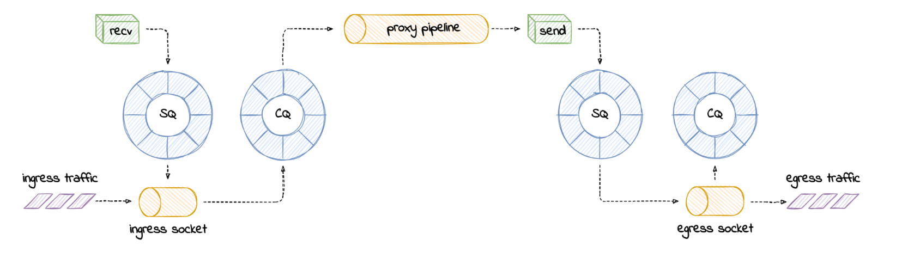

## Reading: Cloudflare — Missing Manuals: io_uring Worker Pool

> Source: https://blog.cloudflare.com/missing-manuals-io_uring-worker-pool/

---

### Overview

Calling io_uring "just an async I/O interface" is an understatement. Underneath the API calls, io_uring is a **full-blown runtime** for processing I/O requests. It spawns threads, sets up work queues, and dispatches I/O requests for processing. All this happens in the background so that the userspace process doesn't have to manage it — but the process can still block while waiting for I/O completion if it wants to.

Using io_uring in a real project raises immediate questions:
- How many threads will be created for my workload by default?
- How can I monitor and control the thread pool size?

These questions are not answered in the *Efficient I/O with io_uring* article or the *Lord of the io_uring* guide — the two main pieces of available documentation. The io_uring man page does touch on it with:

> *"By default, io_uring limits the unbound workers created to the maximum processor count set by `RLIMIT_NPROC`, and the bound workers is a function of the SQ ring size and the number of CPUs in the system."*

But that raises further questions:
- What is an **unbounded** worker?
- How does it differ from a **bounded** worker?

---

### Not All I/O Requests Are Created Equal

io_uring can perform I/O on any kind of file descriptor — regular files, network sockets, character devices. However, the **type** of file descriptor determines which worker pool category the request falls into.

io-wq (the internal io_uring work queue) divides work into two categories:

| Category | Description | Pool limit |
|---|---|---|
| **Bounded work** | Completes in bounded time — e.g., reading from a regular file (`S_IFREG`) or block device (`S_IFBLK`) | Based on SQ ring size × number of CPU cores |
| **Unbounded work** | May never complete — e.g., reading from a network socket (`S_IFSOCK`) or character device | Limited by `RLIMIT_NPROC` |

**Unbounded workers** handle I/O that operates on neither regular files nor block devices — network sockets, pipes, character devices like `/dev/null`. This is the category that matters for **network I/O** (WireGuard, proxies, etc.).

The two worker categories have different limits, which is why understanding which path your workload takes is critical before tuning anything.

---

### Capping the Unbounded Worker Pool Size

Cloudflare's workload is network I/O — pushing data through sockets. In io_uring terms, that means submitting **unbounded work** requests. The article focuses on understanding and controlling the unbounded worker pool.

#### The test workload: `udp_read.rs`

To study how io_uring spawns workers, the approach is:
- Submit many read requests on a **UDP socket**
- Send **no packets** to that socket — so requests never complete naturally
- This gives full control over when completions happen, making worker lifecycle observable

The program (`udp_read.rs`, now in `io_uring_examples/worker_pool_tests/`) does this in a loop:
1. Fill the submission queue with `IORING_OP_READ` requests on a UDP socket
2. Call `submit_and_wait(1)` — blocks until at least one request completes
3. Drain the completion queue
4. Repeat

Because no UDP packets arrive, the reads block indefinitely — the io-wq workers are spawned and sit waiting, which is exactly the state needed to count and observe them.

#### Why strace won't work here

strace only shows syscalls made by the **main thread**. Worker threads run in the background and their syscalls are invisible to strace. Instead, use **in-kernel tracing via tracepoints**.

Discover all available io_uring tracepoints:
```bash
sudo perf list | grep io_uring
# or
sudo bpftrace -l 'tracepoint:io_uring:*'
```

The number of tracepoints available shows that io_uring takes **worker pool visibility seriously**. The key one for worker lifecycle:

```
io_uring:io_uring_queue_async_work  →  fires every time a request is offloaded to io-wq
```

#### Request lifecycle diagram (annotated with tracepoints)

There are **three paths** a request can take after `io_uring_enter()` consumes it from the submission queue:

```
submission queue
      │
      │  [io_uring_enter() called]
      ▼
  request  ──── tracepoint: io_uring:io_uring_submit_sqe
      │
      ├─── PATH 1: complete inline (fast-path)
      │         Data is immediately available — no blocking needed.
      │         → publish fast-path → completion queue
      │         → tracepoint: io_uring:io_uring_complete
      │
      ├─── PATH 2: blocking wait → worker pool
      │         Request cannot complete inline AND was marked IOSQE_ASYNC
      │         (or io_uring decides a blocking attempt is warranted).
      │         → tracepoint: io_uring:io_uring_queue_async_work
      │         → added to run queue → picked up by io-wq worker thread
      │         → [worker blocks until data arrives]
      │         → tracepoint: io_uring:io_uring_complete
      │
      └─── PATH 3: non-blocking wait → poll set  ← DEFAULT for sockets
                Request cannot complete inline. io_uring tries a non-blocking
                read first → gets EAGAIN → registers a wake-up via vfs_poll.
                → tracepoint: io_uring:io_uring_poll_arm
                → request sits in poll set, waiting for socket readiness
                → when socket becomes readable: io_async_wake() fires
                → tracepoint: io_uring:io_uring_poll_wake
                → moved to task list → completion queue
                → tracepoint: io_uring:io_uring_complete
```

**Critical distinction:** Path 3 (poll) is the default for sockets — io_uring does **not** spawn worker threads by default for socket reads. This is a surprising result addressed in the next section.

---

### Connection to Internship Research

This is the **missing link** between the `cat.c` investigation (where `io_uring_queue_async_work` never fired) and the WireGuard hypothesis:

| Workload | File type | io-wq used? | Worker category |
|---|---|---|---|
| `cat_uring` (buffered file read) | `S_IFREG` | ❌ No (kernel 6.x + `NO_IOWAIT`) | — |
| WireGuard tunnel I/O | `S_IFSOCK` | ✅ Yes | **Unbounded** |
| UDP socket reads | `S_IFSOCK` | ✅ Yes | **Unbounded** |

The workqueue bottleneck the Inria hypothesis describes **is real for socket I/O** — it just doesn't apply to file I/O on modern kernels. WireGuard uses sockets, so the hypothesis is on solid ground.

The `udp_read.rs` program gives us a minimal, controllable way to study the exact worker pool behavior that affects WireGuard performance.

---

### Default Behavior: io_uring Polls Sockets, It Doesn't Block on Them

Counter-intuitive finding: **submitting requests is not enough to spawn worker threads.**

Experiment — verify that 4096 SQEs were submitted:
```bash
sudo perf stat -e io_uring:io_uring_submit_sqe -- timeout 1 ./udp-read
# Output: 4096 io_uring:io_uring_submit_sqe events, 1.049s elapsed
```

But check the thread count:
```bash
./udp-read & p=$!; sleep 1; ps -o thcount $p; kill $p; wait $p
# THCNT: 1  ← single-threaded! No workers spawned.
```

This is because io_uring is **smart about sockets**: it knows sockets support non-blocking I/O and can be polled for readiness. So the default path is:

1. Try a non-blocking read on the socket
2. Get `EAGAIN` (no data available)
3. Register a wake-up call via `io_async_wake()` — this calls `vfs_poll` internally
4. Wait to be notified when the socket becomes readable

This is functionally equivalent to using `select()` or `epoll()` from userspace. No worker threads are needed — io_uring just polls and waits. Unless an `IORING_OP_LINK_TIMEOUT` was also submitted, it waits indefinitely.

Confirm with bpftrace that it's the poll path being hit (opcode 22 = `IORING_OP_READ`):
```bash
sudo bpftrace -lv t:io_uring:io_uring_poll_arm
# Fields: ctx, req, opcode, user_data, mask, events

sudo bpftrace -e 't:io_uring:io_uring_poll_arm { @[probe, args->opcode] = count(); } i:s:1 { exit(); }' -c ./udp-read
# Output: @[tracepoint:io_uring:io_uring_poll_arm, 22]: 4096

sudo bpftool btf dump id 1 format c | grep 'IORING_OP_.*22'
# IORING_OP_READ = 22
```

All 4096 read requests took the **poll path** (Path 3), not the worker pool path (Path 2). Zero workers spawned.

---

### Forcing the Worker Pool: `IOSQE_ASYNC`

To make io_uring spawn worker threads, requests must be forced through the **blocking path** (Path 2). This is done with the `IOSQE_ASYNC` flag per-SQE.

From the `io_uring_enter(2)` man page:
```
IOSQE_ASYNC
    Normal operation for io_uring is to try and issue an sqe as
    non-blocking first, and if that fails, execute it in an async
    manner. To support more efficient overlapped operation of requests
    that the application knows/assumes will always (or most of the time)
    block, the application can ask for an sqe to be issued async from
    the start. Available since 5.6.
```

Setting `IOSQE_ASYNC` bypasses the non-blocking attempt entirely. The call chain becomes:

```
io_queue_sqe()  →  io_queue_async_work()  →  create_io_worker()  →  create_io_thread()
```

`create_io_thread()` spawns a new kernel thread to process the work. Remember that function — it comes up again later in the article.

Experiment — run with `--async` flag (which sets `IOSQE_ASYNC` on all SQEs):
```bash
./udp-read --async & pid=$!; sleep 1; ps -o pid,thcount $pid; kill $pid; wait $pid
# PID     THCNT
# 3457597 4097   ← 4096 workers + 1 main thread
```

Thread count jumped from 1 to **4097**: one worker per submitted read request. io_uring has spawned workers — one for each in-flight blocking read.

However this is an overkill for reading one socket — the workers will just sit idle, waiting for data that may never arrive. if we were to limit the number of worker threads , how would we go about that ? There are four ways the article describes:

#### Method 1: Limit the number of in-flight requests
If we take care to never have more than some number of in-flight blocking I/O requests (inflight = submitted but not yet completed), then we will have more or less the same number of workers . This is because:
- io_uring spawns workers only when there is work to process. We can control how many requests we submit and can throttle new submissions based on completion notifications.
- io_uring retires workers when there is no more pending work in the queue. Although there is a grace preiod before workers are retired.

The downside of this approach is that by throttling submissions, we reduce batching. We will have to drain the completion queue , refill the submission queue, and switch context with io_uring_enter() more often, which can lead to performance degradation.

We can convince ourselves that this this method works by tweaking the number of submitted requests, and observing the thread count as the requests complete. The --sqes <N> flag allows us to control how many read requests get queued by our workload at a time. If we want a request to complete , we simply need to send a packet toward the UDP socket we are reading from. The workload does not refill the submission queue.
```bash
$ ./udp-read --async --sqes 8 & pid=$!
# Wait for the workload to submit 8 requests and spawn 8 workers
[1] 7264 ← 8 workers spawned

$ ss -ulnp | fgrep pid=$pid
UNCONN 0 0 127.0.0.1:52763  0.0.0:*  users:(("udp-read",pid=7264,fd=3)) #this is the UDP socket we are reading from , we can send packets to it to trigger completions

$ ps -o thcount $pid; nc -zu 127.0.0.152763; echo -e '\U1F634'; sleep 5; ps -o thcount $pid
THCNT
9  ← 1 main thread + 8 workers
?
THCNT
8  ← 1 worker retired after completion
```
After sending one packet (which triggers the completion of one read request), the run queue length shrinks by one, and the thread count soon follows (one worker retires). This shows that by controlling the number of in-flight requests, we can control the number of workers.

#### Method 2: Configure `IORING_REGISTER_IOWQ_MAX_WORKERS`
In 5.15 the io_uring_register() syscall was extended with a new opcode `IORING_REGISTER_IOWQ_MAX_WORKERS` that allows applications to set an upper limit on the number of unbounded and bounded workers that can be spawned by io_uring. This is a hard limit — if the limit is reached, new requests that would normally trigger worker creation will instead fail with `EAGAIN`.
Snippet from the man page:
```
IORING_REGISTER_IOWQ_MAX_WORKERS
    By default, io_uring limits the unbound workers created to the maximum processor count set by
    RLIMIT_NPROC, and the bounded workers is a function of the SQ ring size and the number of CPUs in
     the system. sometimes this can be excessive (or too little, for bounded), and this command
     provides a way to change the count per ring (per NUMA node) instead. 

    arg must be set to an unsigned int pointer to an array of two values, with the values in the array
    being set to the maximum count of workers per NUMA node. Index 0 holds the bounded worker count,
    and index 1 holds the unbounded worker count. On successful return, the passed in array will
    contain the previous maximum values for each type (bounded and unbounded). If the count being
    passed in is 0 then this command returns the current maximum values and doesn't modify the current
    settings. nr_args must be set to 2, as the command expects two values to be passed in. Available
    
    since 5.15.
```

Since it is a fresh addition to io_uring API, the io_uring Rust library we are using has not caught up with it yet. But with a bit of patching, , we can make it work:
```rust

    /// Get and/or set the limit for number of io_uring worker threads per NUMA
    /// node. `max[0]` holds the limit for bounded workers, which process I/O
    /// operations expected to be bound in time, that is I/O on regular files or
    /// block devices. While `max[1]` holds the limit for unbounded workers,
    /// which carry out I/O operations that can never complete, for instance I/O
    /// on sockets. Passing `0` does not change the current limit. Returns
    /// previous limits on success.
    ///
    /// Requires the `unstable` feature.
    #[cfg(feature = "unstable")]
    pub fn register_iowq_max_workers(&self, max: &mut [u32; 2]) -> io::Result<()> {
        execute(
            self.fd.as_raw_fd(),
            sys::IORING_REGISTER_IOWQ_MAX_WORKERS,
            max.as_mut_ptr().cast(),
            max.len() as _,
        )
        .map(drop)
    }
```
We can tell our toy program to set IORING_REGISTER_IOWQ_MAX_WORKERS (= 19 = 0x13) by running it with the `--workers <N>` option:
```bash
$ strace -o strace.out -e io_uring_register ./udp-read --async --workers 8 &
[1] 3555377 ← 8 workers limit set

$ pstree -pt $!
strace(3555377)─-─udp-read(3555378)─┬─{iou-wrk-3555380}(3555381)
                                        ├─{iou-wrk-3555380}(3555382)
                                        ├─{iou-wrk-3555380}(3555383)
                                        ├─{iou-wrk-3555380}(3555384)
                                        ├─{iou-wrk-3555380}(3555385)
                                        ├─{iou-wrk-3555380}(3555386)
                                        ├─{iou-wrk-3555380}(3555387)
                                        └─{iou-wrk-3555380}(3555388)  ← 8 workers spawned, no more than the limit  

$ cat strace.out
io_uring_register(4, 0x13 /* IORING_REGISTER_??? */, 0x7ffd9b2e3048, 2) = 0 ← 8 workers limit set successfully 
```
This works perfectly. We have spawned just 8 workers to handle the 4096 read requests.
Question remains: is the set limit per io_uring instance ? Per thread ? Per process ? Per UID ? We will find out in the next section.

#### Method 3: Set `RLIMIT_NPROC` ressource limit
The `RLIMIT_NPROC` resource limit sets a hard cap on the number of processes and threads that a user can have. Since unbounded workers are limited by `RLIMIT_NPROC`, setting a low `RLIMIT_NPROC` value can effectively cap the number of unbounded workers that can be spawned by io_uring. 

This resource limit overrides the IORING_REGISTER_IOWQ_MAX_WORKERS setting , which makes sense because bumping RLIMIT_NPROC above the configured hard maximum requires CAP_SYS_RESOURCE capability, which is a much higher bar than just being able to call io_uring_register().

The catch is that the limit is tracked per UID withing a user namespace, so it applies globally to all processes running under the same UID. This means that if you set a low RLIMIT_NPROC value, it can affect not just your application but also other applications running under the same UID, which may not be desirable.

Setting the new process lilmit without using a dedicated UID or outside a dedicated user namespace; where other processes are running under the same UID, can have surprising effects.

Why? Because io_uring will try over and over again  to scale up the worker pool ,only to generate a bunch of `EAGAIN` errors from create_io_worker() if it can't reach the configured RLIMIT_NPROC limit.
```bash
$ prlimit --nproc=8 ./udp-read --async &
[1] 26348

$ sudo bpftrace --btf -e 'kr:create_io_thread { @[retval] = count(); } i:s:1 { print(@); clear(@) } END { clear(@); }' -c '/usr/bin/sleep 3' | cat -s
Attaching 3 probes...
@[-11]: 293631 ← 293631 attempts to create a worker thread, all failed with EAGAIN
@[-11]: 306150 ← 306150 attempts to create a worker thread, all failed with EAGAIN
@[-11]: 311959 ← 311959 attempts to create a worker thread, all failed with EAGAIN

$ mpstat 1 3 # Observe CPU usage due to worker creation attempts
Linux 5.19.0-cloudfare-2021.12.8 (bullseye) 	01/04/22     _x86_64_	(4 CPU)

02:52:46  CPU    %usr   %nice    %sys %iowait    %irq   %soft  %steal %guest   %gnice   %idle
02:52:47  all    0.00    0.00    25.00    0.00    0.00    0.00    0.00    0.00   75.00
02:52:48  all    0.00    0.00    25.13    0.00    0.00    0.00    0.00    0.00   74.87
02:52:49  all    0.00    0.00    25.30    0.00    0.00    0.00    0.00    0.00   74.70
Average:  all    0.00    0.00    25.14    0.00    0.00    0.00    0.00    0.00   74.86
```
We are hogging one core trying to spawn new workers. This is not the best use of CPU time — we are just spinning in a loop trying to create workers, which is wasteful and can lead to performance degradation for other applications running under the same UID.

So if we sue RLIMIT_NPROC as a safety cap over the IORING_REGISTER_IOWQ_MAX_WORKERS limit , we better use a "fresh" UID or a throw away user namespace to avoid impacting other applications.
```bash
$ unshare -U prlimit --nproc=8 ./udp-read --async --workers 16 &
[1] 26523

$ ps -o thcount $!
THCNT
9  ← 8 workers spawned, no more than the limit, and no EAGAIN errors
```

#### Anti-Method 4: cgroup process limit - pids.max file
There is also one othe way to cap the worker pool size: limit the number of tasks (that is , processes and their threads ) in a control group.

It is an anti-example and a potential misconfiguration to watch out for , because just like with RLIMIT_NPROC, we can fall into the same trap where io_uring will burn CPU cycles trying to spawn workers, only to get `EAGAIN` errors when the cgroup limit is reached. The difference is that cgroups are typically used for resource isolation and management in containerized environments, so hitting a cgroup limit can have broader implications for the entire container or service, not just the application using io_uring.
experiment:
```bash
$ systemd-run --user -p TasksMax=128 --same-dir --collect --service-type=exec ./udp-read --async
Running as unit: run-u1234.service

$ systemd-cgls --user-unit run-u1234.service
Unit run-u1234.service (/user.slice/user-1000.slice/user@1000.service/app.slice/run-u1234.service):
├─ 26611 /blog/io_uring_worker_pool/ ./udp-read --async

$ cat /sys/fs/cgroup/user.slice/user-1000.slice/user@1000.service/app.slice/run-u1234.service/pids.max
128  ← cgroup limit set to 128 tasks

$ sudo bpftrace --btf -e 'kr:create_io_thread { @[retval] = count(); } i:s:1 { print(@); clear(@) }'
Attaching 2 probes...
@[-11]: 293631 ← 293631 attempts to create a worker thread, all failed with EAGAIN
@[-11]: 306150 ← 306150 attempts to create a worker thread, all failed with EAGAIN
@[-11]: 311959 ← 311959 attempts to create a worker thread, all failed with EAGAIN

$ systemctl --user stop run-u1234.service
```
Here we again see io_uring wasting time trying to spawn workers, only to get EAGAIN errors when the cgroup limit is reached. The kernel doesn not let the number of tasks within the service's control group go over the configured limit.

Okay , so we know what is the best and worst way to put a limit on the number of io_uring worker threads. But is the limit per io_uring instance ? Per user ? Or something else ? 

---
## One ring , two ring , three ring , four ...
Your process is not limited to one instance of io_uring, naturally. In the case of a network proxy, where we push data from one socket to another, we could have one io_uring instance servicing each half of the proxy.


How many worker threads will be created in the presence of multiple io_urings ? That depends on wether your program is single or multi-threaded.

In the single-threaded case, if the main thread creates two io_uring instances, and configures each io_uring to have a maximum of two unbounded workers then:
experiment:
```bash
$ unshare -U ./udp-read --async --threads 1 --rings 2 --workers 2 &
[1] 26723

$ pstree -pt $!
udp-read(26723)─┬─{iou-wrk-26723}(26724)
                ├─{iou-wrk-26723}(26725)

$ ls -l /proc/26723/fd
total 0
lrwx------ 1 vagrant vagrant 64 Dec 26 17:00 0 -> /dev/pts/0
lrwx------ 1 vagrant vagrant 64 Dec 26 17:00 1 -> /dev/pts/0
lrwx------ 1 vagrant vagrant 64 Dec 26 17:00 2 -> /dev/pts/0
lrwx------ 1 vagrant vagrant 64 Dec 26 17:00 3 -> 'socket:[12345]'  ← socket for ring 1
lrwx------ 1 vagrant vagrant 64 Dec 26 17:00 4 -> 'anon_inode:[io_uring]'  ← ring 1
lrwx------ 1 vagrant vagrant 64 Dec 26 17:00 5 -> 'anon_inode:[io_uring]'  ← ring 2
```
... a total of 2 worker threads are spawned, not 4. The limit is per process, not per io_uring instance. This means that the two io_uring instances share the same pool of workers, and the total number of workers across both rings cannot exceed the configured limit.

While in the case of a multi-threaded program, where two threads create one io_uring each, with a maximum of two unbounded workers per ring, then:
```bash
$ unshare -U ./udp-read --async --threads 2 --rings 2 --workers 2 &
[2] 26723 <- two threads, each with its own io_uring instance

$ pstree -pt $!
udp-read(26723)─┬─{iou-wrk-26724}(26727) 
                ├─{iou-wrk-26724}(26728)
                ├─{iou-wrk-26725}(26729)
                └─{iou-wrk-26725}(26730)
                └─{udp-read}(26724)
                └─{udp-read}(26725)


$ ls -l /proc/26723/fd
total 0
lrwx------ 1 vagrant vagrant 64 Dec 26 17:00 0 -> /dev/pts/0
lrwx------ 1 vagrant vagrant 64 Dec 26 17:00 1 -> /dev/pts/0
lrwx------ 1 vagrant vagrant 64 Dec 26 17:00 2 -> /dev/pts/0
lrwx------ 1 vagrant vagrant 64 Dec 26 17:00 3 -> 'socket:[12345]'  ← socket for ring 1
lrwx------ 1 vagrant vagrant 64 Dec 26 17:00 4 -> 'socket:[12346]'  ← socket for ring 2
lrwx------ 1 vagrant vagrant 64 Dec 26 17:00 5 -> 'anon_inode:[io_uring]'  ← ring 1
lrwx------ 1 vagrant vagrant 64 Dec 26 17:00 6 -> 'anon_inode:[io_uring]'  ← ring 2
```
... a total of 4 worker threads are spawned, 2 for each io_uring instance. This is reflected by the owner thread ID present in the worker thread names (`iou-wrk-26724` and `iou-wrk-26725`), which indicates that each io_uring instance has its own separate pool of workers. The limit is effectively per io_uring instance in this case, because each instance is owned by a different thread.

So you might think - "It makes sense ! Each thread has their own dedicated pool of I/O workers, which service all the io_uring instances operated by that thread."

And you would be right. If we follow the code - task_struct has an instance of `io_uring_task` , aka `io_uring` context for the task. Inside the context , we have a reference to the io_uring work queue
