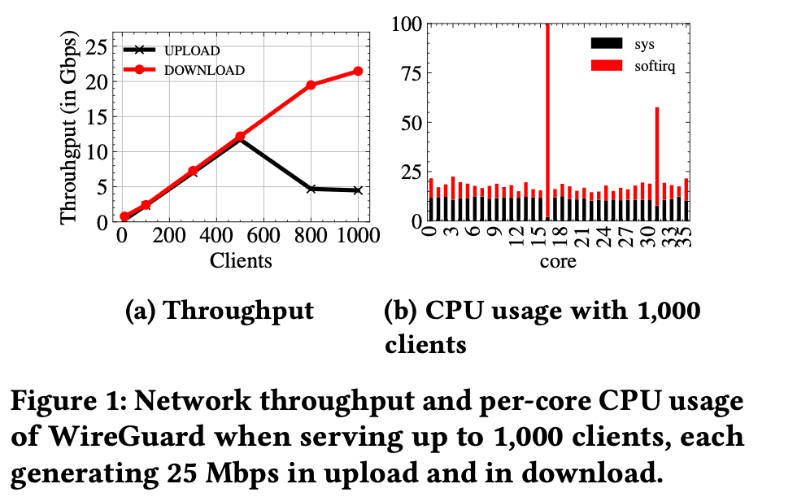
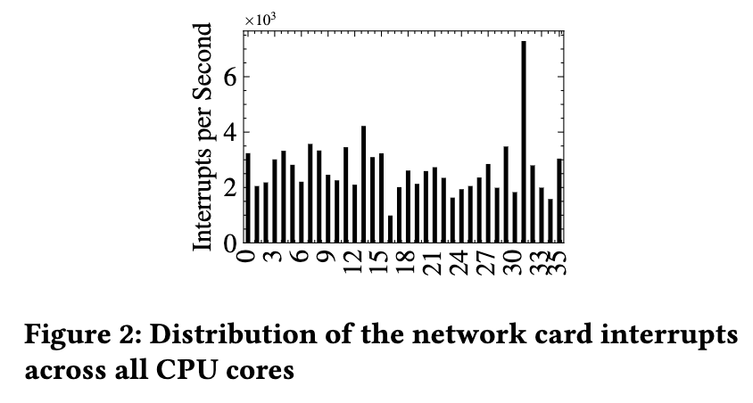
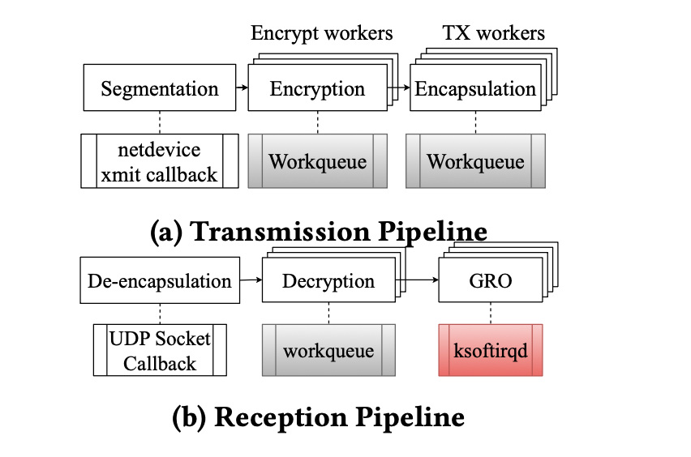

## Reading: The Impact of Kernel Asynchronous APIs on the Performance of a Kernel VPN

> Source: https://hal.science/hal-05211974v1

---

### Overview

Linux Kernel VPN (WireGuard) suffers from severe performance degradation under high load due to **Execution Order Inversion (EoI)** — a phenomenon where packet recombination functions (GRO, executed in high-priority softirq context) preempt earlier stages of the packet processing pipeline before they have completed. This leads to wasted CPU cycles, poor batching, and severe load imbalance across cores.

The paper proposes replacing the softirq execution context for GRO with either **kthreads** or **workqueues**, which run at normal scheduler priority and thus cannot preempt decryption workers. Results:

| Fix | Throughput gain | Latency reduction |
|---|---|---|
| kthreads | 4× | 65% tail latency |
| workqueues | **4.7×** | 46% tail latency |

Best combined improvement: **4.7× throughput, up to 50% tail latency reduction**. Transmission performance is unaffected in both cases.

---

### Introduction

WireGuard is a modern VPN protocol implemented as a Linux kernel module. It is designed to be multithreaded, taking advantage of multicore architectures to handle high loads efficiently.

In practice however, when serving a high number of users, the performance of kernel WireGuard falters. The paper considers a scenario where up to 1000 clients each generate 25 Mbps of upload (received) and download (transmitted) traffic to a WireGuard server equipped with a 25 Gbps NIC and an 18-core CPU.

As shown in Figure 1a:
- **Transmit (download) throughput** scales nearly linearly up to 1000 clients, reaching 22 Gbps. ✅
- **Receive (upload) throughput** hits only **4.8 Gbps** for 800–1000 clients — just **19.2% of available bandwidth**. ❌



#### The root cause: KAAPI misuse in the reception pipeline

Ingress packet processing in WireGuard has three main steps:
1. **De-encapsulation** — performed by the NIC; reassembles incoming packets into larger ones (e.g., using GRO/TSO offload)
2. **Decryption** — performed by the CPU via workqueues (normal priority)
3. **GRO (Generic Receive Offload)** — aggregates packet fragments; executed in a **high-priority softirq context** (`ksoftirqd`)

The priority mismatch between steps 2 and 3 is the problem: GRO (softirq, high priority) can preempt decryption (workqueue, normal priority). GRO fires before decryption finishes — finding little or nothing to recombine — which breaks packet batching.

This mismatch is called **Execution Order Inversion (EoI)**: later pipeline stages run before earlier ones have completed.

#### EoI's two consequences

1. **Wasted work**: GRO softirqs are scheduled before any decrypted packets are available → immediate abort, wasted CPU cycles
2. **Load imbalance feedback loop**: When decrypted packets *do* become available, GRO must process a large backlog in one shot → that NAPI poller runs long → the core accumulates further interrupts → it grows ever more overloaded while other cores stay idle

Over time, this feedback loop leads to severe, persistent load imbalance: one core saturates at ~94% CPU, others hover around 20% (Figure 1b).

#### Why simply rebalancing interrupts doesn't help

The distribution of RX interrupts across CPU cores (Figure 2) reveals a puzzling discrepancy: core 11 receives roughly 2× more RX interrupts than other cores — moderate imbalance typical of hash-based distribution. Yet **core 18 saturates at 100% softirq** (Figure 1b) despite receiving *fewer* interrupts than core 11.



This shows the problem is not interrupt volume — it's what happens *after* the interrupt fires. Simple interrupt redistribution cannot fix EoI. A deeper structural change is needed.

---

## Section 2: Background

### 2.1 Linux Kernel Asynchronous APIs (KAPIs)

The Linux kernel provides three main mechanisms for asynchronous execution:

#### Softirqs
Softirqs are handled by specialized kernel threads called **ksoftirqd**. They run at **high priority** and can preempt normal-priority threads.

In networking, the **NAPI** subsystem uses softirqs to handle large volumes of incoming packets:
- Each NIC registers a `napi_struct` with a polling function
- `napi_struct` instances are placed in a per-core queue called `softnet_data`
- When a software interrupt fires, `ksoftirqd` executes the polling functions from `softnet_data`

This is how WireGuard's GRO currently runs — in softirq context, which is the source of the EoI problem.

#### kthreads
A **kthread** is a kernel-managed data structure initialized with a function defining the work it performs. kthreads are scheduled by the kernel scheduler like any other task — they are subject to **scheduler fairness and load balancing**, meaning they run at normal priority and cannot preempt other normal-priority threads.

kthreads are already supported in the GRO API. The paper proposes using them as a drop-in replacement for the softirq context for GRO.

#### Workqueues
A **workqueue** is a pool of kthreads (called "workers") that execute small functions ("work items"). Workqueues enable asynchronous task execution across multiple CPU cores.

Conceptual analogy to softirqs:

| Softirq concept | Workqueue analog |
|---|---|
| `ksoftirqd` threads | workers |
| `softnet_data` queue | workqueue |
| `napi_struct` | work item |

WireGuard *already* uses workqueues for decryption — but **not** for GRO. The paper proposes patching the kernel to support GRO inside workqueues.

### 2.2 WireGuard Internals

WireGuard creates encrypted tunnels between multiple peers. Each WireGuard peer has two pipelines:

#### Transmission pipeline (TX — outgoing packets)

```
Segmentation → Encryption → Encapsulation
               (workqueue)  (workqueue)
```

- **Encryption**: runs asynchronously in workqueues with **one CPU-affine worker thread per core**
- **Encapsulation**: uses **one work item per peer**, schedulable on any core
- No EoI issue here — the pipeline stages don't have conflicting priority levels

#### Reception pipeline (RX — incoming packets)

```
De-encapsulation → Decryption → GRO
(UDP socket cb)   (workqueue)  (ksoftirqd ← HIGH PRIORITY)
```

- **Decryption**: runs in workqueues at normal priority ✅
- **GRO**: runs in `ksoftirqd` at **high priority** ❌

This is the EoI mismatch. GRO can preempt decryption mid-stream, observe no decrypted packets, abort, and leave the pipeline in a degraded batching state.

---

## Section 3: Execution Order Inversion (EoI)

### 3.1 What is EoI?

EoI is a general concept, defined formally in the paper:

> Consider a pipeline of functions F₁, F₂, ..., Fₘ where each Fᵢ must execute before Fⱼ (i < j). Each function runs in an execution context Gᵢ with an associated priority p(Gᵢ). **EoI occurs when p(Gᵢ) < p(Gⱼ) for i < j** — allowing a later function to preempt an earlier one prematurely.

In the WireGuard reception pipeline:
- F₁ = Decryption, running in context G₁ = workqueue, priority = **normal**
- F₂ = GRO, running in context G₂ = softirq (ksoftirqd), priority = **high**

Since p(G₁) < p(G₂), GRO can run before decryption completes. That's EoI.



The figure illustrates the contrast:
- **Ordered (optimal)**: F1→F2→F3 completes as a batch, 2 jobs processed, latency = 3
- **Unordered (EoI)**: F3 fires early (interrupts F2), processes nothing, must re-run later → 1 job processed, latency = 3+ε

EoI halves throughput and increases latency even with the same amount of CPU work.

### 3.2 How EoI Affects WireGuard Specifically

In the reception pipeline, when packets are dequeued from the decryption queue, WireGuard uses `spin_lock_bh` / `spin_unlock_bh`. **`spin_unlock_bh` re-enables bottom halves (BH)**, which immediately triggers pending software interrupts — including NAPI pollers.

The sequence under EoI:
1. Decryption worker picks up packets, starts processing
2. `spin_unlock_bh` called mid-pipeline → BH re-enabled → NAPI softirq fires
3. GRO runs on core X, finds **zero decrypted packets** → aborts immediately
4. Decryption finishes — but batching opportunity is gone
5. Next NAPI cycle finds a backlog, processes many packets, runs long

The transmission pipeline does **not** exhibit EoI — it has no such BH-unlock-in-the-middle-of-pipeline pattern.

### 3.3 Impact on CPU Utilization

Under high upload workloads, EoI leads to severe per-core imbalance:

- **Most cores**: NAPI pollers fire early, find 0–1 decrypted packets → ~1 packet per NAPI invocation → low CPU, ~20% utilization
- **Overloaded core**: NAPI poller delayed (competing threads, other devices) → fires late → finds a backlog → processes **~5 packets per NAPI invocation** → 5× per-invocation runtime → core saturates at ~94%

The mechanism that pins load to one core:
1. Decryption workers scheduled round-robin across cores (no load awareness)
2. When a worker finishes, it calls `napi_schedule()` — this enqueues the NAPI poller **on the same CPU the worker is currently running on**
3. Heavy cores keep receiving new NAPI pollers because workers keep landing on them
4. No load balancing happens: the scheduler doesn't rebalance NAPI pollers across cores

Result: a self-reinforcing feedback loop where one core accumulates GRO work and falls further behind, while others remain underutilized.

---

## Connection to Internship Research

This is the paper that directly motivates the internship hypothesis. Key connection points:

| Paper finding | Internship relevance |
|---|---|
| WireGuard RX throughput = 19.2% of available bandwidth | This is the slowdown to reproduce |
| Root cause: GRO (softirq) preempts Decryption (workqueue) | Confirms the "KAAPI overhead" hypothesis |
| Fix: run GRO in workqueue or kthread instead | The patch to evaluate / reproduce |
| Workqueues → 4.7× throughput | The headline result to reproduce |
| CPU imbalance: 94% vs 20% across cores | Observable with `perf stat` per-core + bpftrace |

**What the internship adds (hypothesis):** Beyond the EoI story, is there additional overhead from io-wq's workqueue scheduling itself? The `udp_read.rs` experiments and the worker pool behavior we studied are relevant to the decryption workqueue path.

**Next step from here:** ~~Understand the paper's patch (Section 4 in the paper, not yet read)~~ → done, see Sections 3.4–5 below. Contact Brice Ekane / Teo Pisenti for the WireGuard test environment to reproduce Figure 1a numbers.

---

### 3.4 Impact on Pipeline Processing Speed

Beyond CPU imbalance, EoI also directly degrades **throughput and tail latency** at the pipeline level.

Consider a pipeline with three functions F₁, F₂, F₃, each taking one time unit:
- **Optimal (ordered)**: F₁→F₂→F₃ → 1 job in 3 time units → 2 jobs in 6 time units
- **With EoI**: F₃ fires early (before F₂ finishes) → processes nothing → must re-run later → 1 job in 3+ε time units

Where ε ≤ 1 captures the overhead of the disordered execution. Over extended runs this compounds: fewer jobs complete per unit time → **lower throughput**, and each job takes longer → **higher tail latency**.

This is the mathematical grounding for why the 94%-loaded core in Figure 1b causes the 19.2% throughput collapse: it's not just one slow core, it's the pipeline stalling upstream waiting for GRO to finish its oversized batch.

### 3.5 EoI in Other Applications

EoI is a general design hazard, not specific to WireGuard. It can arise in **any system where pipeline stages run in different priority execution contexts**:
- Storage stacks mixing softirq and workqueue processing
- Network middleware (proxies, firewalls) with similar NAPI + workqueue pipelines
- Any async pipeline where a downstream stage has higher scheduling priority than an upstream stage

The WireGuard case is just a concrete, measurable instance. The fix (align execution context priorities across pipeline stages) is the generalizable lesson.

---

## Section 4: Using Alternative KAAPI in WireGuard

### The design criteria for a replacement

The alternative execution context for GRO must:
1. **Eliminate EoI** — run at the same priority as decryption (workqueue, normal scheduler priority)
2. **Allow high-frequency packet processing** — no artificial rate limiting
3. **Improve upload (reception) performance** — fix the bottleneck
4. **Not harm download (transmission) performance** — side-effect free

Both kthreads and workqueues run at normal scheduler priority → they satisfy criterion 1. The kernel scheduler handles their fairness and load balancing.

### 4.1 Running NAPI pollers in kthreads

kthreads already have **first-class NAPI support**. Enabling them is a configuration-only change — no kernel code modification needed:

```bash
echo 1 > /sys/class/net/<iface_name>/threaded
```

Where `iface_name` is the network interface whose NAPI pollers should run in kthreads. That's it. The NAPI subsystem already knows how to run pollers in kthreads.

**Why this eliminates EoI:** kthreads are scheduled by the kernel scheduler at normal priority. They cannot preempt workqueue decryption workers. GRO now runs only when the scheduler allows it, after decryption has had its turn.

**Downside — scalability:** One kthread is created per peer when the VPN interface comes up. With 1,000 clients → 1,000+ threads. This creates:
- Excessive context switching as the scheduler juggles all these threads
- Frequent thread migrations between CPU cores
- Substantial scheduling overhead

The paper also evaluates **threaded-pinned**: each kthread is pinned to a specific CPU core to reduce migration overhead.

### 4.2 Running NAPI pollers in workqueues

The NAPI subsystem does **not** natively support workqueues, so this required a kernel patch (136 lines of code to NAPI + 55 lines to WireGuard).

**The patch — two parts:**

#### Initialization
The gap to bridge: NAPI uses `napi_struct`, workqueues use `work_struct`. The patch:
1. Wraps `napi_struct` inside a `work_struct`
2. Replaces `netif_napi_add` with a new function `netif_napi_add_wq`
3. `netif_napi_add_wq` establishes the association between `napi_struct`, `work_struct`, and the workqueue
4. During device setup, `dev_run_in_workqueue` is called to enable workqueue mode for every attached NAPI poller

#### Scheduling
When `napi_schedule` is called and the NAPI instance is in workqueue mode:
- **Old path**: enqueue `napi_struct` into `softnet_data` → `ksoftirqd` picks it up
- **New path**: call `queue_work_on` → enqueue the associated `work_struct` onto the workqueue for the relevant CPU core → kernel workqueue subsystem dispatches it to a worker thread

The workqueue subsystem uses a **fixed pool of worker threads** (one per CPU core), so client count doesn't affect thread count. As the number of work items increases, only the queue depth grows — not the thread count. This avoids the scheduling overhead of the kthread approach.

**Why workqueues beat kthreads for throughput:**
- Fixed thread pool → no context switch explosion
- No thread migrations → better cache locality
- Workqueue infrastructure already handles load distribution

**Why kthreads beat workqueues for latency:**
- Each kthread is dedicated to one peer → more predictable, lower per-packet latency
- Workqueues share workers across all peers → more contention, slightly higher but more uniform latency

### 4.3 Kthreads vs Workqueues — head-to-head

| | kthreads | workqueues |
|---|---|---|
| Kernel changes | None (config only) | 136 LoC (NAPI) + 55 LoC (WireGuard) |
| Thread count | 1 per peer (grows with clients) | 1 per CPU core (fixed) |
| Context switches | High (many threads) | Low (fixed pool) |
| Throughput | 4× | **4.7×** |
| Tail latency reduction | **65%** | 46% |
| Scheduler overhead | High | Low |
| Deployment complexity | Low | High |

**Summary:** Workqueues win on throughput and CPU efficiency; kthreads win on latency and ease of deployment.

### 4.4 Impact on Other Drivers

An important safety property: **only WireGuard's GRO pollers are affected**. GRO pollers initialized by other drivers continue running in `ksoftirqd` as before. The patch only changes the execution context of NAPI pollers that explicitly opt in via `netif_napi_add_wq` / `dev_run_in_workqueue`.

This means the patch cannot interfere with other NIC drivers or networking subsystems — a clean isolation boundary.

---

## Section 5: Evaluation

### 5.1 Experimental Setup

**Hardware:**
- 21 machines, Intel Xeon Gold 5220 CPU, **18 physical cores each**
- 10 machines = clients, 10 machines = targets, 1 machine = WireGuard VPN server
- All on the same switch with **25 Gbps Mellanox ConnectX-4 NICs**
- Full-duplex mode enabled by default

**Software:**
- Debian 12, Linux kernel 6.1
- WireGuard = kernel v6.1 built-in version
- Traffic generation: `iPerf3 v3.9`
- Latency measurement: `netperf`, reporting **99th percentile (tail latency)**
- CPU usage measurement: `sysstat`
- Each experiment run **5 times**, median value reported

**Metrics:**
- Throughput: median forwarded throughput (Gbps) over 60 seconds via `sysstat`
- Latency: 99th percentile TCP_RR from `netperf`
- CPU: total + per-core usage via `sysstat`

**Four configurations compared:**
1. **Baseline** — stock WireGuard (GRO in softirq)
2. **Threaded** — kthreads (write 1 to `/sys/class/net/.../threaded`)
3. **Threaded-pinned** — kthreads pinned to specific CPU cores
4. **Workqueues** — patched NAPI + WireGuard

### 5.2 CPU Usage Results

#### Per-core load (Figure 6 — 1,000 clients, reception)

- **Baseline (Figure 6a)**: severe imbalance — one core at 94% (softirq), others ~20%
- **Kthreads / Workqueues (Figure 6b)**: balanced — up to 95% load across **all** cores

With GRO no longer running in softirq, the corresponding CPU usage shows up as **sys** (kernel thread time) rather than **softirq** time. The scheduler now distributes GRO work fairly. Transmission shows even distribution in all configurations — unaffected, as expected.

#### Total CPU usage vs. throughput (Figure 7)

The key trade-off graph: lower CPU usage at the same throughput = better efficiency. Optimal configuration = bottom-right of the plot.

- **Reception (Figure 7a)**: workqueues achieve the same throughput as kthreads but with **less CPU** → better efficiency. Kthreads use more CPU for comparable throughput because of scheduling overhead.
- **Transmission (Figure 7b)**: all variants perform identically — baseline, threaded, workqueues all show linear CPU growth. Kthreads use *more* CPU than baseline for the same transmission throughput (overhead without benefit).

**Bottom line on CPU:** Workqueues are the most CPU-efficient configuration. kthreads fix the problem but at a higher scheduling cost.

### 5.3 Throughput Results (Figure 8)

#### Reception (Figure 8a — upload)

- **Baseline**: throughput collapses after ~400 clients, plateaus at ~4.8 Gbps
- **Threaded**: reaches ~20 Gbps at 1,000 clients → **~4× improvement**
- **Threaded-pinned**: similar to threaded, slightly better in some regimes
- **Workqueues**: reaches ~22 Gbps at 1,000 clients → **~4.7× improvement**, closest to line rate

#### Transmission (Figure 8b — download)

All four configurations scale **linearly and identically** up to 1,000 clients (~22 Gbps). EoI only affected the reception pipeline — the patch has zero impact on transmission, confirming the fix is surgical.

### 5.4 Summary of Results

| Metric | Baseline | kthreads | workqueues |
|---|---|---|---|
| RX throughput (1,000 clients) | 4.8 Gbps | ~20 Gbps (**4×**) | ~22 Gbps (**4.7×**) |
| Tail latency reduction | — | **65%** | 46% |
| Per-core balance | 94% / 20% | balanced (~95%) | balanced (~95%) |
| CPU efficiency (RX) | poor | medium | **best** |
| TX impact | — | none | none |

**Workqueues win on throughput and CPU efficiency.** **kthreads win on tail latency** (dedicated thread per peer → more predictable scheduling). The choice between them depends on whether the priority is maximum throughput or minimum tail latency.

---

## Updated Connection to Internship Research

| Paper finding | Internship relevance |
|---|---|
| WireGuard RX = 19.2% bandwidth (Figure 1a) | Target to reproduce |
| Root cause: GRO (softirq) preempts Decryption (workqueue) — EoI | Confirms KAAPI overhead hypothesis |
| Fix: GRO in kthreads or workqueues | The patch to evaluate |
| Workqueues → 4.7× throughput, balanced per-core CPU | Headline result to reproduce |
| kthreads → 4× throughput, 65% latency reduction | Alternative to compare |
| CPU imbalance: 94% vs 20% across cores | Reproducible with `perf stat --per-core` + `sysstat` |
| Workqueues = fixed thread pool → no scheduling explosion | Connects to io-wq worker pool behavior from Cloudflare article |

**The connection to io-wq / Cloudflare article:** The paper's workqueue fix uses the *same* Linux workqueue infrastructure (`work_struct`, `queue_work_on`, worker pool) that io_uring's io-wq is built on. Understanding worker pool sizing (`IORING_REGISTER_IOWQ_MAX_WORKERS`) from the Cloudflare article is directly relevant to understanding why workqueues scale better than kthreads here — fixed thread count, no `RLIMIT_NPROC` explosion.


Jeudi 9h - Presentation de EOI ,  avec Code et arguments - salle 471